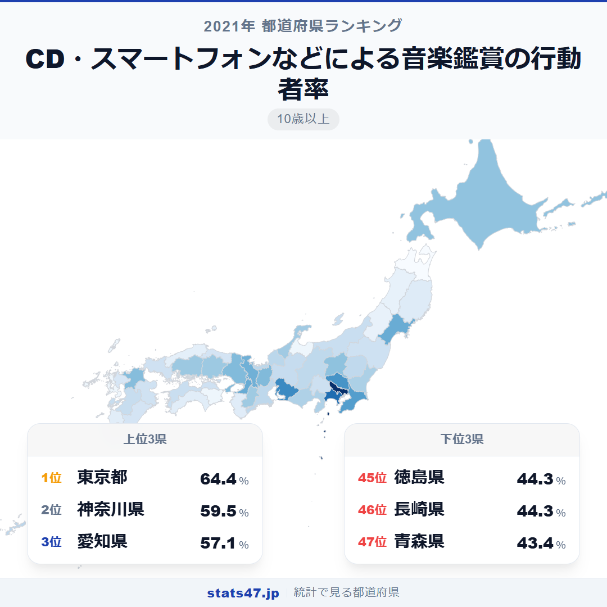
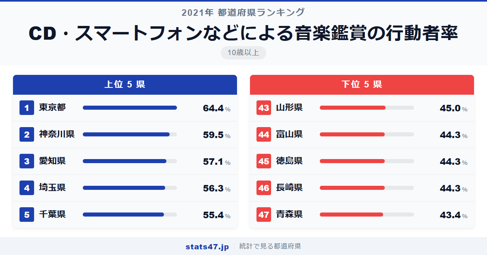
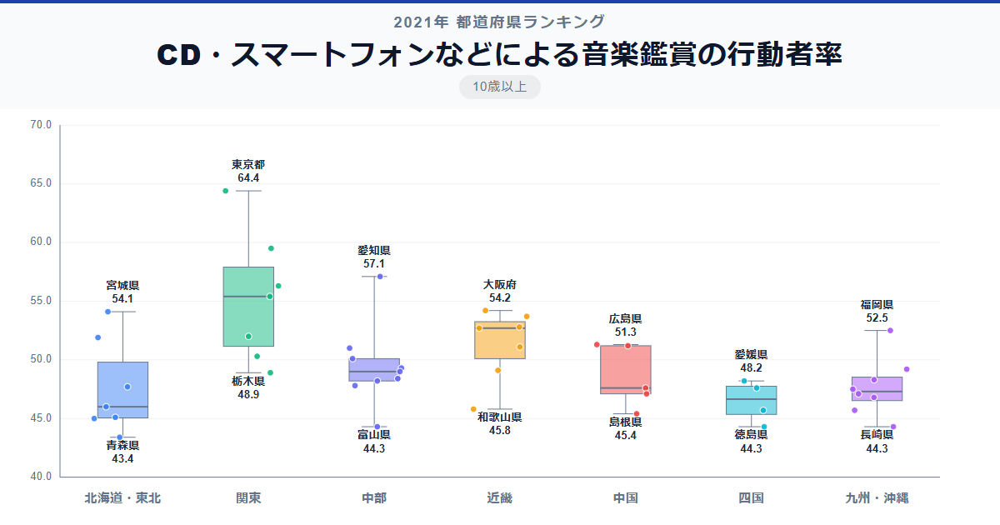

東京都では3人に2人が日常的に音楽を聴いているのに、青森県では2人に1人を下回る。CDからスマートフォン、サブスクリプションへと聴き方は変わっても、音楽鑑賞の習慣には21ポイントもの地域差が残っています。

全国1位の東京都は偏差値84.7で64.4％。最下位の青森県は偏差値35.2で43.4％です。1.5倍という差は映画館以外での映画鑑賞と似た水準で、デジタルコンテンツでも地域差は意外と大きいことが浮き彫りになっています。

「CD・スマートフォンなどによる音楽鑑賞の行動者率」は、10歳以上の人口のうち過去1年間にCD・スマートフォン・パソコンなどで音楽を聴いた人の割合です。総務省の社会生活基本調査に基づくデータで、ライブ鑑賞は含みません。

## データハイライト

全国平均: 49.67％

1位: 東京都（64.4％ / 偏差値 84.7）

47位: 青森県（43.4％ / 偏差値 35.2）

全国平均は49.67％と、ほぼ2人に1人が何らかの形で音楽を聴いています。上位は大都市圏が中心ですが、宮城県7位・広島県14位など、地方の県も健闘しています。下位には東北地方の県が多く、高齢化率の高さとの関連がうかがえます。

## 【コロプレス地図】日本全国の分布

<!-- note投稿時: この画像行を削除し、images/choropleth-map-1080x1080.png をアップロード -->

東京都と神奈川県が最も濃い色で、ここから同心円状に薄くなっていく傾向があります。愛知県・大阪府も濃く、三大都市圏が音楽鑑賞の中心地であることは他の文化系指標と共通しています。

宮城県が7位の54.1％と東北の中では突出して高く、仙台市の若年層の多さが影響していると考えられます。沖縄県は21位の49.2％とほぼ全国平均で、音楽文化が盛んなイメージほどは高くない結果です。

日本海側の県が全体的に薄い色を示しており、富山県44位・長崎県46位タイ・徳島県46位タイと、地方の高齢化が進む県が下位に並んでいます。

## 上位5：分析

<!-- note投稿時: この画像行を削除し、images/chart-x-1200x630.png をアップロード -->

通勤電車の中でイヤホンをしている人を見ない日はない東京都。偏差値84.7で64.4％と、3人に2人近くが音楽を聴く習慣を持っています。SpotifyやApple Musicなどのサブスクリプションサービスの浸透に加え、電車での通勤時間という「聴く時間」が確保されていることも大きな要因でしょう。

2位の神奈川県は偏差値73.2で59.5％。東京に次ぐ人口規模を持ち、通勤時の音楽鑑賞が日常化しています。

愛知県が偏差値67.5の57.1％で3位に入りました。車通勤が多い愛知県では、カーオーディオやスマートフォン接続での音楽鑑賞が主流で、東京とは異なる「聴くシーン」が行動者率を支えています。

4位は埼玉県で偏差値65.6の56.3％。長い通勤時間がそのまま音楽を聴く時間になっており、首都圏のベッドタウンならではの高い行動者率です。

千葉県が偏差値63.5の55.4％で5位。埼玉県と同じく東京への長距離通勤が多く、その移動時間が音楽鑑賞の時間に転換されています。

## 下位5：分析

全国で最も高齢化率が高い県のひとつである青森県は、偏差値35.2の43.4％で最下位。高齢者層ではスマートフォンでの音楽鑑賞が浸透しきっておらず、CDプレーヤーの利用も減少傾向にあることが行動者率の低さにつながっています。

長崎県と徳島県がともに偏差値37.4の44.3％で46位タイ。長崎県は離島を含む広い県土で、若年人口の流出が進んでいます。徳島県も高齢化率の高さが音楽鑑賞の行動者率を下げる要因です。

44位は富山県で偏差値37.4の44.3％。北陸の中では石川県17位・福井県20位と比べて低く、クラシック音楽鑑賞では上位だった富山県が普段の音楽鑑賞ではやや低い位置にいるのが興味深い違いです。

山形県が偏差値39.0で45.0％の43位。冬場は外出が減り、自宅での過ごし方も音楽よりテレビ中心という生活スタイルが影響しているのかもしれません。

## 地域別の傾向

<!-- note投稿時: この画像行を削除し、images/boxplot-1200x630.png をアップロード -->

関東が最も高く、東北が最も低い傾向です。中部・近畿は全国平均をやや上回る水準で安定しており、九州と四国は低めにばらついています。

## まとめ

CD・スマートフォンなどによる音楽鑑賞の行動者率は、年齢構成とデジタル環境が形作る指標です。このデータから以下の洞察が得られます。

**「通勤時間」が音楽を聴く時間をつくっている**

首都圏が上位を独占する背景には、長い電車通勤が「音楽を聴く時間」として機能していることがあります。
車通勤の愛知県も3位と高く、移動時間と音楽鑑賞は密接に結びついています。

**高齢化が進む県ほど行動者率が低い傾向**

下位に並ぶ青森県・長崎県・徳島県は、いずれも高齢化率が高い県です。
スマートフォンの操作やサブスクリプションの契約にハードルがある高齢者層が多いことが、行動者率を押し下げています。

**サブスク時代でも21ポイントの地域差が残る**

CDからストリーミングへの移行で音楽へのアクセスは格段に容易になりましたが、それでも東京64.4％と青森43.4％には大きな差があります。
デジタルデバイドの影響は、音楽という身近な文化活動にも色濃く表れています。

## もっと詳しく知りたい方へ

全47都道府県の順位や、グラフ・地図での可視化は stats47 で見ることができます。

### CD・スマートフォンなどによる音楽鑑賞の行動者率ランキング 全都道府県版

https://stats47.jp/ranking/hobby-participation-rate-music-listening

### ポピュラー音楽鑑賞の行動者率ランキング

https://stats47.jp/ranking/hobby-participation-rate-popular-music

### クラシック音楽鑑賞の行動者率ランキング

https://stats47.jp/ranking/hobby-participation-rate-classical-music

### 楽器の演奏の行動者率ランキング

https://stats47.jp/ranking/hobby-participation-rate-instrument

### カラオケの行動者率ランキング

https://stats47.jp/ranking/hobby-participation-rate-karaoke

### 邦楽の行動者率ランキング

https://stats47.jp/ranking/hobby-participation-rate-japanese-music

---

**stats47** は、e-Stat の公的統計データを47都道府県別に可視化するサービスです。
ランキング・散布図・時系列チャートで、地域の違いがひと目でわかります。

https://stats47.jp
