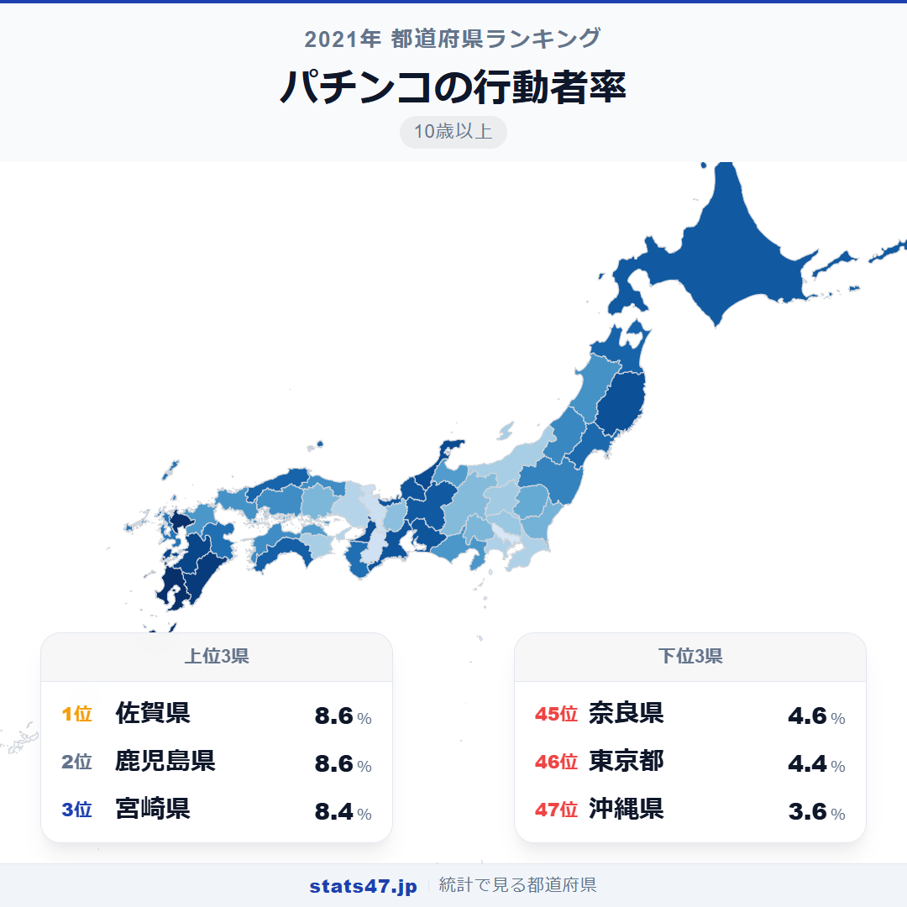
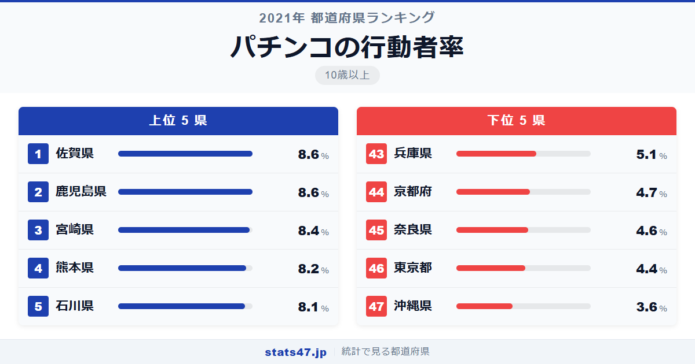
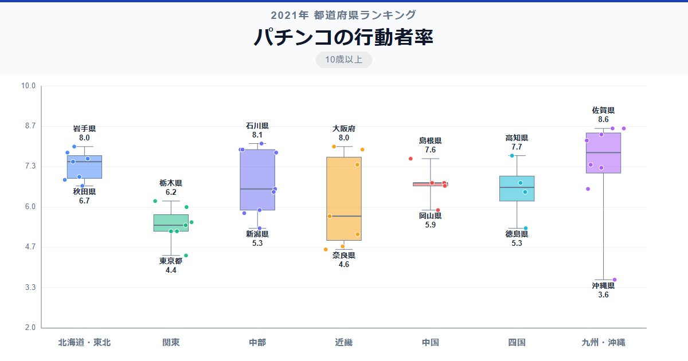

パチンコが最も盛んな県は東京でも大阪でもありません。佐賀県です。全国1位の佐賀県は8.6％で偏差値65.8、同率1位の鹿児島県も8.6％。一方、東京都は4.4％で偏差値31.5の46位と、大都市ほどパチンコ離れが進んでいる構図が鮮明です。

最下位の沖縄県は3.6％で偏差値24.9。1位との差は2.4倍で、レジャーの選択肢が多い地域ほど低い傾向が見えてきます。

「パチンコの行動者率」は、過去1年間にパチンコを行った10歳以上の人の割合です。総務省「社会生活基本調査」（2021年）のデータに基づいています。

## データハイライト

全国平均: 6.67％

1位: 佐賀県（8.6％ / 偏差値 65.8）

47位: 沖縄県（3.6％ / 偏差値 24.9）

九州勢が上位に集中し、大都市圏が下位に並ぶという、他の趣味系ランキングとは逆転した構図になっています。近畿の京都・奈良・兵庫も低く、都市型のライフスタイルとパチンコの距離感がうかがえます。

## 【コロプレス地図】日本全国の分布

<!-- note投稿時: この画像行を削除し、images/choropleth-map-1080x1080.png をアップロード -->

地図を見ると、九州南部と北陸・東北が濃い色で染まっています。佐賀・鹿児島・宮崎・熊本の九州4県がすべて8％を超え、ベスト4を独占しました。

反対に、首都圏は軒並み薄い色です。東京4.4％、千葉5.2％、神奈川5.2％と、関東南部はいずれも全国平均を大きく下回っています。

北陸の石川県が8.1％で5位に入っているのが目を引きます。車社会でロードサイドのパチンコ店が身近な存在であることが、高い行動者率につながっていると考えられます。

## 上位5：分析

<!-- note投稿時: この画像行を削除し、images/chart-x-1200x630.png をアップロード -->

車での移動が中心の佐賀県では、ロードサイドに大型パチンコ店が数多く立地しています。偏差値65.8の8.6％で全国トップ。他のレジャー施設が限られる中で、身近な娯楽としてのポジションを占めています。

同率1位の鹿児島県も偏差値65.8で8.6％。温暖な九州南部で、週末のレジャーとして定着している様子がうかがえます。

3位の宮崎県は偏差値64.1で8.4％。九州南部3県が揃ってトップ3を形成し、地域的な文化としてのパチンコの存在感が際立ちます。

熊本県が偏差値62.5の8.2％で4位に続きます。九州の中心都市・熊本市を含みながらも高い数値で、都市部と郊外の両方でパチンコが親しまれていることを示しています。

5位は北陸の石川県で偏差値61.7の8.1％。九州勢の独壇場に割って入った形で、冬季の屋内娯楽としての需要が高いことが背景にあります。

## 下位5：分析

沖縄県は3.6％で偏差値24.9の最下位。マリンスポーツなど屋外レジャーの選択肢が豊富なことに加え、独自の娯楽文化を持つ沖縄では、パチンコの存在感が相対的に薄いといえます。

46位の東京都は偏差値31.5で4.4％。娯楽の選択肢が圧倒的に多い東京では、パチンコは数あるレジャーの一つにすぎません。

奈良県は偏差値33.1の4.6％で45位。大阪のベッドタウンとしての性格が強く、大都市的なライフスタイルの影響を受けています。

京都府が偏差値33.9で4.7％の44位。観光都市として文化的な趣味が好まれる傾向があるのかもしれません。

43位の兵庫県は偏差値37.2の5.1％。神戸を中心とした都市部の影響で、近畿圏の低い傾向に沿った結果です。

## 地域別の傾向

<!-- note投稿時: この画像行を削除し、images/boxplot-1200x630.png をアップロード -->

九州・東北・北陸が高く、関東・近畿が低い傾向です。都市化が進んだ地域ほどパチンコ離れが進行しているパターンが明確に見えます。

## まとめ

パチンコの行動者率は、他の趣味系ランキングとは対照的に、地方が高く大都市が低い逆転構図を見せています。このデータから以下の洞察が得られます。

**九州南部がベスト4を独占する「パチンコベルト」**

佐賀・鹿児島・宮崎・熊本が8％台で並び、地域文化としての定着度の高さがうかがえます。
車社会でロードサイドのパチンコ店が身近な存在であることが大きな要因です。

**大都市ほどパチンコから遠ざかる**

東京46位、京都44位、奈良45位と、都市部は軒並み低い水準です。
娯楽の選択肢が豊富な都市では、パチンコの相対的な魅力が下がっています。

**沖縄の最下位はレジャー環境の豊かさの裏返し**

3.6％で断然の最下位。
屋外レジャーが年中楽しめる沖縄では、室内娯楽であるパチンコへの依存度が低いといえます。

## もっと詳しく知りたい方へ

全47都道府県の順位や、グラフ・地図での可視化は stats47 で見ることができます。

### パチンコの行動者率ランキング 全都道府県版

https://stats47.jp/ranking/hobby-participation-rate-pachinko

### ゲームの行動者率ランキング

https://stats47.jp/ranking/hobby-participation-rate-video-games

### カラオケの行動者率ランキング

https://stats47.jp/ranking/hobby-participation-rate-karaoke

### 将棋の行動者率ランキング

https://stats47.jp/ranking/hobby-participation-rate-shogi

### 囲碁の行動者率ランキング

https://stats47.jp/ranking/hobby-participation-rate-go

### キャンプの行動者率ランキング

https://stats47.jp/ranking/hobby-participation-rate-camping

---

**stats47** は、e-Stat の公的統計データを47都道府県別に可視化するサービスです。
ランキング・散布図・時系列チャートで、地域の違いがひと目でわかります。

https://stats47.jp
