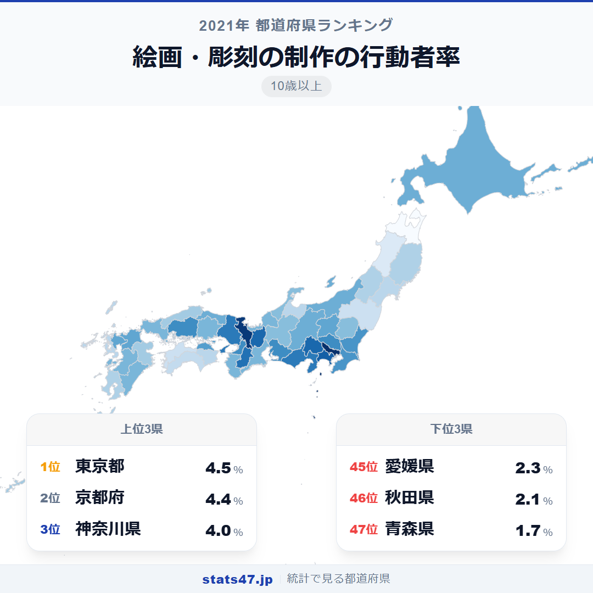
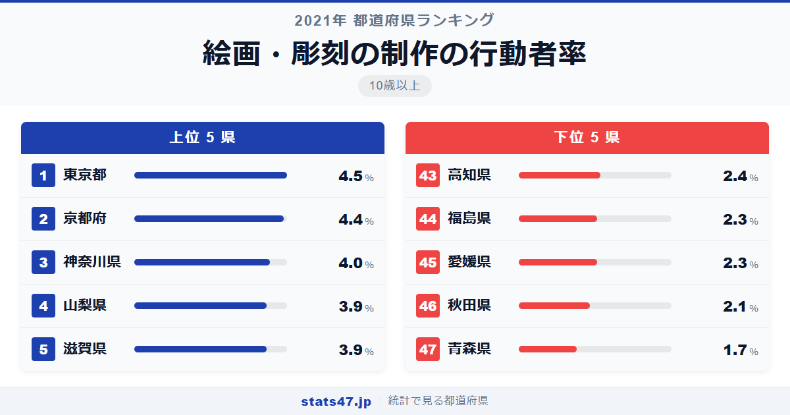
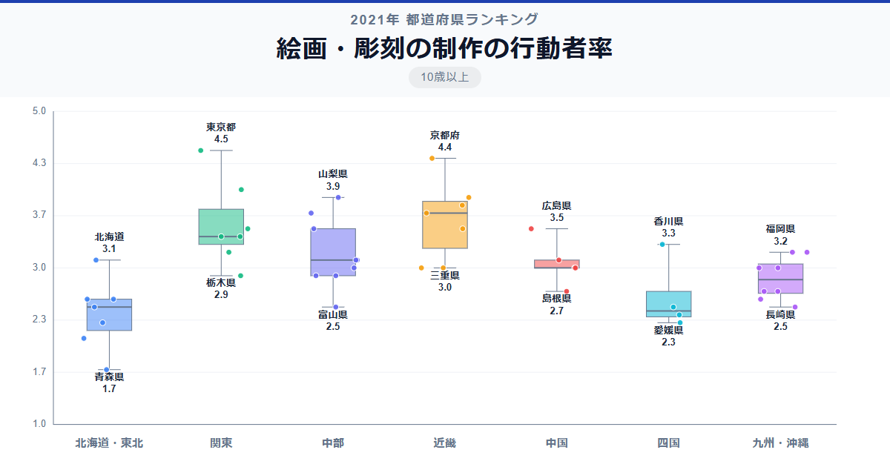

絵を描いたり彫刻を制作したりする人が最も多いのは東京都。では2位はどこでしょうか。神奈川でも大阪でもなく、京都府です。

総務省「社会生活基本調査」（2021年）によると、東京都の行動者率は4.5％で偏差値74.9。京都府は4.4％で偏差値73.2と、わずか0.1ポイントの差で追っています。最下位の青森県は1.7％で偏差値26.0。1位と最下位の差は2.6倍です。

美術大学や画廊が集積する都市と、芸術とは縁遠い地域。その格差は、文化インフラの差として如実に表れています。

「絵画・彫刻の制作の行動者率」は、過去1年間に絵画の制作や彫刻を行った人の割合を10歳以上人口に対して算出した指標です。総務省が5年ごとに実施する社会生活基本調査のデータに基づいています。

## データハイライト

全国平均: 3.07％

1位: 東京都（4.5％ / 偏差値 74.9）

47位: 青森県（1.7％ / 偏差値 26.0）

全体として大都市圏や文化的な拠点を持つ県が高く、東北が低い傾向です。標準偏差0.57ポイントで、上位と下位の差がはっきり分かれています。

## 【コロプレス地図】日本全国の分布

<!-- note投稿時: この画像行を削除し、images/choropleth-map-1080x1080.png をアップロード -->

地図を見ると、首都圏と近畿が濃い色で浮かび上がります。東京・京都・神奈川・兵庫と、美術館や画廊が集積する文化都市が上位を占めるのは自然な結果です。

一方、東北は全般的に色が薄く、青森県が最下位、秋田県が46位と北東北が特に低い水準です。冬の長い地域で文化活動の選択肢が限られることが影響しているかもしれません。

山梨県と滋賀県が4位・5位に入っているのは注目に値します。自然豊かな風景に恵まれた地域では、風景画を描く動機が生まれやすいことも一因でしょう。

## 上位5：分析

<!-- note投稿時: この画像行を削除し、images/chart-x-1200x630.png をアップロード -->

美術大学、画廊、アートギャラリーが国内最多の東京都が、偏差値74.9で4.5％の1位です。プロからアマチュアまで、絵画や彫刻に取り組む環境が最も整った都市です。カルチャーセンターのアート講座も豊富に開かれています。

京都府が4.4％で偏差値73.2と僅差の2位に入りました。京都市立芸術大学をはじめとする芸術教育の拠点があり、寺社の美意識や町家の景観が日常的にアートへの感性を刺激する環境です。古都ならではの文化の厚みが数値に反映されています。

3位の神奈川県は4.0％で偏差値66.2。横浜には美術館やアートスペースが多く、鎌倉・葉山には芸術家が集うコミュニティも存在します。

山梨県が3.9％で偏差値64.5と4位に入ったのは意外かもしれません。富士山や南アルプスの雄大な景色に囲まれた山梨には、風景画を描く愛好家が集まりやすい環境があります。

同率4位の滋賀県も3.9％で偏差値64.5。琵琶湖を中心とした美しい自然景観と、信楽焼をはじめとする工芸文化の土壌が、絵画・彫刻への関心を高めています。

## 下位5：分析

青森県は1.7％で偏差値26.0の最下位です。46位との差も0.4ポイントあり、突出して低い水準です。芸術系の教育機関や画廊が県内に少なく、絵画制作を始めるきっかけとなる環境が限られています。

46位の秋田県は2.1％で偏差値33.0。東北北部は冬期の活動が制約される面に加え、文化施設へのアクセスが限られることも影響しています。

愛媛県は2.3％で偏差値36.5。四国の中では香川県が3.3％で15位なのと比べると見劣りします。香川のアートの島・直島のような拠点の有無が、県内の芸術活動への関心にも差を生んでいるのかもしれません。

同じ2.3％で福島県も偏差値36.5。広い県土に文化施設が分散し、日常的にアートに触れる機会が少ないことが背景にあります。

43位の高知県は2.4％で偏差値38.3。四万十川や太平洋の美しい風景に恵まれながらも、制作活動に参加する人の割合は全国平均を下回っています。

## 地域別の傾向

<!-- note投稿時: この画像行を削除し、images/boxplot-1200x630.png をアップロード -->

関東と近畿が高く、東北が最も低い傾向です。美術館や画廊など文化施設の集積度が、そのまま行動者率に反映されるパターンです。

## まとめ

絵画・彫刻の制作の行動者率は、芸術文化の環境整備度を映す指標です。このデータから以下の洞察が得られます。

**京都が東京に肉薄する理由**

京都は東京にわずか0.1ポイント差の2位。人口規模では大きく劣る京都がここまで高いのは、芸術教育の蓄積と日常に溶け込んだ美意識の賜物です。

**自然の景観がアート活動を刺激する**

山梨4位、滋賀5位と、自然に恵まれた地方県も上位に入っています。
美術館の数だけでなく、描きたくなる風景の存在も行動の動機として重要です。

**東北の低さは文化インフラの課題**

青森1.7％、秋田2.1％と東北北部は全国最低水準です。
画廊や教室など、制作を始めるきっかけとなる場の整備が行動者率を左右しています。

## もっと詳しく知りたい方へ

全47都道府県の順位や、グラフ・地図での可視化は stats47 で見ることができます。

### 絵画・彫刻の制作の行動者率ランキング 全都道府県版

https://stats47.jp/ranking/hobby-participation-rate-painting

### 陶芸・工芸の行動者率ランキング

https://stats47.jp/ranking/hobby-participation-rate-pottery

### 美術鑑賞の行動者率ランキング

https://stats47.jp/ranking/hobby-participation-rate-art-appreciation

### 写真の撮影・プリントの行動者率ランキング

https://stats47.jp/ranking/hobby-participation-rate-photography

### 書道の行動者率ランキング

https://stats47.jp/ranking/hobby-participation-rate-calligraphy

### 華道の行動者率ランキング

https://stats47.jp/ranking/hobby-participation-rate-flower-arrangement

---

**stats47** は、e-Stat の公的統計データを47都道府県別に可視化するサービスです。
ランキング・散布図・時系列チャートで、地域の違いがひと目でわかります。

https://stats47.jp
