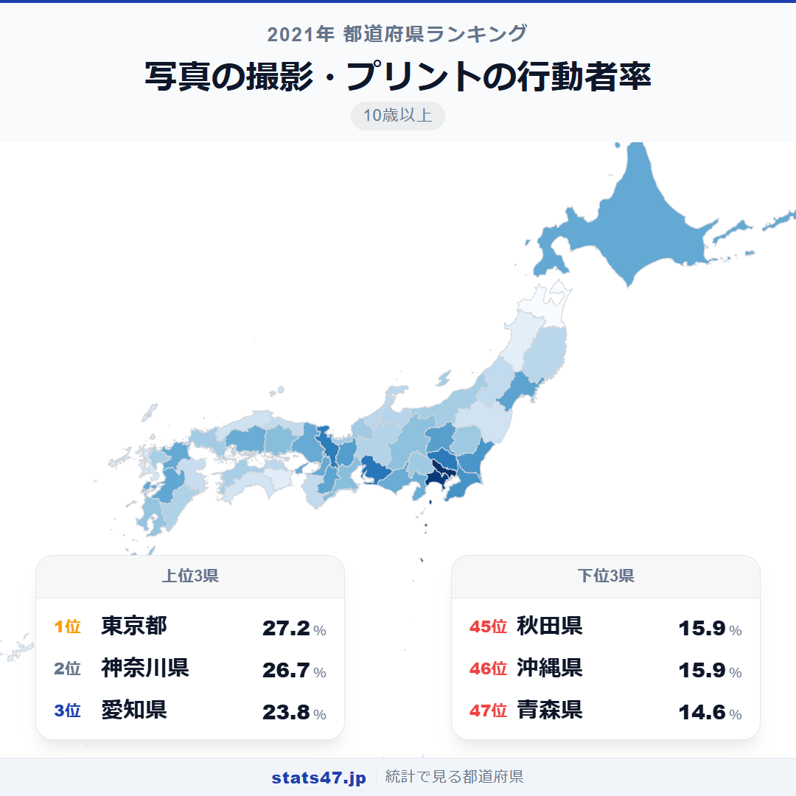
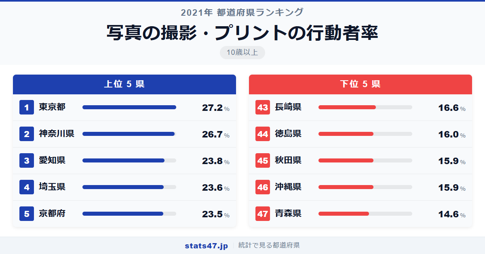
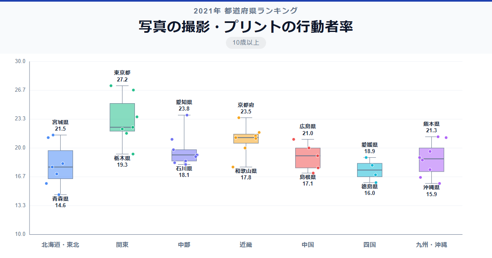

都市部に住む人ほど写真を撮る。何となくそんなイメージがあるかもしれませんが、データで見るとその差は想像以上です。全国1位の東京都は27.2％、最下位の青森県は14.6％。偏差値でいえば東京都が78.4に対して青森県は30.5と、大きな開きがあります。

この差はなぜ生まれるのでしょうか。撮りたくなる風景や施設の多さだけでは説明しきれない、意外な地域パターンが浮かび上がります。

「写真の撮影・プリントの行動者率」は、過去1年間に趣味として写真撮影やプリントを行った10歳以上の人の割合です。総務省「社会生活基本調査」（2021年）のデータに基づいています。

## データハイライト

全国平均: 19.73％

1位: 東京都（27.2％ / 偏差値 78.4）

47位: 青森県（14.6％ / 偏差値 30.5）

全体的に大都市圏が上位を占め、関東・東海・近畿のベッドタウンも高い傾向です。一方、東北・四国が軒並み低く、地方都市と大都市で趣味の行動パターンに差があることがうかがえます。

## 【コロプレス地図】日本全国の分布

<!-- note投稿時: この画像行を削除し、images/choropleth-map-1080x1080.png をアップロード -->

地図を見ると、東京・神奈川・愛知・京都など大都市を抱える都府県が濃く色づいています。北関東の茨城・群馬も20％を超えており、首都圏の影響が広域に及んでいることがわかります。

一方で、東北6県はすべて全国平均を下回りました。青森・秋田は15％台にとどまり、最も低いグループを形成しています。四国も全県が平均以下で、徳島県は16.0％と低い水準です。

意外なのは熊本県です。12位の21.3％で、九州勢では福岡と並んで高い位置にいます。九州の中でも県ごとの差が大きいことがわかります。

## 上位5：分析

<!-- note投稿時: この画像行を削除し、images/chart-x-1200x630.png をアップロード -->

人口が集中し、撮影スポットやイベントが豊富な東京都が偏差値78.4の27.2％で堂々の1位。スマートフォンの普及もあり、日常的に写真を楽しむ環境が整っています。

2位の神奈川県は偏差値76.5で26.7％。鎌倉・横浜・湘南エリアなどフォトジェニックなスポットが多く、カメラ愛好家のコミュニティも活発です。

愛知県が3位に入り、偏差値65.5の23.8％を記録しました。名古屋を中心とした都市部の人口規模に加え、周辺の自然景観も撮影対象として親しまれています。

埼玉県は偏差値64.7で23.6％の4位。東京への通勤圏であり、都市部の文化的影響を強く受けていることが背景にあります。

古都の景観が写真映えする京都府が5位で、偏差値64.3の23.5％。寺社仏閣や四季折々の風景を撮影する観光客だけでなく、地元住民にとっても被写体に事欠かない土地柄です。

## 下位5：分析

最下位の青森県は14.6％で偏差値30.5。冬季の厳しい気候が屋外での撮影機会を制限していることに加え、高齢化率の高さも影響していると考えられます。

秋田県と沖縄県はともに15.9％で偏差値35.5の45位タイ。秋田は青森と同じく冬の長さが要因でしょう。沖縄は美しい風景が多いにもかかわらず低い数値で、観光客が撮る写真と地元住民の趣味行動は別物であることを示唆しています。

44位の徳島県は偏差値35.8で16.0％。四国の中でも特に低く、写真撮影を趣味とする層が薄い地域です。

長崎県は16.6％で偏差値38.1の43位。観光地として知られる長崎ですが、住民の趣味としての写真撮影率は低めにとどまりました。

## 地域別の傾向

<!-- note投稿時: この画像行を削除し、images/boxplot-1200x630.png をアップロード -->

関東が最も高く、東北が最も低い傾向です。東海・近畿も比較的高い水準にあり、大都市圏の存在が地域全体の数値を押し上げています。

## まとめ

写真の撮影・プリントの行動者率は、都市規模と強い関連を見せています。このデータから以下の洞察が得られます。

**大都市圏ほど写真を撮る人が多い**

東京・神奈川・愛知が上位3を占め、埼玉・京都が続きます。
撮影スポットの豊富さだけでなく、文化的な刺激や趣味コミュニティの厚みが関係しています。

**東北は全県が平均以下**

冬季の長さや高齢化の進行が、趣味としての写真撮影率を押し下げている可能性があります。
青森と東京では約1.9倍の差が開いています。

**観光地の魅力と住民の趣味行動は別物**

沖縄や長崎など観光地として人気の県でも、住民自身の写真撮影率は低い傾向です。
「訪れる人」と「住む人」の行動パターンには乖離があることがわかります。

## もっと詳しく知りたい方へ

全47都道府県の順位や、グラフ・地図での可視化は stats47 で見ることができます。

### 写真の撮影・プリントの行動者率ランキング 全都道府県版

https://stats47.jp/ranking/hobby-participation-rate-photography

### 趣味としての読書の行動者率ランキング

https://stats47.jp/ranking/hobby-participation-rate-reading

### 映画館での映画鑑賞の行動者率ランキング

https://stats47.jp/ranking/hobby-participation-rate-cinema

### 園芸・庭いじり・ガーデニングの行動者率ランキング

https://stats47.jp/ranking/hobby-participation-rate-gardening

### 趣味としての料理・菓子作りの行動者率ランキング

https://stats47.jp/ranking/hobby-participation-rate-cooking

### 美術鑑賞の行動者率ランキング

https://stats47.jp/ranking/hobby-participation-rate-art-appreciation

---

**stats47** は、e-Stat の公的統計データを47都道府県別に可視化するサービスです。
ランキング・散布図・時系列チャートで、地域の違いがひと目でわかります。

https://stats47.jp
