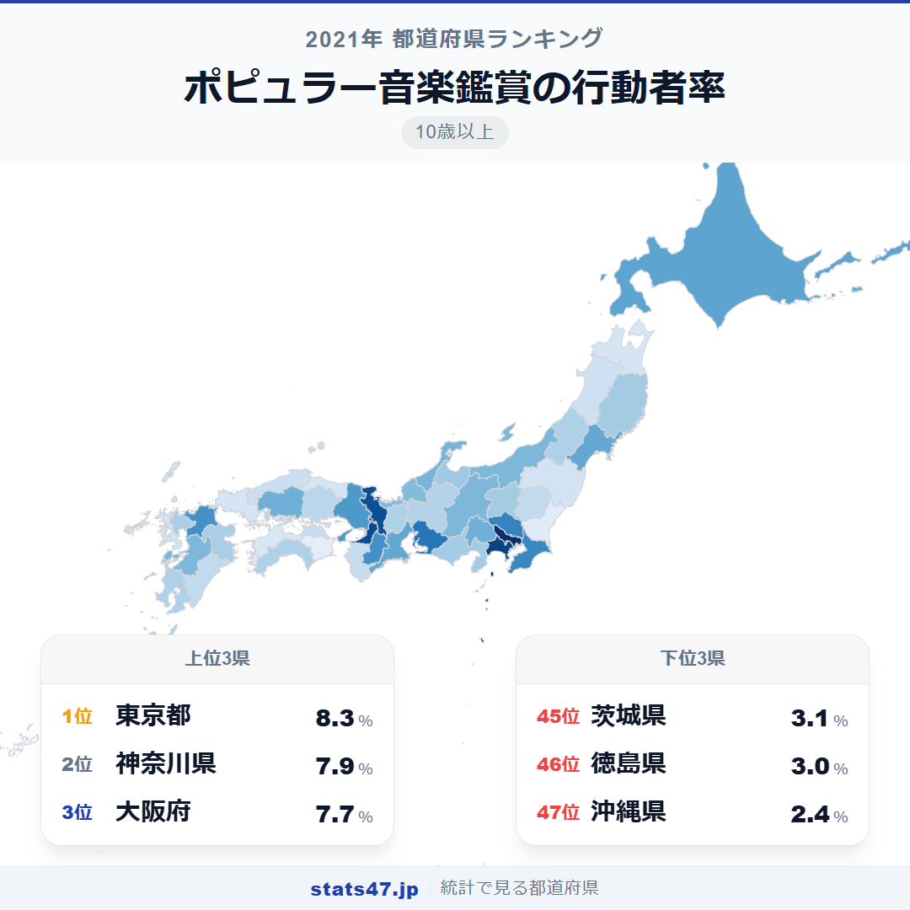
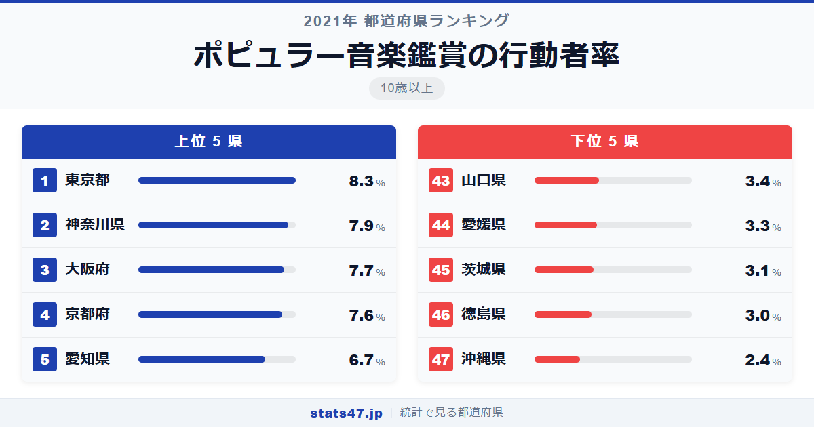
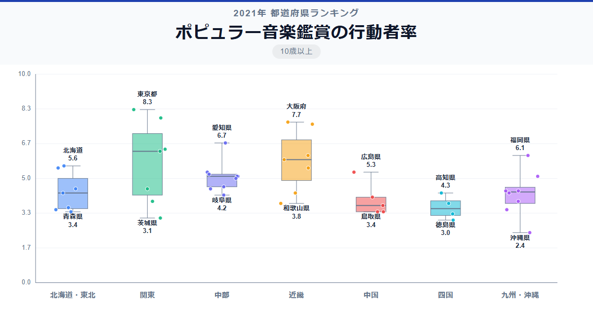

音楽の島・沖縄がまさかの最下位。ポピュラー音楽鑑賞の行動者率で沖縄県はわずか2.4％と、全国で最も低い値を記録しています。音楽が盛んなイメージとは正反対の結果です。

全国1位の東京都は偏差値75.9で8.3％。最下位の沖縄県は偏差値32.2で2.4％にとどまり、3.5倍の差があります。上位4県は東京・神奈川・大阪・京都と大都市圏が独占しており、ライブ会場の集積度がそのまま順位に直結しています。

「ポピュラー音楽鑑賞の行動者率」は、10歳以上の人口のうち過去1年間にポピュラー音楽のコンサートやライブに行った人の割合です。総務省の社会生活基本調査に基づくデータで、会場での鑑賞を対象としています。

## データハイライト

全国平均: 4.80％

1位: 東京都（8.3％ / 偏差値 75.9）

47位: 沖縄県（2.4％ / 偏差値 32.2）

全国平均は4.80％と、約21人に1人の割合。2021年はコロナ禍の影響でライブ・コンサートの開催が制限されていた時期であり、全体的に値が低めに出ています。それでも大都市圏と地方の差は歴然で、ライブ会場のある場所に行動者率が集中する構図は変わりません。

## 【コロプレス地図】日本全国の分布

<!-- note投稿時: この画像行を削除し、images/choropleth-map-1080x1080.png をアップロード -->

東京都・神奈川県・大阪府・京都府が濃い色で目立ち、ライブハウスやアリーナが集中する都市部が高い値を示しています。愛知県・福岡県も比較的濃く、全国ツアーで必ず組み込まれるエリアが上位に来ていることがわかります。

沖縄県が最も薄い色を示しているのは印象的です。独自の音楽文化が豊かな沖縄ですが、「ポピュラー音楽のコンサート」という文脈では、本土アーティストのツアーが回りにくい地理的条件が影響しています。

茨城県が45位の3.1％と首都圏でありながら低いのも注目すべき点です。東京への通勤圏でありながら、県内にライブ会場が少ないことが響いているようです。

## 上位5：分析

<!-- note投稿時: この画像行を削除し、images/chart-x-1200x630.png をアップロード -->

東京ドーム、日本武道館、Zepp。日本の音楽シーンの中心地である東京都は偏差値75.9で8.3％と、約12人に1人がライブに足を運んでいます。小さなライブハウスからアリーナクラスまで、毎日どこかでライブが行われている環境は東京ならではです。

2位の神奈川県は偏差値72.9の7.9％です。横浜アリーナやKアリーナ横浜など大規模会場が充実し、東京のライブにも通いやすい好立地が強みになっています。

大阪府が偏差値71.4で7.7％の3位。大阪城ホールやZepp Osaka Baysideなど、西日本の音楽シーンの中心として機能しています。

4位は京都府で偏差値70.7の7.6％。ロームシアター京都をはじめとするホールに加え、大阪のライブ会場にも30分ほどでアクセスできる地の利があります。大阪とほぼ同率なのは注目に値するでしょう。

愛知県が偏差値64.0の6.7％で5位に入りました。バンテリンドームナゴヤや日本ガイシホールなど、全国ツアーの主要会場を擁しています。

## 下位5：分析

音楽文化が豊かなイメージの沖縄県ですが、偏差値32.2の2.4％で全国最下位。この統計は会場でのコンサート鑑賞を対象としており、地元のライブハウスで沖縄民謡やロックを楽しむ文化とは測定対象が異なります。本土アーティストのツアーが地理的に回りにくいことが大きく影響しています。

46位の徳島県は偏差値36.7で3.0％。大規模なコンサートホールが少なく、ライブを観るには大阪や神戸まで遠征する必要がある地域です。

45位は茨城県で偏差値37.4の3.1％。首都圏に属しながらこの低さは意外ですが、県内の大規模ライブ会場の不足が影響しています。東京に近い分、わざわざ県内では観ないという事情もあるかもしれません。

愛媛県が偏差値38.9の3.3％で44位。松山市にはライブハウスがあるものの、四国全体としてツアーの巡回が限られていることが行動者率を抑えています。

山口県も偏差値39.6で3.4％の43位。広島や福岡という大規模会場のある都市に挟まれ、山口県自体でのライブ開催が少ないことが背景にあります。

## 地域別の傾向

<!-- note投稿時: この画像行を削除し、images/boxplot-1200x630.png をアップロード -->

関東と近畿が高く、四国と中国地方が低い傾向です。九州は福岡県が高い一方で他県は低めと、域内格差が大きい地域となっています。

## まとめ

ポピュラー音楽鑑賞の行動者率は、ライブ会場の立地とツアールートに強く規定されています。このデータから以下の洞察が得られます。

**「ライブ会場がある場所」にファンが集まる構造**

東京・大阪・名古屋・福岡の4大都市圏が上位を占めるのは、全国ツアーのルートがこれらの都市を中心に組まれているためです。
会場がなければ公演が来ず、公演がなければ行動者率は上がらないという循環構造があります。

**沖縄県最下位の裏にある「統計の定義」**

沖縄県の音楽文化の豊かさは疑いようがありませんが、この統計はポピュラー音楽の「コンサート鑑賞」を対象としています。
沖縄の音楽体験は居酒屋やライブバーなど、統計に拾われにくい形態で楽しまれている面があります。

**コロナ禍が全体の行動者率を押し下げた2021年の特殊性**

全国平均4.80％は通常時より低い値で、2021年はライブ・コンサートの開催制限が続いていた時期です。
地方ほど代替手段が少なく、オンラインライブへの移行が進まなかった地域の影響が大きく出ています。

## もっと詳しく知りたい方へ

全47都道府県の順位や、グラフ・地図での可視化は stats47 で見ることができます。

### ポピュラー音楽鑑賞の行動者率ランキング 全都道府県版

https://stats47.jp/ranking/hobby-participation-rate-popular-music

### クラシック音楽鑑賞の行動者率ランキング

https://stats47.jp/ranking/hobby-participation-rate-classical-music

### CD・スマートフォンなどによる音楽鑑賞の行動者率ランキング

https://stats47.jp/ranking/hobby-participation-rate-music-listening

### 楽器の演奏の行動者率ランキング

https://stats47.jp/ranking/hobby-participation-rate-instrument

### カラオケの行動者率ランキング

https://stats47.jp/ranking/hobby-participation-rate-karaoke

### 邦楽の行動者率ランキング

https://stats47.jp/ranking/hobby-participation-rate-japanese-music

---

**stats47** は、e-Stat の公的統計データを47都道府県別に可視化するサービスです。
ランキング・散布図・時系列チャートで、地域の違いがひと目でわかります。

https://stats47.jp
