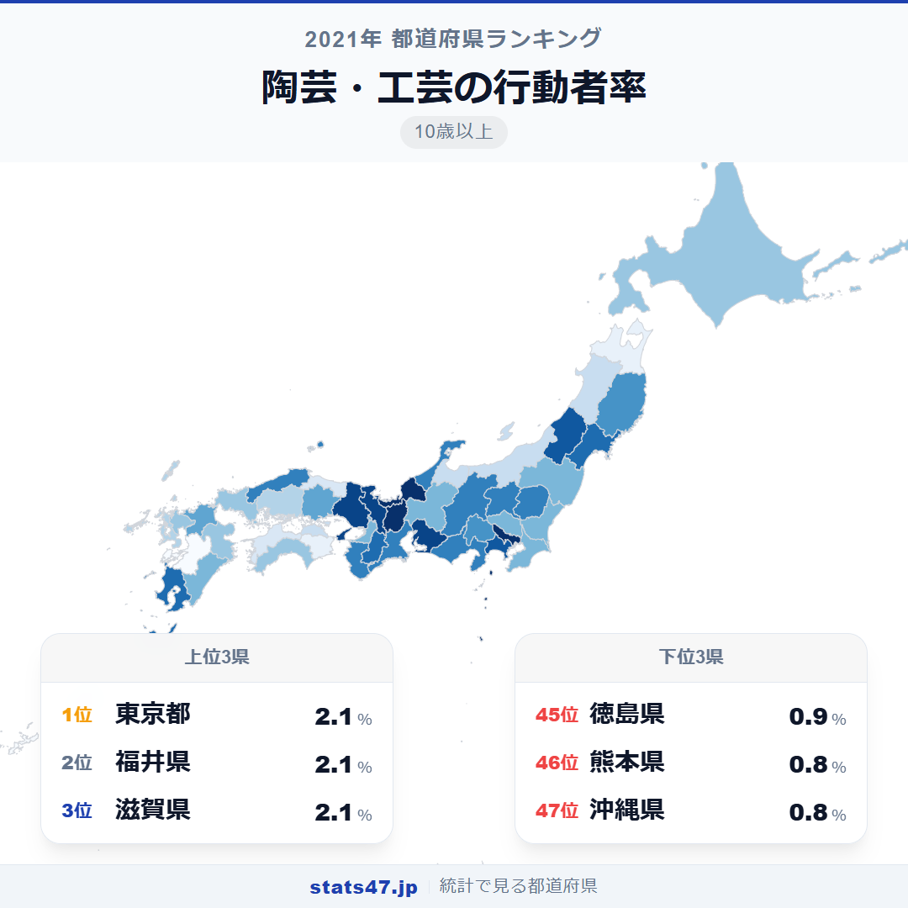
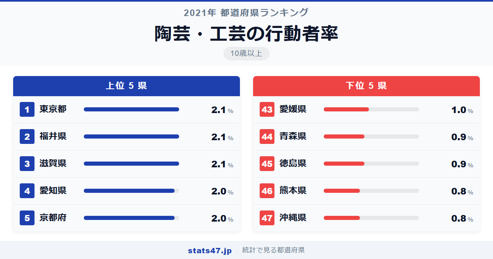
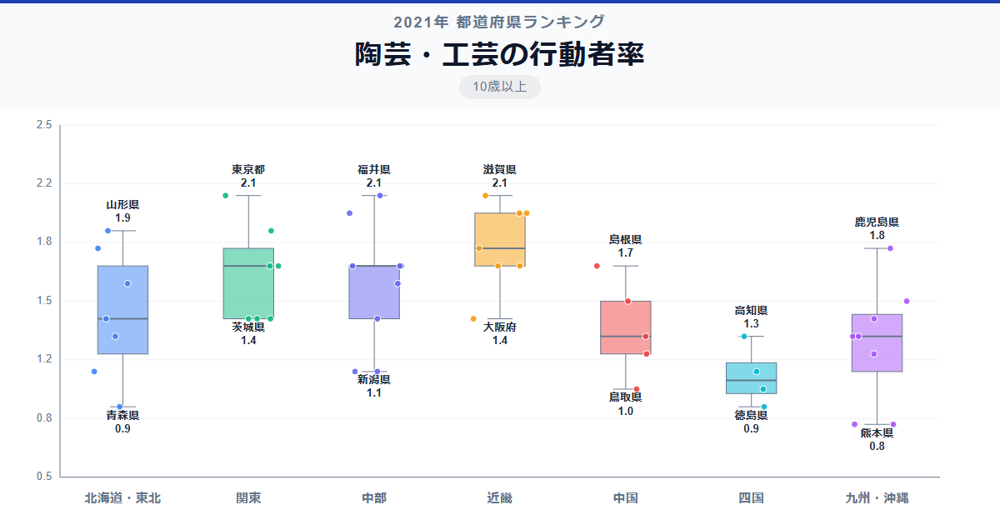

陶芸体験ができる窯元は各地にありますが、日常的に陶芸や工芸に取り組む人が最も多いのはどこか。東京都・福井県・滋賀県が三つ巴で1位に並んでいます。

総務省「社会生活基本調査」（2021年）によると、3県はいずれも行動者率2.1％で偏差値67.2。全国平均1.49％を大きく上回ります。最下位は沖縄県と熊本県で0.8％、偏差値30.9。1位と最下位の差は2.6倍です。

焼き物の産地として名高い県が上位に入る一方で、有田焼の佐賀県は34位、瀬戸焼の地元・愛知県は4位。産地の知名度と行動者率は必ずしも一致しないのが面白い点です。

「陶芸・工芸の行動者率」は、過去1年間に陶芸や工芸を行った人の割合を10歳以上人口に対して算出した指標です。総務省が5年ごとに実施する社会生活基本調査のデータに基づいています。

## データハイライト

全国平均: 1.49％

1位: 東京都（2.1％ / 偏差値 67.2）

47位: 沖縄県（0.8％ / 偏差値 30.9）

行動者率そのものは1.5％前後と低い指標ですが、北陸・東海・近畿に高い県が集まり、九州南部が低い傾向が見られます。焼き物文化の歴史が深い地域ほど行動者率が高い傾向です。

## 【コロプレス地図】日本全国の分布

<!-- note投稿時: この画像行を削除し、images/choropleth-map-1080x1080.png をアップロード -->

地図を見ると、北陸から東海・近畿にかけて濃い色が広がっています。福井・滋賀・愛知・京都と、焼き物の産地や工芸文化が盛んな地域が並んでいるのが印象的です。

東京都が1位なのは陶芸教室の数の多さが背景にあります。「つくる体験」としての陶芸が都市のカルチャーとして定着していることが見て取れます。

一方、九州は熊本・沖縄が最下位圏に沈んでいます。有田焼の佐賀県は1.3％で34位と、産地のブランド力が必ずしも県民の行動者率には結びついていません。

## 上位5：分析

<!-- note投稿時: この画像行を削除し、images/chart-x-1200x630.png をアップロード -->

越前焼の産地として700年以上の歴史を持つ福井県が、偏差値67.2で2.1％の1位タイです。越前和紙や若狭塗など多彩な工芸品があり、県民にとって「ものづくり」は身近な文化活動です。

信楽焼で知られる滋賀県も2.1％で偏差値67.2。信楽町にはたぬきの置物で有名な窯元が集積し、陶芸体験ができる施設が充実しています。琵琶湖畔の自然の中で土に触れる暮らしが根づいています。

東京都も2.1％で偏差値67.2の同率1位。こちらは窯元よりも都市型の陶芸教室が中心です。仕事帰りに通えるスタジオや週末の体験教室など、「つくる楽しみ」を手軽に味わえる環境が整っています。

4位の愛知県は2.0％で偏差値64.4。瀬戸焼や常滑焼の産地として、焼き物文化が日常に溶け込んでいます。窯業の伝統が県民の工芸活動を支えています。

京都府も2.0％で偏差値64.4。清水焼に代表される京焼の伝統に加え、工芸品の制作を学べる場が数多く存在します。古都の美意識がものづくりへの参加意欲を高めています。

## 下位5：分析

沖縄県と熊本県が0.8％で偏差値30.9の最下位を分け合いました。沖縄にはやちむんという独自の陶器文化がありますが、社会生活基本調査の「陶芸・工芸」の枠組みでは行動者率が低く出ています。熊本は焼き物産地としての知名度は高くなく、工芸活動の基盤が相対的に薄い地域です。

45位の徳島県は0.9％で偏差値33.7。大谷焼という伝統窯業がありますが、県全体の参加者は限定的です。

同じ0.9％で青森県も偏差値33.7。津軽焼や八戸焼などの伝統はあるものの、窯元の数が少なく、日常的に陶芸に触れる機会が限られています。

43位の愛媛県は1.0％で偏差値36.5。砥部焼の産地ですが、県民全体の行動者率は全国平均を下回っています。産地のある町とそれ以外の地域で参加率に大きな差がある可能性があります。

## 地域別の傾向

<!-- note投稿時: この画像行を削除し、images/boxplot-1200x630.png をアップロード -->

北陸と東海・近畿が高く、九州が低い傾向です。伝統的な窯業の集積地が含まれる地域ほど行動者率が高い、わかりやすいパターンです。

## まとめ

陶芸・工芸の行動者率は、ものづくり文化の地域的な厚みを映す指標です。このデータから以下の洞察が得られます。

**産地の知名度と行動者率は一致しない**

有田焼の佐賀県は34位、備前焼の岡山県は22位。産地のブランド力が高くても県民全体の行動者率が高いとは限りません。
窯元が点在する一部の町と、県全体の参加率は別の話です。

**北陸・東海の工芸文化の厚み**

福井1位、愛知4位、京都5位と、伝統工芸が盛んな地域が上位に並びます。
越前焼・瀬戸焼・清水焼と、焼き物の歴史が県民の日常にまで浸透している地域です。

**東京の1位は「体験としての陶芸」の浸透**

東京の1位は窯元ではなく陶芸教室の充実によるもの。
「つくる体験」としての陶芸が都市のライフスタイルに組み込まれていることを示しています。

## もっと詳しく知りたい方へ

全47都道府県の順位や、グラフ・地図での可視化は stats47 で見ることができます。

### 陶芸・工芸の行動者率ランキング 全都道府県版

https://stats47.jp/ranking/hobby-participation-rate-pottery

### 絵画・彫刻の制作の行動者率ランキング

https://stats47.jp/ranking/hobby-participation-rate-painting

### 書道の行動者率ランキング

https://stats47.jp/ranking/hobby-participation-rate-calligraphy

### 華道の行動者率ランキング

https://stats47.jp/ranking/hobby-participation-rate-flower-arrangement

### 写真の撮影・プリントの行動者率ランキング

https://stats47.jp/ranking/hobby-participation-rate-photography

### 美術鑑賞の行動者率ランキング

https://stats47.jp/ranking/hobby-participation-rate-art-appreciation

---

**stats47** は、e-Stat の公的統計データを47都道府県別に可視化するサービスです。
ランキング・散布図・時系列チャートで、地域の違いがひと目でわかります。

https://stats47.jp
