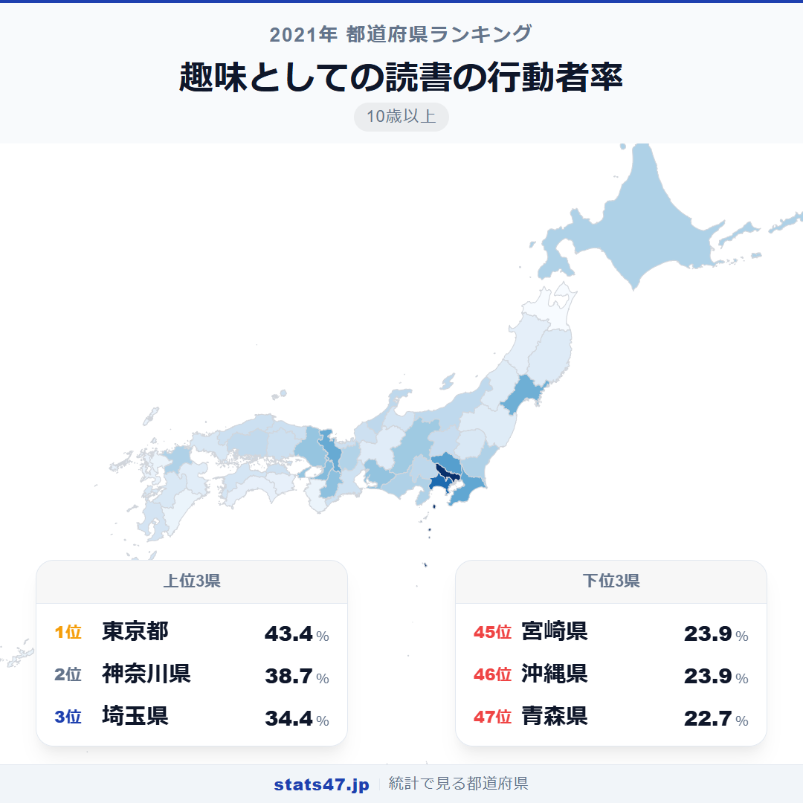
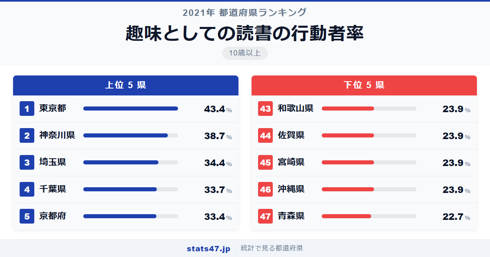
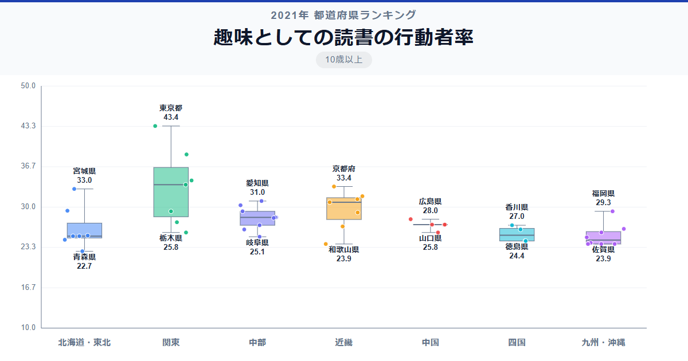

東京都民の約4割が趣味で本を読んでいます。一方、青森県では約2割。住む場所によって読書習慣にここまで差があるのは驚きです。全国1位の東京都は43.4％で偏差値88.4。最下位の青森県は22.7％で偏差値36.6。1位と47位の差は約1.9倍に達します。

上位は首都圏が独占していますが、6位に宮城県が入るなど、必ずしも人口規模だけでは決まりません。

「趣味としての読書の行動者率」は、過去1年間に趣味として読書を行った10歳以上の人の割合です。総務省「社会生活基本調査」（2021年）のデータに基づいています。

## データハイライト

全国平均: 28.06％

1位: 東京都（43.4％ / 偏差値 88.4）

47位: 青森県（22.7％ / 偏差値 36.6）

上位10県はすべて三大都市圏またはその周辺県で占められています。下位には東北・四国・九州の県が集中し、書店やライブラリーの数が影響していそうです。

## 【コロプレス地図】日本全国の分布

<!-- note投稿時: この画像行を削除し、images/choropleth-map-1080x1080.png をアップロード -->

地図を眺めると、首都圏を中心に関東一帯が濃い色に染まっているのが一目瞭然です。京都・大阪・兵庫の近畿圏、愛知の東海圏もはっきりと高い数値を示しています。

東北地方は全体的に薄く、青森の22.7％を筆頭に25％前後の県が並びます。秋田・山形・福島も25％台で、冬季の通勤・通学時間の短さが「電車読書」の機会を減らしている面もあるかもしれません。

長野県が11位の30.3％と健闘しています。図書館数の多さや文化的な意識の高さが、地方でありながら上位に食い込む理由でしょう。

## 上位5：分析

<!-- note投稿時: この画像行を削除し、images/chart-x-1200x630.png をアップロード -->

書店数、図書館数ともに全国最多の東京都は偏差値88.4の43.4％で圧倒的な1位。電車通勤の長さも読書時間を確保する一因で、出版文化の中心地ならではの環境です。

神奈川県が偏差値76.6で38.7％の2位に続きます。東京のベッドタウンとして通勤時間が長く、電車の中で本を開く習慣が定着しやすい地域といえます。

3位の埼玉県は偏差値65.9の34.4％。神奈川と同じく東京への通勤圏で、大型書店やブックカフェも増えている地域です。

千葉県は偏差値64.1で33.7％の4位。首都圏の一角として、東京・神奈川・埼玉と同様のパターンが見られます。

5位の京都府は偏差値63.4で33.4％を記録しました。大学が多く学生人口の比率が高いことが、読書率を押し上げている大きな要因です。

## 下位5：分析

最下位の青森県は22.7％で偏差値36.6。車社会で電車読書の機会が少なく、書店数も限られています。冬場の外出控えが図書館利用にもつながりにくい環境です。

沖縄県と宮崎県はともに23.9％で偏差値39.6。沖縄は独自の文化的背景を持ちますが、趣味としての読書という指標では低い結果に。宮崎も車中心の生活スタイルが影響していると考えられます。

佐賀県も23.9％で同率45位。和歌山県も同じ23.9％で43位タイに入り、地方の中小都市で読書率が伸びにくい構造がうかがえます。

## 地域別の傾向

<!-- note投稿時: この画像行を削除し、images/boxplot-1200x630.png をアップロード -->

関東が突出して高く、近畿・東海が続きます。東北と九州がやや低めで、北海道・中国・四国は中程度に位置しています。

## まとめ

趣味としての読書の行動者率は、都市インフラと通勤スタイルを映す鏡のような指標です。このデータから以下の洞察が得られます。

**首都圏の「電車読書文化」が数値を押し上げている**

上位4県はすべて首都圏。長い通勤時間が読書の機会を生み出しています。
車通勤中心の地域との差は、ライフスタイルの違いそのものです。

**京都・宮城など大学都市の健闘**

学生人口の多さが読書率を底上げしています。
宮城は東北唯一の上位10入りで、仙台の都市機能が反映されています。

**地方の読書離れは書店減少と連動している可能性**

下位の県は書店数が少なく、車社会で移動中の読書機会も限られます。
デジタル化や図書館サービスの充実が、この格差を縮める鍵になるかもしれません。

## もっと詳しく知りたい方へ

全47都道府県の順位や、グラフ・地図での可視化は stats47 で見ることができます。

### 趣味としての読書の行動者率ランキング 全都道府県版

https://stats47.jp/ranking/hobby-participation-rate-reading

### マンガを読む行動者率ランキング

https://stats47.jp/ranking/hobby-participation-rate-manga

### 詩・和歌・俳句・小説などの創作の行動者率ランキング

https://stats47.jp/ranking/hobby-participation-rate-writing

### 映画館での映画鑑賞の行動者率ランキング

https://stats47.jp/ranking/hobby-participation-rate-cinema

### 映画館以外での映画鑑賞の行動者率ランキング

https://stats47.jp/ranking/hobby-participation-rate-home-movie

### 図書館蔵書数ランキング

https://stats47.jp/ranking/library-books

---

**stats47** は、e-Stat の公的統計データを47都道府県別に可視化するサービスです。
ランキング・散布図・時系列チャートで、地域の違いがひと目でわかります。

https://stats47.jp
