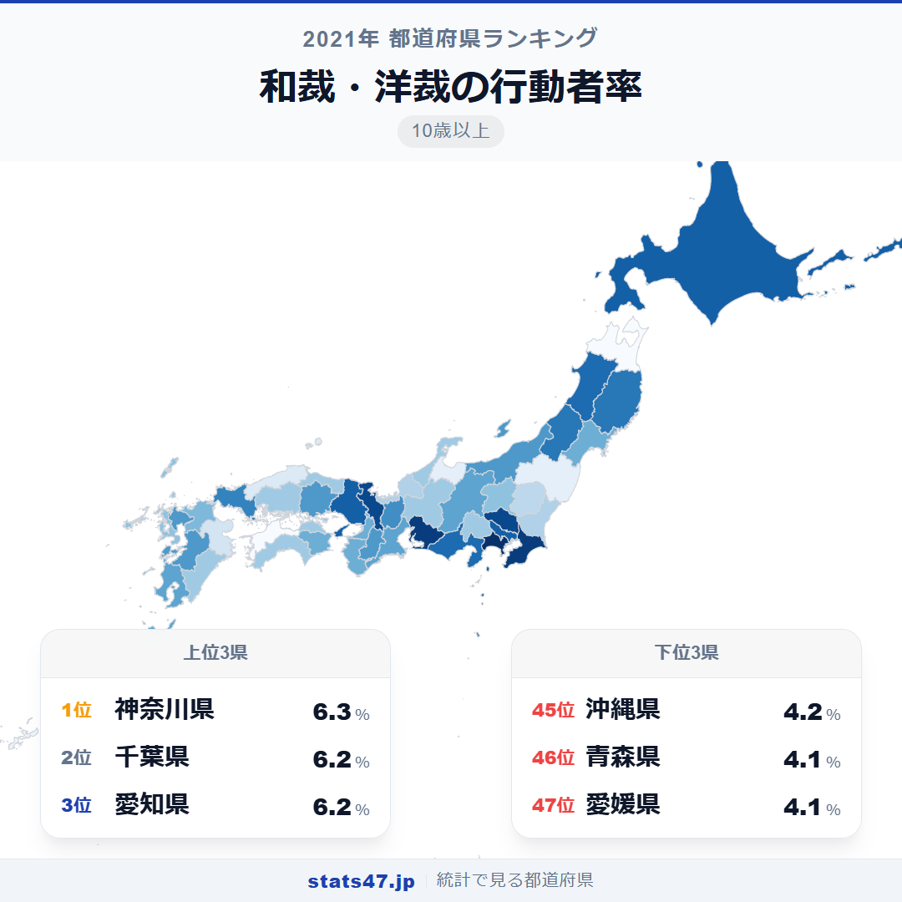
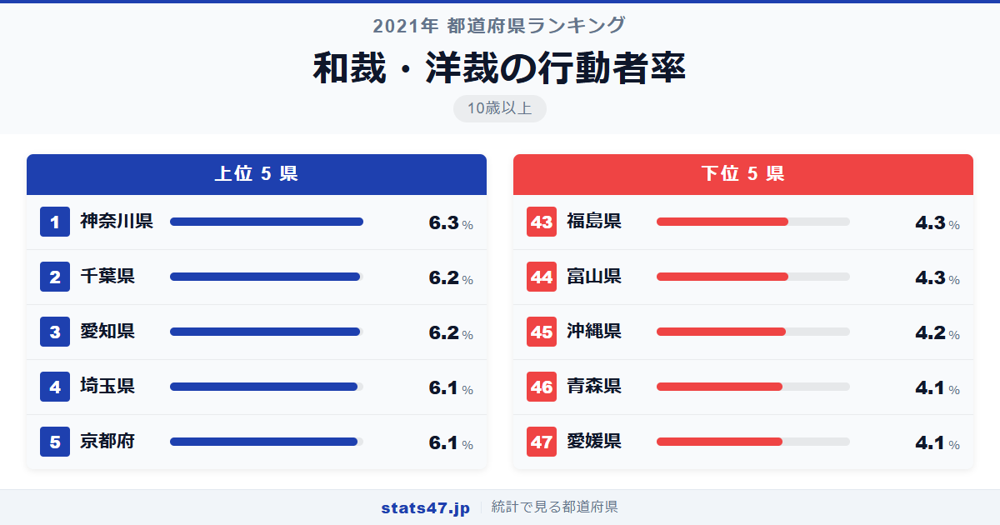
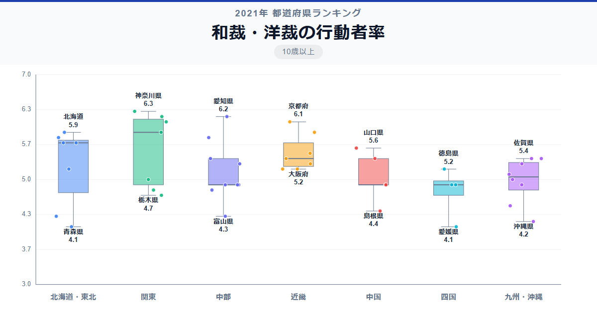

ミシンや針を手に取る人が最も多い県は神奈川県。東京ではなく、隣の神奈川が全国1位です。

総務省「社会生活基本調査」（2021年）によると、神奈川県の和裁・洋裁の行動者率は6.3％で偏差値68.9。全国平均5.21％を1ポイント以上上回っています。最下位の愛媛県と青森県は4.1％で偏差値30.7。1位と最下位の差は1.5倍と、趣味系ランキングの中では比較的小さい部類です。

手芸ブームやハンドメイド市場の拡大で注目される裁縫ですが、県ごとの差はどんな背景から生まれているのでしょうか。

「和裁・洋裁の行動者率」は、過去1年間に和裁や洋裁を行った人の割合を10歳以上人口に対して算出した指標です。総務省が5年ごとに実施する社会生活基本調査のデータに基づいています。

## データハイライト

全国平均: 5.21％

1位: 神奈川県（6.3％ / 偏差値 68.9）

47位: 愛媛県（4.1％ / 偏差値 30.7）

格差は1.5倍と小さいですが、首都圏・東海・近畿が高く、東北や一部地方が低い傾向が見られます。全国的に5％前後の行動者率で、20人に1人が裁縫を楽しんでいる計算です。

## 【コロプレス地図】日本全国の分布

<!-- note投稿時: この画像行を削除し、images/choropleth-map-1080x1080.png をアップロード -->

地図を見ると、首都圏と東海地方が濃い色で目立ちます。神奈川・千葉・埼玉・愛知と、人口の多い大都市近郊が上位に並んでいるのが特徴的です。

興味深いのは、東北の秋田県と岩手県が上位に入っている点です。9位の秋田県は5.8％、11位の岩手県は5.7％。冬の長い地域で室内の手仕事として裁縫が続けられてきた伝統が、数値に表れているようです。

一方、愛媛県が最下位なのは四国の中でも特異な結果です。同じ四国でも香川県は4.9％で35位と差があります。

## 上位5：分析

<!-- note投稿時: この画像行を削除し、images/chart-x-1200x630.png をアップロード -->

手芸用品店やファブリックショップが充実する神奈川県が、偏差値68.9で6.3％の1位です。横浜を中心に洋裁教室やハンドメイドのワークショップが盛んで、素材の入手しやすさが行動を後押ししています。

千葉県は6.2％で偏差値67.2。ショッピングモール内の手芸専門店が多く、買い物のついでに生地や材料を調達できる環境が整っています。

同率2位の愛知県も6.2％で偏差値67.2。名古屋の大須には手芸材料の専門店が集まるエリアがあり、中部地方における裁縫文化の中心地として機能しています。

4位は埼玉県と京都府で6.1％、偏差値65.5。埼玉は首都圏のベッドタウンとして手芸店へのアクセスが良好です。京都は和裁の伝統が息づく古都であり、着物文化との結びつきが洋裁とはまた違った裁縫人口を支えています。

京都府が埼玉県と並んで4位に入ったのは、西陣織をはじめとする繊維産業の伝統が背景にあります。布に触れる機会が多い土地柄が、趣味としての裁縫にもつながっています。

## 下位5：分析

最下位の愛媛県は4.1％で偏差値30.7。四国の中でも最も低く、県内の手芸用品店の少なさが裁縫の始めにくさにつながっている可能性があります。

同率最下位の青森県も4.1％で偏差値30.7。東北の中では秋田・岩手が上位にいるのと対照的です。青森は冬の期間が特に長く厳しいですが、裁縫以外の室内活動に時間が向いているのかもしれません。

45位の沖縄県は4.2％で偏差値32.4。温暖な気候のもとで防寒着を縫う必要がなく、衣服のリメイクや手作りの動機が相対的に弱いことが影響していそうです。

44位の富山県は4.3％で偏差値34.2。北陸3県の中では石川が4.9％、福井が4.8％なのに対し、富山だけが低水準に沈んでいます。

福島県も4.3％で偏差値34.2。東北の中では秋田・岩手・山形と比べて低く、県内の裁縫文化の温度差が見えてきます。

## 地域別の傾向

<!-- note投稿時: この画像行を削除し、images/boxplot-1200x630.png をアップロード -->

関東と東海・近畿が高く、四国と東北の一部が低い傾向です。ただし東北では秋田・岩手が上位に入るなど、地域内のばらつきが大きいのも特徴です。

## まとめ

和裁・洋裁の行動者率は、手仕事の文化と暮らしの環境を映しています。このデータから以下の洞察が得られます。

**手芸用品店のアクセスが行動を左右する**

上位の神奈川・千葉・愛知は、いずれも手芸用品店や生地屋が充実した地域です。
材料が身近に手に入る環境は、裁縫を始める最初の一歩を後押しします。

**冬の長い東北で裁縫が盛んな理由**

秋田県9位、岩手県11位と東北勢が健闘しています。
雪に閉ざされる冬の室内で、実用を兼ねた裁縫が暮らしの一部として定着してきた歴史があります。

**格差1.5倍は趣味系では小さい部類**

1位と最下位の差が1.5倍にとどまるのは、裁縫が地域を問わず広く行われている証拠です。
教室に通う趣味よりも、自宅でひとりで始められる手軽さが全国的な普及を支えています。

## もっと詳しく知りたい方へ

全47都道府県の順位や、グラフ・地図での可視化は stats47 で見ることができます。

### 和裁・洋裁の行動者率ランキング 全都道府県版

https://stats47.jp/ranking/hobby-participation-rate-sewing

### 編み物・手芸の行動者率ランキング

https://stats47.jp/ranking/hobby-participation-rate-knitting

### 趣味としての料理・菓子作りの行動者率ランキング

https://stats47.jp/ranking/hobby-participation-rate-cooking

### 園芸・庭いじり・ガーデニングの行動者率ランキング

https://stats47.jp/ranking/hobby-participation-rate-gardening

### 絵画・彫刻の制作の行動者率ランキング

https://stats47.jp/ranking/hobby-participation-rate-painting

### 陶芸・工芸の行動者率ランキング

https://stats47.jp/ranking/hobby-participation-rate-pottery

---

**stats47** は、e-Stat の公的統計データを47都道府県別に可視化するサービスです。
ランキング・散布図・時系列チャートで、地域の違いがひと目でわかります。

https://stats47.jp
