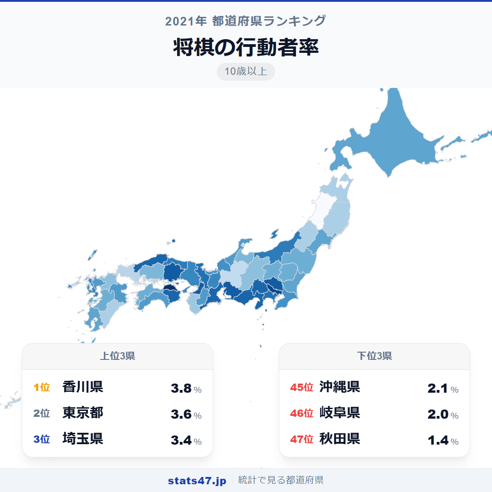
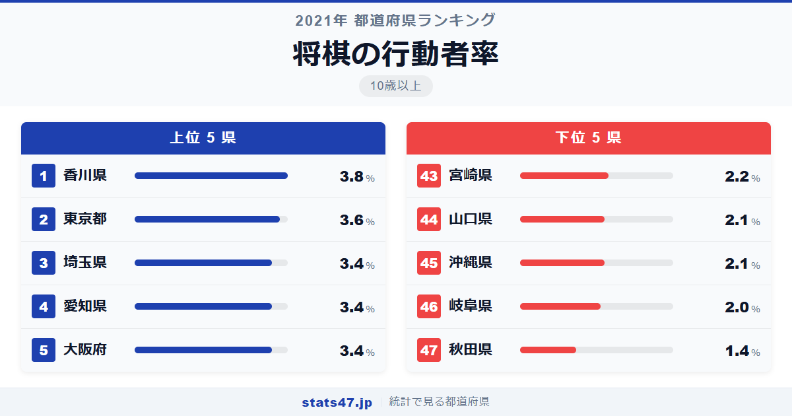
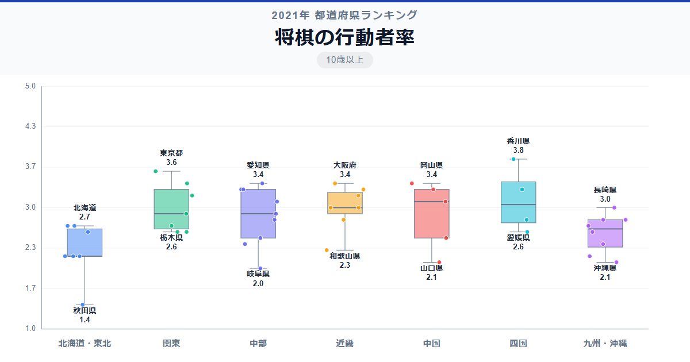

藤井聡太ブームで注目を集める将棋。全国で最も将棋を指す人が多い県は、意外にも香川県です。全国1位の香川県は3.8％で偏差値70.9、2位の東京都は3.6％で偏差値66.7。一方、最下位の秋田県はわずか1.4％で偏差値21.2と、将棋人口の地域差は約2.7倍に達します。

全国平均は2.79％。100人中3人弱という小さな世界ですが、なぜ香川県がトップに立つのでしょうか。

「将棋の行動者率」は、過去1年間に将棋を行った10歳以上の人の割合です。総務省「社会生活基本調査」（2021年）のデータに基づいています。

## データハイライト

全国平均: 2.79％

1位: 香川県（3.8％ / 偏差値 70.9）

47位: 秋田県（1.4％ / 偏差値 21.2）

大都市圏が上位に並ぶ中で香川県がトップに立ったのが最大の注目ポイントです。下位は東北地方と一部の中国・九州地方に集中しています。

## 【コロプレス地図】日本全国の分布

<!-- note投稿時: この画像行を削除し、images/choropleth-map-1080x1080.png をアップロード -->

地図で見ると、四国の香川県が鮮やかに目立ちます。東京・埼玉・愛知・大阪といった大都市圏も高い値を示していますが、岡山・島根・三重・徳島など中規模の県も3.3％以上を記録しているのが特徴的です。

東北地方は全体的に低く、秋田県の1.4％が際立って低い水準です。山形・岩手・青森も2.2％にとどまり、将棋文化の浸透度に地域差があることがわかります。

九州では宮崎が2.2％で低い一方、長崎・佐賀は3.0％前後と差があり、一様ではありません。

## 上位5：分析

<!-- note投稿時: この画像行を削除し、images/chart-x-1200x630.png をアップロード -->

小豆島の大石天狗堂をはじめ、将棋駒の文化と縁の深い香川県が偏差値70.9の3.8％で全国の頂点に。人口規模では小さくても、地域の将棋教室やサークル活動が盛んな土地柄です。

東京都は偏差値66.7で3.6％の2位。将棋会館があり、プロ棋士のイベントやアマチュア大会へのアクセスが容易な環境が、裾野の広さにつながっています。

3位タイの埼玉県は偏差値62.6で3.4％。首都圏のベッドタウンとして、将棋道場や教室が数多く存在します。

同率3位の愛知県も偏差値62.6の3.4％を記録しました。藤井聡太棋士の出身地・瀬戸市を擁する愛知県は、近年の将棋ブームの中心地ともいえる存在です。

大阪府が同じく偏差値62.6の3.4％で5位タイ。関西将棋会館がある大阪は、西日本の将棋文化の拠点としての地位を保っています。

## 下位5：分析

秋田県は1.4％で偏差値21.2と、47位で突出して低い数値です。他の下位県が2.0〜2.2％の中で唯一1％台にとどまっており、将棋人口の少なさが際立ちます。

岐阜県が偏差値33.6の2.0％で46位。隣県の愛知が3.4％と高いだけに、県境を越えた違いが興味深い結果です。

45位タイの沖縄県は偏差値35.7で2.1％。将棋よりも囲碁や他のレクリエーションが好まれる地域的な嗜好が影響しているかもしれません。

山口県も2.1％で偏差値35.7の同率45位。中国地方の中では岡山が3.4％と高いのに対し、山口は低い水準にとどまっています。

宮崎県は偏差値37.8で2.2％の43位。九州南部で将棋の浸透度がやや低い傾向がうかがえます。

## 地域別の傾向

<!-- note投稿時: この画像行を削除し、images/boxplot-1200x630.png をアップロード -->

関東と四国が高く、東北が低い傾向です。近畿・中国地方は県によるばらつきが大きく、地域内の差が目立ちます。

## まとめ

将棋の行動者率は、大都市圏の優位とともに、地方の文化的伝統が反映される興味深い指標です。このデータから以下の洞察が得られます。

**香川県1位は地域文化の力**

人口約95万人の小さな県が全国トップ。
将棋駒の文化や地域の教室・サークル活動が、大都市にも負けない行動者率を生み出しています。

**藤井効果を感じさせる愛知県の存在**

藤井聡太棋士の地元・愛知県が3位タイ。
プロ棋士の活躍が地域の将棋人口を増やす好循環が生まれている可能性があります。

**秋田県の突出した低さが示す課題**

秋田県は1.4％で2位以下に大差をつけての最下位。
高齢化と人口減少が進む地域で、将棋のような文化活動の維持が課題になっています。

## もっと詳しく知りたい方へ

全47都道府県の順位や、グラフ・地図での可視化は stats47 で見ることができます。

### 将棋の行動者率ランキング 全都道府県版

https://stats47.jp/ranking/hobby-participation-rate-shogi

### 囲碁の行動者率ランキング

https://stats47.jp/ranking/hobby-participation-rate-go

### ゲームの行動者率ランキング

https://stats47.jp/ranking/hobby-participation-rate-video-games

### 趣味としての読書の行動者率ランキング

https://stats47.jp/ranking/hobby-participation-rate-reading

### マンガを読む行動者率ランキング

https://stats47.jp/ranking/hobby-participation-rate-manga

### パチンコの行動者率ランキング

https://stats47.jp/ranking/hobby-participation-rate-pachinko

---

**stats47** は、e-Stat の公的統計データを47都道府県別に可視化するサービスです。
ランキング・散布図・時系列チャートで、地域の違いがひと目でわかります。

https://stats47.jp
