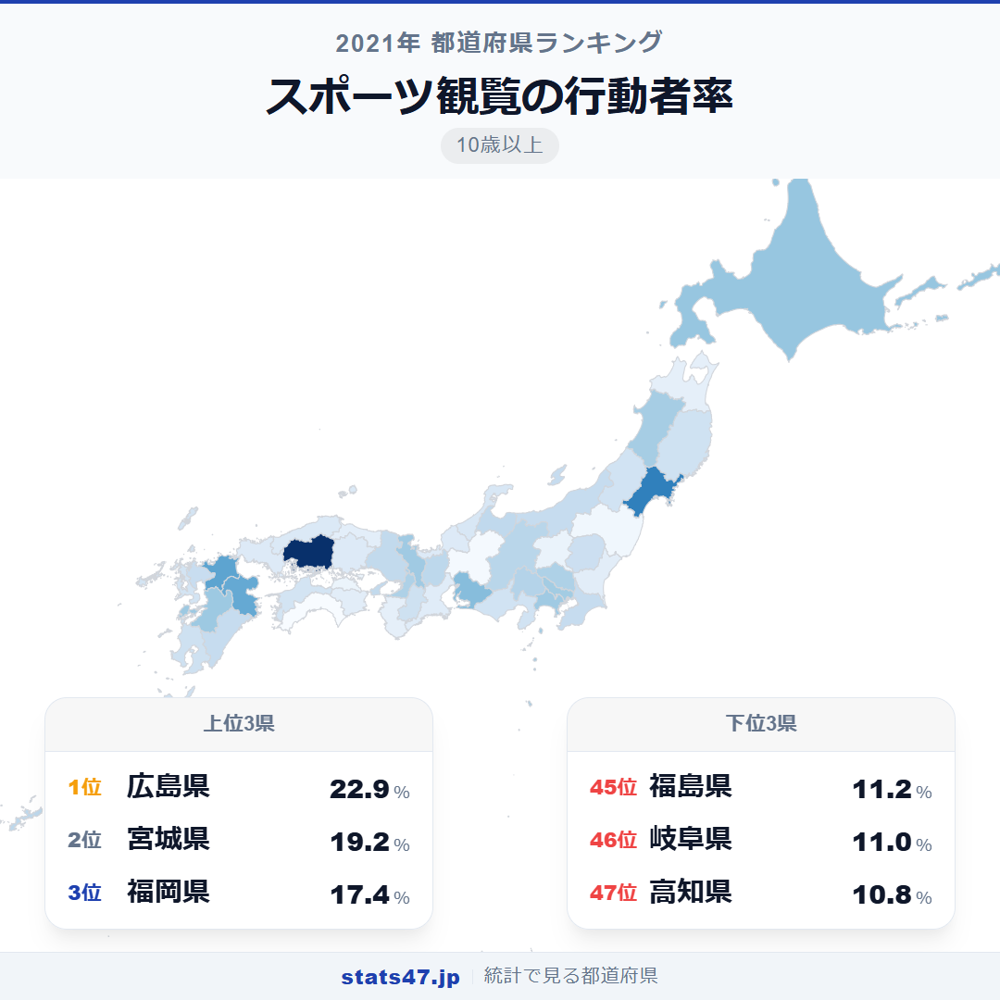
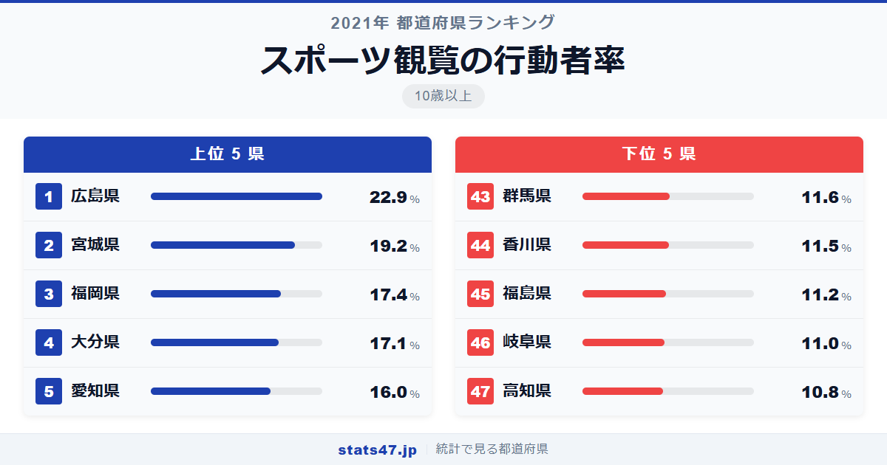
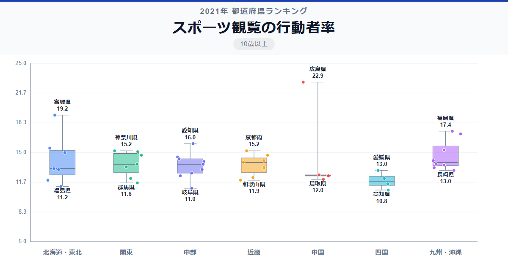

広島県民の5人に1人以上がスポーツを観に行っている。この数字は2位の宮城県を3.7ポイントも上回り、47都道府県で圧倒的な1位です。

全国1位の広島県は偏差値92.0で22.9％。最下位の高知県は偏差値36.1の10.8％にとどまり、その差は2.1倍にのぼります。東京都が10位の15.1％と意外に低く、プロスポーツチームの数だけでは説明できない結果となっています。

「スポーツ観覧の行動者率」は、10歳以上の人口のうち過去1年間にスポーツを会場で観覧した人の割合です。総務省の社会生活基本調査のデータで、テレビ観戦ではなく実際にスタジアムや体育館に足を運んだ人を対象としています。

## データハイライト

全国平均: 13.81％

1位: 広島県（22.9％ / 偏差値 92.0）

47位: 高知県（10.8％ / 偏差値 36.1）

全国平均は13.81％で、約7人に1人がスポーツ観覧を経験しています。広島県の偏差値92.0は他のランキングでもめったに見ない突出ぶりです。プロスポーツチームの人気と地域の一体感が如実に数字に表れています。

## 【コロプレス地図】日本全国の分布

<!-- note投稿時: この画像行を削除し、images/choropleth-map-1080x1080.png をアップロード -->

地図上で広島県が一際濃い色を放っています。次いで宮城県・福岡県・大分県が目立ち、プロスポーツチームの存在感と地域の応援文化がそのまま色の濃さに反映されています。

意外にも東京都は中程度の色合いです。プロチームの数は日本一でも、人口が多いぶん観覧率としては高くなりにくいのかもしれません。むしろ秋田県が11位の15.0％と健闘しており、バスケットボールのプロチームの人気がうかがえます。

北陸や中国地方（広島県を除く）は全体的に薄く、プロスポーツチームが少ない地域との対応が見て取れます。

## 上位5：分析

<!-- note投稿時: この画像行を削除し、images/chart-x-1200x630.png をアップロード -->

カープ愛に象徴される広島県のスポーツ熱は、数字でも圧倒的です。偏差値92.0で22.9％と、5人に1人以上がスタジアムに足を運んでいます。プロ野球の広島東洋カープとサッカーのサンフレッチェ広島という2大プロチームが、県全体の観戦文化を支えています。

2位の宮城県は偏差値74.9の19.2％。東北楽天ゴールデンイーグルスとベガルタ仙台の本拠地として、仙台市を中心にスポーツ観戦が日常に溶け込んでいる地域です。

福岡県が偏差値66.6の17.4％で3位に入りました。ソフトバンクホークスの圧倒的な人気に加え、アビスパ福岡やギラヴァンツ北九州など複数のプロチームが観覧の機会を生み出しています。

温泉とサッカーの街・大分県は偏差値65.2で17.1％の4位。大分トリニータの存在が県全体のスポーツ観覧率を押し上げており、人口規模に対して非常に高い値を記録しています。

5位は愛知県で偏差値60.1の16.0％。中日ドラゴンズや名古屋グランパスエイトなど、多彩なプロスポーツが観覧文化を底上げしています。

## 下位5：分析

プロスポーツチームの本拠地がない高知県は、偏差値36.1の10.8％で全国最下位です。社会人野球は盛んですが、プロの試合を観る機会が限られていることが数字に表れています。

46位の岐阜県は偏差値37.0で11.0％。FC岐阜があるものの、名古屋のプロチームに観客を奪われがちな地理的事情もあるでしょう。

福島県が偏差値37.9の11.2％で45位に入っています。広い県土に対してプロチームの拠点が限られ、スタジアムへのアクセスが課題となっている面があります。

44位は香川県で偏差値39.3の11.5％。カマタマーレ讃岐がありますが、四国全体としてプロスポーツの集客力がまだ発展途上の段階です。

群馬県は偏差値39.8で11.6％の43位。ザスパクサツ群馬などのクラブがあるものの、首都圏のプロチームに流れるファンも多い地域です。

## 地域別の傾向

<!-- note投稿時: この画像行を削除し、images/boxplot-1200x630.png をアップロード -->

九州・中国地方が高い傾向ですが、広島県が極端に引き上げている影響もあります。東北は宮城県と秋田県が高い一方で福島県が低く、域内のばらつきが大きい地域です。

## まとめ

スポーツ観覧の行動者率は、プロスポーツチームの存在と地域の応援文化を如実に反映しています。このデータから以下の洞察が得られます。

**広島県の突出は「街ぐるみの応援文化」の証**

偏差値92.0という圧倒的な数字は、単にチームがあるだけでは生まれません。
カープ女子に代表されるように、世代を超えてスポーツ観戦が生活の一部になっている文化が広島にはあります。

**東京都10位が示す「人口の多さ」の逆説**

プロチームの数は日本一の東京都ですが、行動者率では15.1％の10位にとどまっています。
娯楽の選択肢が多すぎることが、かえってスポーツ観覧の率を分散させているのかもしれません。

**プロチームの有無が地域の観覧率を決定づける**

下位県に共通するのは、プロスポーツチームの不在または集客力の弱さです。
チームの誘致や育成が、地域のスポーツ文化を変える鍵を握っています。

## もっと詳しく知りたい方へ

全47都道府県の順位や、グラフ・地図での可視化は stats47 で見ることができます。

### スポーツ観覧の行動者率ランキング 全都道府県版

https://stats47.jp/ranking/hobby-participation-rate-sports-spectating

### スポーツの年間行動者率ランキング

https://stats47.jp/ranking/sports-annual-participation-rate-10plus

### 野球の行動者率ランキング

https://stats47.jp/ranking/sports-participation-rate-baseball

### サッカーの行動者率ランキング

https://stats47.jp/ranking/sports-participation-rate-soccer

### バスケットボールの行動者率ランキング

https://stats47.jp/ranking/sports-participation-rate-basketball

### ゴルフの行動者率ランキング

https://stats47.jp/ranking/sports-participation-rate-golf

---

**stats47** は、e-Stat の公的統計データを47都道府県別に可視化するサービスです。
ランキング・散布図・時系列チャートで、地域の違いがひと目でわかります。

https://stats47.jp
