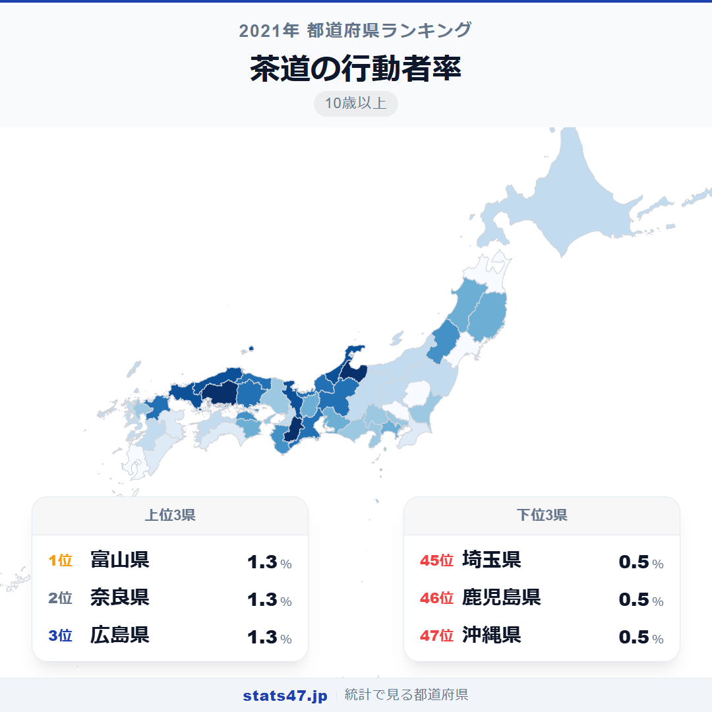
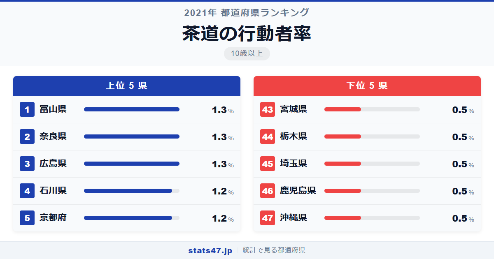
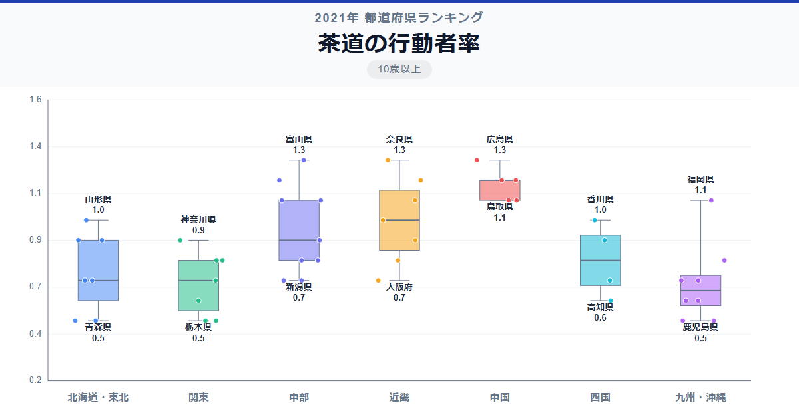

茶道の本場といえば京都。ところが行動者率で1位に立ったのは富山県です。

総務省「社会生活基本調査」（2021年）によると、富山県の茶道の行動者率は1.3％で偏差値68.4。同率1位の奈良県・広島県も1.3％です。京都府は1.2％で5位。最下位は沖縄県の0.5％で偏差値35.3、1位との差は2.6倍に達します。

なぜ京都ではなく北陸の富山なのか。茶道文化が根づく地域の条件を、データから探ってみましょう。

「茶道の行動者率」は、過去1年間に茶道を行った人の割合を10歳以上人口に対して算出した指標です。総務省が5年ごとに実施する社会生活基本調査のデータに基づいています。

## データハイライト

全国平均: 0.86％

1位: 富山県（1.3％ / 偏差値 68.4）

47位: 沖縄県（0.5％ / 偏差値 35.3）

行動者率は1％前後と低い指標ですが、北陸・近畿・中国地方に高い県が集中し、首都圏と東北が低い傾向がはっきりしています。偏差値の幅も比較的狭く、中間層に多くの県がひしめいています。

## 【コロプレス地図】日本全国の分布

<!-- note投稿時: この画像行を削除し、images/choropleth-map-1080x1080.png をアップロード -->

地図を見ると、北陸から近畿・中国地方にかけて濃い色が広がっています。富山・石川・福井の北陸3県がそろって上位に入り、京都・奈良の古都も高い水準です。

対照的に、東北は全般的に薄く、埼玉県が45位、栃木県が44位と首都圏の一部も低い水準に沈んでいます。人口の多い地域が必ずしも文化活動の行動者率で上位になるとは限らない好例です。

広島県の1位タイは意外に感じるかもしれません。広島には茶道の流派が根づいた歴史があり、公民館や文化施設での茶道教室が活発に行われています。

## 上位5：分析

<!-- note投稿時: この画像行を削除し、images/chart-x-1200x630.png をアップロード -->

加賀藩の文化が色濃く残る北陸から、富山県が偏差値68.4で1.3％のトップタイです。裏千家をはじめとする茶道の流派が北陸に深く根づいており、冬の長い季節に室内で茶を楽しむ文化が受け継がれてきました。

同率1位の奈良県も1.3％で偏差値68.4。茶道の祖・村田珠光ゆかりの地として、歴史的に茶の湯文化が盛んな土地柄です。社寺を中心とした茶会が頻繁に開催されています。

広島県が1.3％で偏差値68.4と1位に並んだのは見逃せません。上田宗箇流という広島発祥の茶道流派があり、武家茶道の伝統が現代まで続いています。

4位の石川県は1.2％で偏差値64.2。金沢は「茶道の街」として知られ、日常生活のなかで茶道に触れる機会が全国でも特に多い地域です。

京都府も1.2％で偏差値64.2と5位に入りました。茶道の宗家が集まる京都がトップでないのは意外ですが、人口に対する行動者率では北陸や奈良に一歩譲る結果です。茶道人口の絶対数では京都がリードしている可能性もあります。

## 下位5：分析

沖縄県は0.5％で偏差値35.3の最下位です。沖縄には琉球王国時代からの独自の喫茶文化がありますが、本州式の茶道とは異なる文化圏にあります。

同じ0.5％で鹿児島県も偏差値35.3。薩摩藩は武芸を重視した藩風で知られ、茶道よりも剣術や書道が盛んだった歴史が影響しているのかもしれません。

埼玉県は0.5％で偏差値35.3。東京に隣接しながらも茶道の行動者率は最下位圏です。通勤に時間を取られるベッドタウンでは、定期的なお稽古の時間確保が難しいことが背景にあります。

栃木県も0.5％で偏差値35.3。北関東は華道と同様に茶道も低い傾向にあり、伝統文化の基盤が相対的に薄い地域です。

43位の宮城県も0.5％で偏差値35.3。東北最大の都市・仙台を擁しますが、茶道の文化は西日本に比べて根づきが弱いようです。

## 地域別の傾向

<!-- note投稿時: この画像行を削除し、images/boxplot-1200x630.png をアップロード -->

北陸と近畿・中国地方が高く、東北と関東が低い傾向です。茶道文化の歴史的な蓄積が、現代の行動者率にそのまま反映されています。

## まとめ

茶道の行動者率は、地域に受け継がれてきた文化の深さを数値化した指標です。このデータから以下の洞察が得られます。

**北陸の茶道文化は加賀藩の遺産**

富山・石川・福井の北陸3県がそろって上位に入りました。
加賀百万石の文化的な遺産が、400年以上の時を経て今なお生活に根づいています。

**京都は「率」では1位ではない**

茶道の宗家が集まる京都は5位にとどまりました。人口規模が大きいぶん、行動者率では北陸や奈良に譲ります。
ただし茶道人口の絶対数では京都がリードしている可能性が高く、率と数の見方の違いが重要です。

**首都圏の低さは時間の問題**

埼玉45位、栃木44位と首都圏の一部が最下位圏に沈みます。
通勤時間が長い地域では、定期的な稽古を必要とする茶道は続けにくい趣味のひとつです。

## もっと詳しく知りたい方へ

全47都道府県の順位や、グラフ・地図での可視化は stats47 で見ることができます。

### 茶道の行動者率ランキング 全都道府県版

https://stats47.jp/ranking/hobby-participation-rate-tea-ceremony

### 華道の行動者率ランキング

https://stats47.jp/ranking/hobby-participation-rate-flower-arrangement

### 書道の行動者率ランキング

https://stats47.jp/ranking/hobby-participation-rate-calligraphy

### 邦舞・おどりの行動者率ランキング

https://stats47.jp/ranking/hobby-participation-rate-japanese-dance

### 邦楽の行動者率ランキング

https://stats47.jp/ranking/hobby-participation-rate-japanese-music

### 陶芸・工芸の行動者率ランキング

https://stats47.jp/ranking/hobby-participation-rate-pottery

---

**stats47** は、e-Stat の公的統計データを47都道府県別に可視化するサービスです。
ランキング・散布図・時系列チャートで、地域の違いがひと目でわかります。

https://stats47.jp
