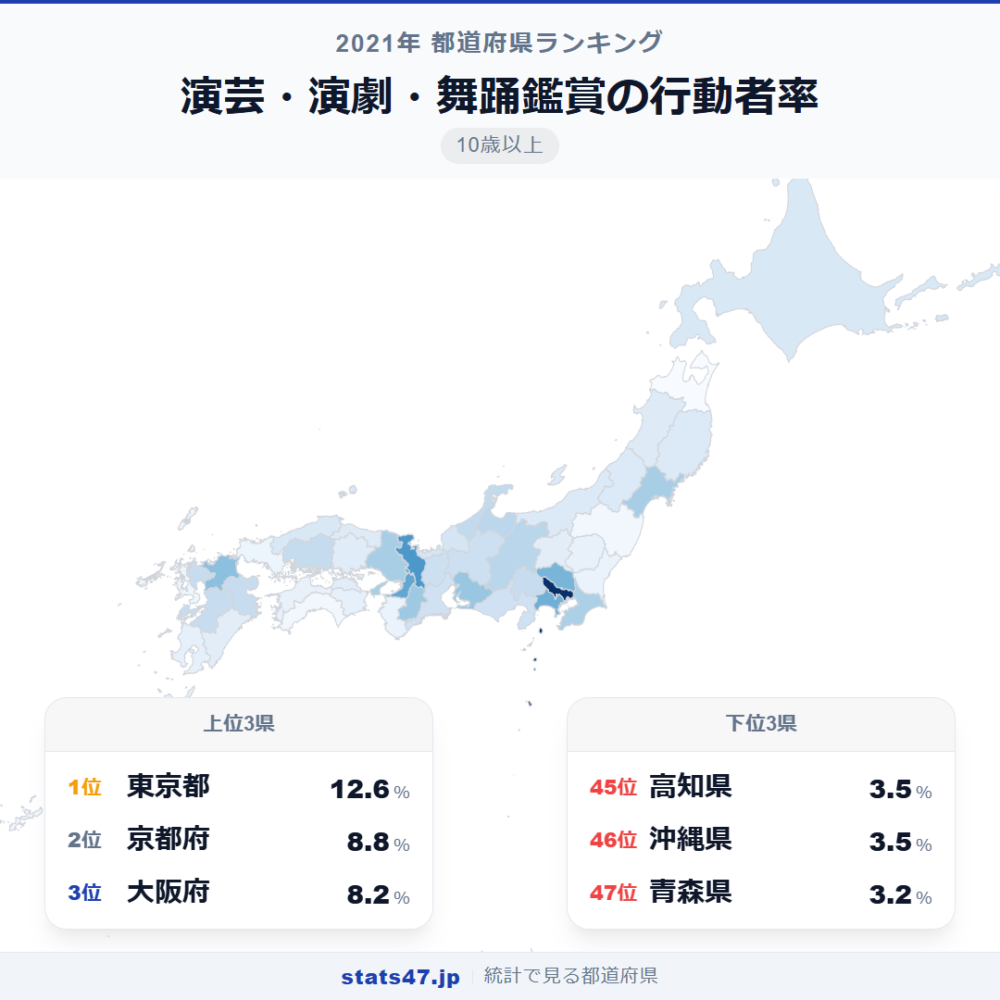
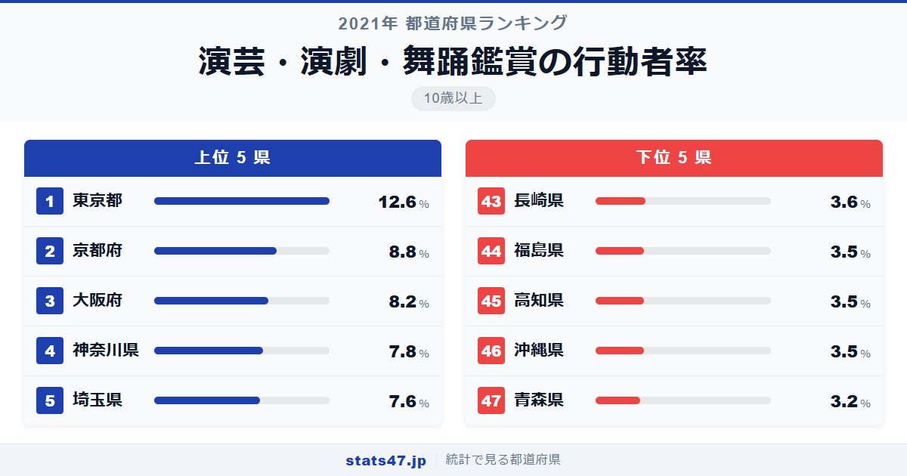
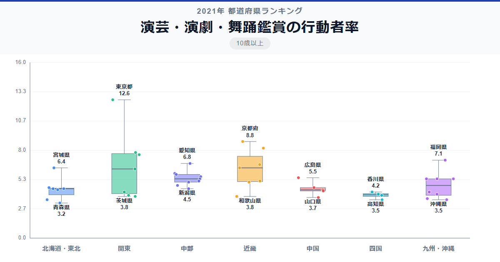

東京都では8人に1人が演劇や舞踊を観に行くのに対し、青森県ではわずか31人に1人。その差は実に3.9倍で、文化的な体験の格差がこれほどはっきり出るランキングも珍しいでしょう。

全国1位の東京都は偏差値92.8で12.6％。最下位の青森県は偏差値38.0で3.2％にとどまります。2位以下を大きく引き離す東京の突出ぶりが、このランキング最大の特徴です。

「演芸・演劇・舞踊鑑賞の行動者率」は、10歳以上の人口のうち過去1年間に演芸・演劇・舞踊を会場で鑑賞した人の割合です。総務省の社会生活基本調査に基づくデータで、落語・歌舞伎・バレエ・ミュージカルなど幅広いジャンルを含みます。

## データハイライト

全国平均: 5.26％

1位: 東京都（12.6％ / 偏差値 92.8）

47位: 青森県（3.2％ / 偏差値 38.0）

全国平均は5.26％と、約19人に1人の割合です。東京都の偏差値92.8は他を圧倒しており、2位の京都府との差は3.8ポイントもあります。演劇・演芸は公演が特定の都市に集中するため、大都市圏と地方の差が非常に大きく出る指標です。

## 【コロプレス地図】日本全国の分布

<!-- note投稿時: この画像行を削除し、images/choropleth-map-1080x1080.png をアップロード -->

地図上で東京都が突出して濃い色を放ち、その周辺の神奈川県・埼玉県がやや薄い色で続いています。京都府と大阪府の近畿圏も比較的濃く、劇場が集積する都市部に観客が集まる構図が明確です。

東北地方は全域にわたって薄い色が広がり、四国・九州の南部も低めです。一方、富山県が13位の5.8％と北陸の中で健闘しており、オーバードホールなどの充実した文化施設が行動者率を支えていることがうかがえます。

福岡県が6位の7.1％と九州では突出して高く、博多座という劇場文化の拠点が大きな役割を果たしています。

## 上位5：分析

<!-- note投稿時: この画像行を削除し、images/chart-x-1200x630.png をアップロード -->

帝国劇場、新国立劇場、歌舞伎座、新橋演舞場。日本の演劇文化の中枢が集まる東京都は、偏差値92.8で12.6％と他を圧倒しています。宝塚歌劇の東京公演や小劇場演劇まで、あらゆるジャンルの公演を日常的に観られる環境は東京だけのものです。

京都府は偏差値70.7で8.8％の2位です。南座での歌舞伎公演や、祇園の花街での舞踊鑑賞など、伝統芸能が生活圏に溶け込んでいる京都ならではの高さといえます。

3位は大阪府で偏差値67.2の8.2％。松竹座や梅田芸術劇場を擁し、吉本新喜劇という演芸の一大拠点でもあります。笑いの文化が「観に行く」習慣を根付かせている面もあるでしょう。

神奈川県は偏差値64.8の7.8％で4位。東京への近さから都内の劇場に通う県民が多いことに加え、KAAT神奈川芸術劇場など県内の施設も充実しています。

5位の埼玉県は偏差値63.6で7.6％。彩の国さいたま芸術劇場があり、都内の劇場へもアクセスしやすい立地が行動者率を押し上げています。

## 下位5：分析

青森県が偏差値38.0の3.2％で全国最下位です。大規模な劇場施設が限られ、全国ツアー公演のルートからも外れがちな地理的条件が大きく影響しています。

沖縄県・高知県・福島県が3.5％で同率45位。偏差値はいずれも39.7です。沖縄県は独自のエイサーやお笑い文化がある一方で、本土の劇団の巡回公演が少ないことが行動者率を下げています。高知県も同様に、地理的な遠さが巡回公演の機会を減らしています。

43位は長崎県で偏差値40.3の3.6％。離島を含む県土の広さが、劇場へのアクセスのハードルを上げている面があります。

## 地域別の傾向

<!-- note投稿時: この画像行を削除し、images/boxplot-1200x630.png をアップロード -->

関東と近畿が高く、東北と四国が低い傾向が明確です。関東は東京都が極端に高い一方、茨城県は40位の3.8％と域内格差が大きくなっています。

## まとめ

演芸・演劇・舞踊鑑賞の行動者率は、劇場インフラの集中度がそのまま数字に表れる指標です。このデータから以下の洞察が得られます。

**東京一極集中が最も顕著な文化指標**

偏差値92.8という東京の突出ぶりは、スポーツ観覧や映画鑑賞よりもはるかに大きな格差を示しています。
演劇は「その場所でしか観られない」という特性上、公演が集まる東京に行動者率が集中するのは必然です。

**近畿圏の伝統芸能が鑑賞文化を支えている**

京都府2位・大阪府3位の高さは、歌舞伎・文楽・吉本新喜劇といった伝統ある演芸文化が「観に行く」習慣を世代を超えて受け継いでいることの証です。

**地方では「公演が来ない」ことが最大の壁**

下位県の共通点は劇場施設の不足と巡回公演の少なさです。
デジタル配信やライブビューイングの活用が、この文化格差を縮める手段として期待されています。

## もっと詳しく知りたい方へ

全47都道府県の順位や、グラフ・地図での可視化は stats47 で見ることができます。

### 演芸・演劇・舞踊鑑賞の行動者率ランキング 全都道府県版

https://stats47.jp/ranking/hobby-participation-rate-theater

### 映画館での映画鑑賞の行動者率ランキング

https://stats47.jp/ranking/hobby-participation-rate-cinema

### クラシック音楽鑑賞の行動者率ランキング

https://stats47.jp/ranking/hobby-participation-rate-classical-music

### ポピュラー音楽鑑賞の行動者率ランキング

https://stats47.jp/ranking/hobby-participation-rate-popular-music

### 美術鑑賞の行動者率ランキング

https://stats47.jp/ranking/hobby-participation-rate-art-appreciation

### スポーツ観覧の行動者率ランキング

https://stats47.jp/ranking/hobby-participation-rate-sports-spectating

---

**stats47** は、e-Stat の公的統計データを47都道府県別に可視化するサービスです。
ランキング・散布図・時系列チャートで、地域の違いがひと目でわかります。

https://stats47.jp
