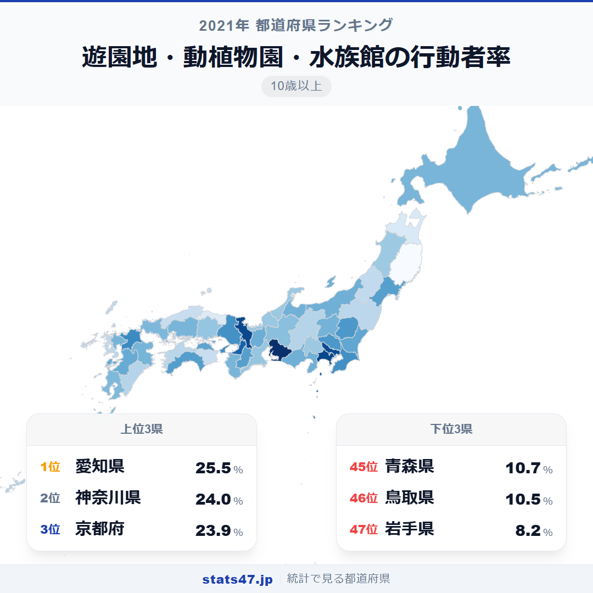
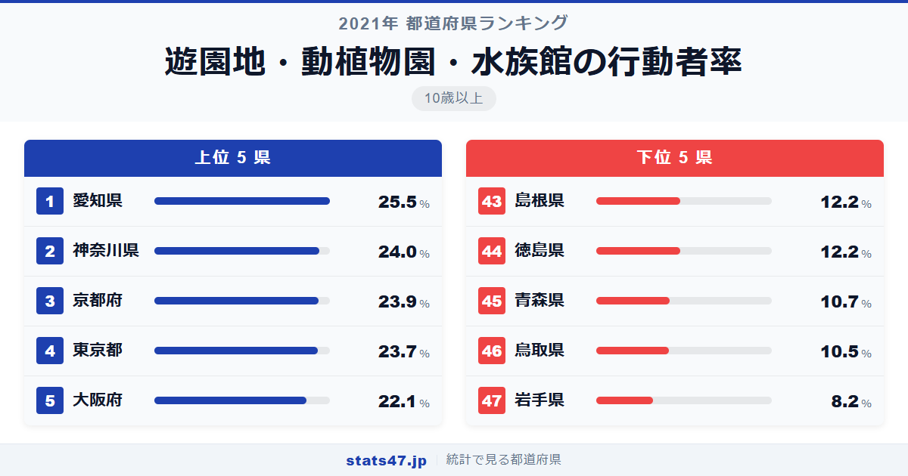
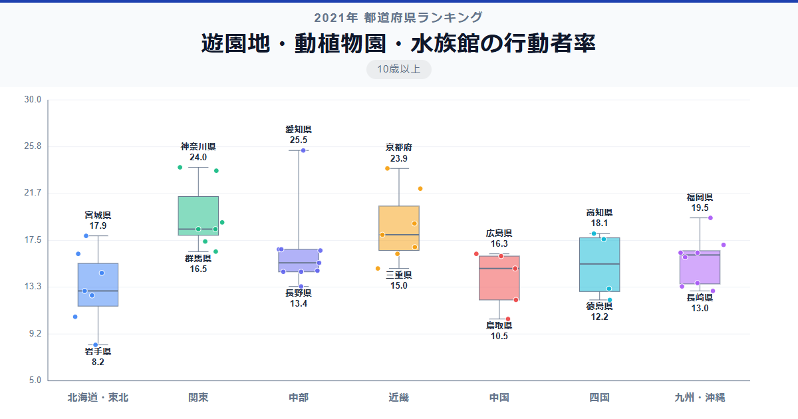

遊園地や水族館に最も足を運ぶのはどこの県民でしょうか。ディズニーランドのある千葉でもUSJの大阪でもなく、答えは愛知県です。全国1位の愛知県は25.5％で偏差値76.0、レゴランド・名古屋港水族館・東山動植物園を擁する施設の充実ぶりが数字に表れました。最下位の岩手県は8.2％で偏差値27.0。その差は実に3.1倍にのぼります。

テーマパーク施設がある県が必ずしも上位ではない、というのがこのランキングの面白いところです。

「遊園地・動植物園・水族館の行動者率」は、過去1年間にこれらの施設を訪れた10歳以上の人の割合です。総務省「社会生活基本調査」（2021年）のデータに基づいています。

## データハイライト

全国平均: 16.33％

1位: 愛知県（25.5％ / 偏差値 76.0）

47位: 岩手県（8.2％ / 偏差値 27.0）

上位は大都市圏が占めますが、高知県が11位に入るなど意外な県も。2021年はコロナ禍の影響を受けた調査年ですが、それでも地域差ははっきり出ています。

## 【コロプレス地図】日本全国の分布

<!-- note投稿時: この画像行を削除し、images/choropleth-map-1080x1080.png をアップロード -->

地図を見ると、三大都市圏とその周辺が濃く色づいています。愛知・神奈川・京都・東京・大阪のトップ5が固まっており、太平洋ベルト地帯に高い県が集中しています。

東北地方は全体的に薄く、岩手の8.2％は全国でも突出して低い数値です。青森も10.7％にとどまり、施設へのアクセスの距離が行動者率に直結していることがわかります。

九州は福岡が19.5％で6位と高い一方、宮崎・長崎は13％台で、県による差が大きい地域です。

## 上位5：分析

<!-- note投稿時: この画像行を削除し、images/chart-x-1200x630.png をアップロード -->

東山動植物園は年間入場者数で全国トップクラス。名古屋港水族館やレゴランドも加わり、愛知県は偏差値76.0の25.5％で堂々の1位です。若いファミリー層の多さが、家族連れでの来場を後押ししています。

2位の神奈川県は偏差値71.7で24.0％。横浜のズーラシアや八景島シーパラダイスなど、県内に複数の大型施設を持つ恵まれた環境です。

京都府が偏差値71.4の23.9％で3位に入りました。京都市動物園や京都水族館に加え、大阪のUSJや海遊館へのアクセスも良好な立地が強みです。

東京都は偏差値70.9で23.7％の4位。上野動物園・葛西臨海水族園をはじめ施設は豊富ですが、コロナ禍での入場制限の影響も受けた数値といえます。

5位の大阪府は偏差値66.3の22.1％。USJ・海遊館・天王寺動物園と人気施設が揃いながらも、1位の愛知とは3ポイント以上の差が開きました。

## 下位5：分析

岩手県は8.2％で偏差値27.0の最下位。県内に大型の遊園地やテーマパークが少なく、最寄りの大型施設へのアクセスにも時間がかかる地理的条件が大きく影響しています。

46位の鳥取県は偏差値33.5で10.5％。人口最少県であり、商業施設全般の集積度が低い地域です。

青森県は偏差値34.0の10.7％で45位。冬季の厳しい気候が外出そのものを制限し、年間を通じた行動者率を下げる要因となっています。

44位の徳島県は偏差値38.3で12.2％。四国の中でも施設数が少なく、近隣の香川県にある施設への県境を越えた移動が必要になります。

島根県も12.2％で偏差値38.3の同率43位。山陰地方の交通アクセスの限界が、行動者率の低さにつながっています。

## 地域別の傾向

<!-- note投稿時: この画像行を削除し、images/boxplot-1200x630.png をアップロード -->

関東・東海・近畿が高く、東北・中国・四国が低い傾向です。施設の数とアクセスの良さが、地域差を生む最大の要因になっています。

## まとめ

遊園地・動植物園・水族館の行動者率は、レジャー施設へのアクセス環境を映し出す指標です。このデータから以下の洞察が得られます。

**「施設がある県」と「行く人が多い県」は違う**

ディズニーのある千葉は7位、USJの大阪は5位。施設の存在だけでなく、ファミリー層の人口比率や複数施設の充実度がものを言います。

**愛知県1位は施設の充実と人口構成の合わせ技**

東山動植物園・名古屋港水族館・レゴランドの3施設に加え、若いファミリー層の多さが25.5％という高い数値を実現しました。

**岩手県8.2％は施設アクセス格差の象徴**

最下位の岩手県と1位の愛知県では3.1倍の差。
大型レジャー施設の有無と交通インフラが、住民のレジャー行動を大きく左右しています。

## もっと詳しく知りたい方へ

全47都道府県の順位や、グラフ・地図での可視化は stats47 で見ることができます。

### 遊園地・動植物園・水族館の行動者率ランキング 全都道府県版

https://stats47.jp/ranking/hobby-participation-rate-theme-parks

### キャンプの行動者率ランキング

https://stats47.jp/ranking/hobby-participation-rate-camping

### 映画館での映画鑑賞の行動者率ランキング

https://stats47.jp/ranking/hobby-participation-rate-cinema

### スポーツ観覧の行動者率ランキング

https://stats47.jp/ranking/hobby-participation-rate-sports-spectating

### ゲームの行動者率ランキング

https://stats47.jp/ranking/hobby-participation-rate-video-games

### カラオケの行動者率ランキング

https://stats47.jp/ranking/hobby-participation-rate-karaoke

---

**stats47** は、e-Stat の公的統計データを47都道府県別に可視化するサービスです。
ランキング・散布図・時系列チャートで、地域の違いがひと目でわかります。

https://stats47.jp
