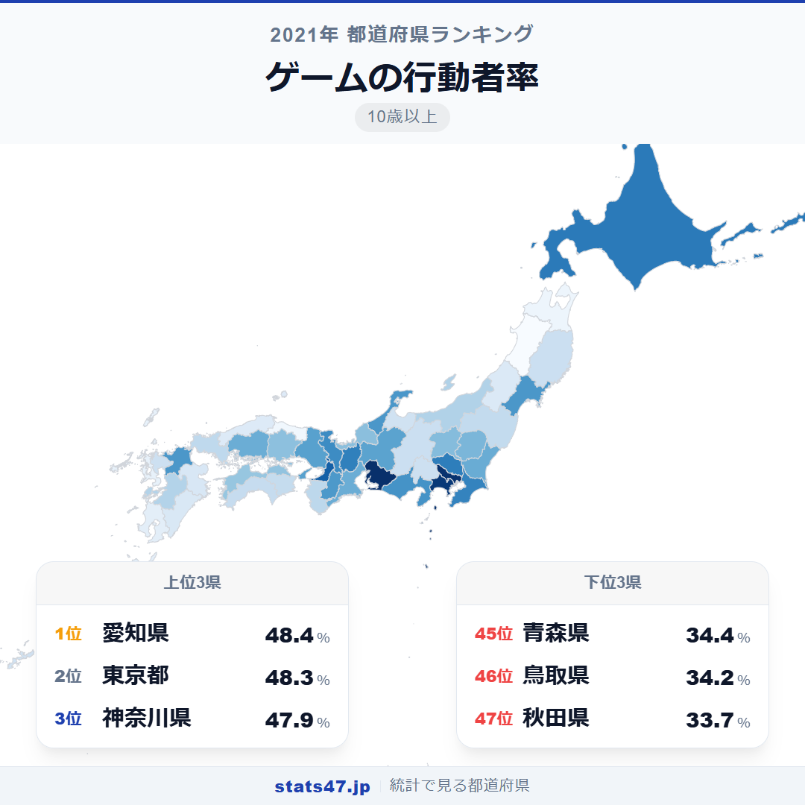
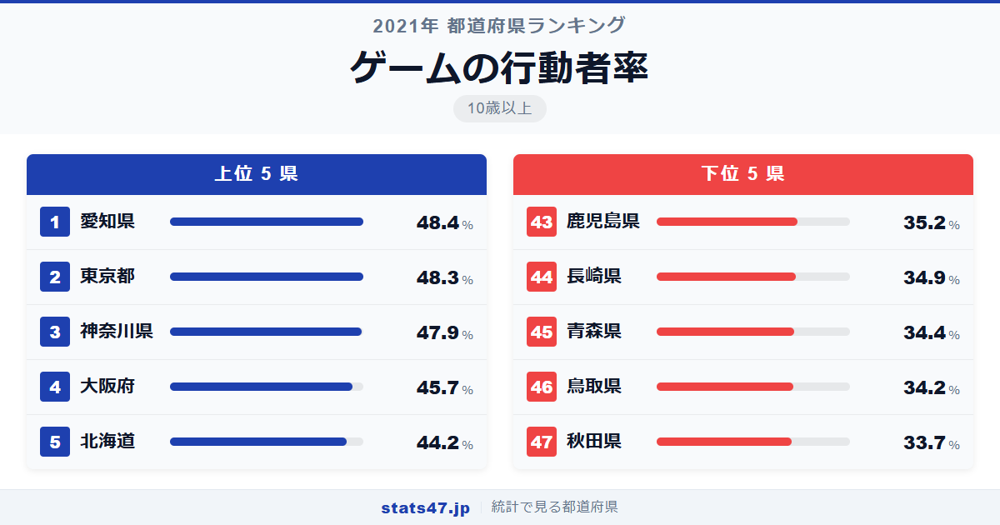
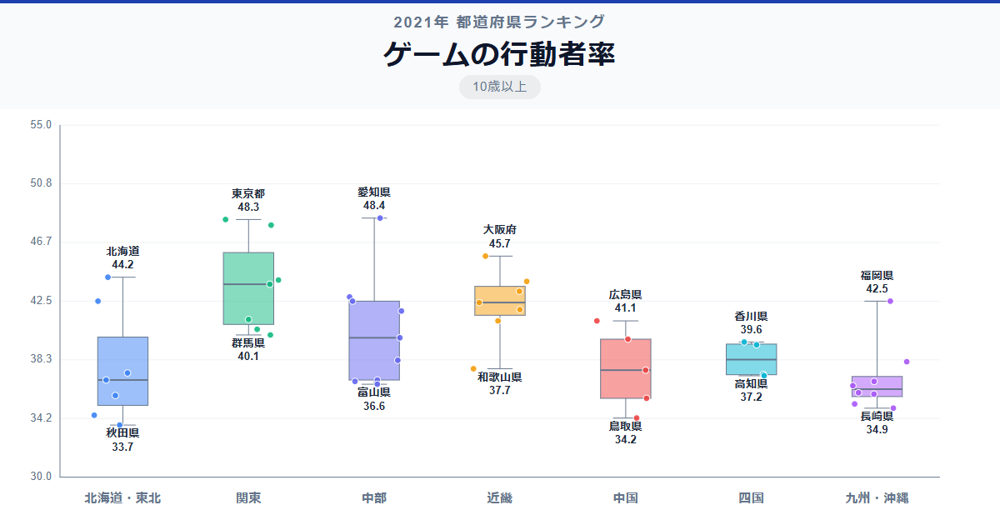

日本人の約4割がゲームを楽しんでいます。もはや子どもの遊びではなく、幅広い世代に浸透した国民的な趣味。その中で全国1位に輝いたのは愛知県で48.4％、偏差値72.8。わずか0.1ポイント差で東京都が48.3％の2位に続きます。最下位の秋田県は33.7％で偏差値34.0ですが、それでも3人に1人はゲームをしており、全国的な浸透度の高さがわかります。

1位と47位の差は1.4倍。趣味系ランキングの中で最も格差が小さい指標の一つです。

「ゲームの行動者率」は、過去1年間にテレビゲーム・パソコンゲームなどを行った10歳以上の人の割合です。総務省「社会生活基本調査」（2021年）のデータに基づいています。

## データハイライト

全国平均: 39.75％

1位: 愛知県（48.4％ / 偏差値 72.8）

47位: 秋田県（33.7％ / 偏差値 34.0）

上位は大都市圏が中心ですが、北海道が5位に入るなど地方にも高い県があります。下位は東北・九州南部に集中し、高齢化率との関連が示唆されます。

## 【コロプレス地図】日本全国の分布

<!-- note投稿時: この画像行を削除し、images/choropleth-map-1080x1080.png をアップロード -->

地図を見ると、他の趣味系ランキングほどの極端な地域差は見られません。全国的にゲームが浸透していることがわかりますが、それでも太平洋ベルト地帯が相対的に高い傾向は読み取れます。

東北地方の青森・秋田が34％前後と低く、九州でも鹿児島・長崎が低めです。これらの県に共通するのは高齢化率の高さで、ゲームの主な利用者層である若年〜中年層の比率が低いことが直接的な要因と考えられます。

石川県が12位タイの42.5％と健闘しているのが注目点。北陸の冬はゲームを楽しむ時間に恵まれているのかもしれません。

## 上位5：分析

<!-- note投稿時: この画像行を削除し、images/chart-x-1200x630.png をアップロード -->

愛知県は偏差値72.8の48.4％で僅差のトップ。ゲーム関連企業が集積する東海圏の中心地であり、若いファミリー層が多い人口構成も高い数値の背景にあります。

わずか0.1ポイント差の東京都は偏差値72.6で48.3％の2位。eスポーツ施設やゲームセンターの数は全国最多で、ゲーム文化のあらゆる側面が集約されています。

3位の神奈川県は偏差値71.5で47.9％。横浜を中心に若い世代が多く、首都圏のゲーム文化を共有しています。

大阪府が偏差値65.7の45.7％で4位に入りました。関西のゲームコミュニティの中心地として、eスポーツイベントも盛んに開催されています。

5位は北海道で偏差値61.7の44.2％。冬の長い北海道では室内で過ごす時間が多く、ゲームが身近な娯楽として定着しやすい環境があります。

## 下位5：分析

秋田県は33.7％で偏差値34.0の最下位。全国で最も高齢化率が高い県であり、若年層の県外流出もあいまって、ゲームの行動者率を押し下げています。

46位の鳥取県は偏差値35.3で34.2％。人口最少県であり、若年層の比率が低いことが反映されています。

青森県は偏差値35.9の34.4％で45位。秋田と同様に東北の高齢化が影響している地域です。

長崎県は34.9％で偏差値37.2の44位。離島を多く抱え、ゲーム機やソフトの入手環境にも影響がある可能性がありますが、インターネット環境の整備により今後は変化するかもしれません。

43位の鹿児島県は偏差値38.0で35.2％。九州南部は高齢化率が高く、下位に位置する県が集中しています。

## 地域別の傾向

<!-- note投稿時: この画像行を削除し、images/boxplot-1200x630.png をアップロード -->

関東と東海が高く、東北が低い傾向です。ただし地域間の差は他の趣味系ランキングに比べて小さく、ゲームの全国的な浸透がうかがえます。

## まとめ

ゲームの行動者率は、趣味系指標の中で最も地域差が小さいランキングの一つです。このデータから以下の洞察が得られます。

**最下位でも3人に1人がゲーマー**

秋田県の33.7％でさえ、国民の3分の1がゲームを楽しんでいることを意味します。
1.4倍という小さな格差は、ゲームがあらゆる地域に浸透した証拠です。

**愛知が東京を上回った意外な結果**

ゲーム関連企業の集積と、若いファミリー層の多さが愛知をトップに押し上げました。
文化の中心地が必ずしも行動者率のトップとは限らないことを示しています。

**高齢化率がゲーム率を最も大きく左右する**

下位5県はすべて高齢化率が高い県です。
ゲームの主な利用層が若年〜中年層であるため、人口構成の違いがそのまま順位に反映されています。

## もっと詳しく知りたい方へ

全47都道府県の順位や、グラフ・地図での可視化は stats47 で見ることができます。

### ゲームの行動者率ランキング 全都道府県版

https://stats47.jp/ranking/hobby-participation-rate-video-games

### マンガを読む行動者率ランキング

https://stats47.jp/ranking/hobby-participation-rate-manga

### 映画館での映画鑑賞の行動者率ランキング

https://stats47.jp/ranking/hobby-participation-rate-cinema

### パチンコの行動者率ランキング

https://stats47.jp/ranking/hobby-participation-rate-pachinko

### 遊園地・動植物園・水族館の行動者率ランキング

https://stats47.jp/ranking/hobby-participation-rate-theme-parks

### 将棋の行動者率ランキング

https://stats47.jp/ranking/hobby-participation-rate-shogi

---

**stats47** は、e-Stat の公的統計データを47都道府県別に可視化するサービスです。
ランキング・散布図・時系列チャートで、地域の違いがひと目でわかります。

https://stats47.jp
