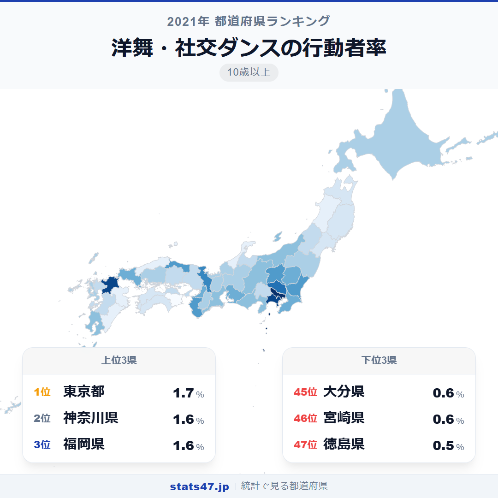
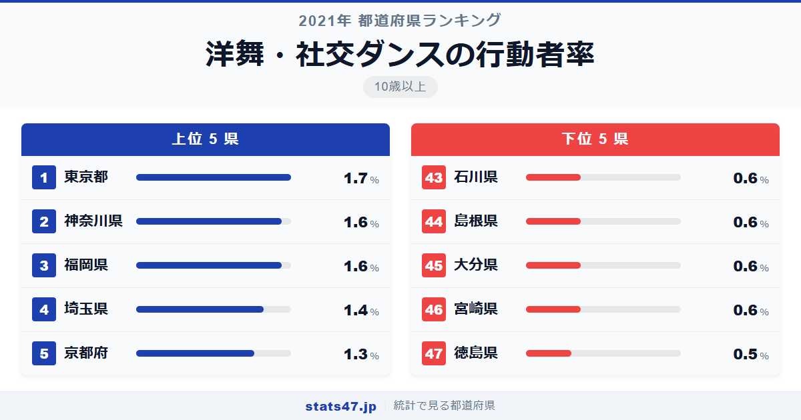
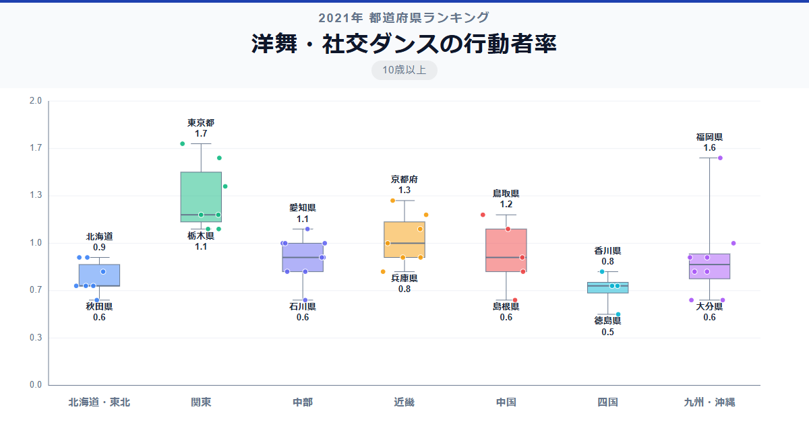

洋舞・社交ダンスの行動者率で全国1位と最下位の差は3.4倍。47都道府県の中でもっとも格差が大きい趣味のひとつです。

総務省「社会生活基本調査」（2021年）によると、1位の東京都は1.7％で偏差値77.9。最下位の徳島県は0.5％で偏差値33.6です。全国平均は0.94％。上位には首都圏の都県が並び、地方との差が際立っています。

バレエやジャズダンス、社交ダンスといった洋舞の教室はどこにでもあるわけではありません。都市部への集中度の高さが、そのまま数値に表れている指標です。

「洋舞・社交ダンスの行動者率」は、過去1年間にバレエ・モダンダンス・社交ダンスなどを行った人の割合を10歳以上人口に対して算出した指標です。総務省が5年ごとに実施する社会生活基本調査のデータに基づいています。

## データハイライト

全国平均: 0.94％

1位: 東京都（1.7％ / 偏差値 77.9）

47位: 徳島県（0.5％ / 偏差値 33.6）

行動者率そのものは1％前後と低い指標ですが、1位と最下位の3.4倍という格差は、同じ趣味系ランキングの中でも大きい部類に入ります。首都圏と地方の文化インフラの差が如実に表れています。

## 【コロプレス地図】日本全国の分布

<!-- note投稿時: この画像行を削除し、images/choropleth-map-1080x1080.png をアップロード -->

地図を見ると、首都圏の東京・神奈川・埼玉が突出して濃い色で目を引きます。ダンススタジオやバレエ教室の密度が高い大都市圏が、そのまま上位に直結しています。

意外なのは福岡県の3位。九州の中心都市として、ダンス教室やスタジオが充実していることが背景にあります。また、鳥取県が1.2％で9位に入っているのも注目です。

最下位圏は徳島・宮崎・大分・島根と、人口規模が小さい県が並んでいます。洋舞の教室が少ない地域では、始めるきっかけ自体が限られます。

## 上位5：分析

<!-- note投稿時: この画像行を削除し、images/chart-x-1200x630.png をアップロード -->

ダンススタジオが最も集積する東京都が、偏差値77.9で1.7％と断トツの1位です。プロの指導者から趣味のサークルまで、あらゆるレベルの洋舞が揃う都市環境が圧倒的な数値を支えています。

神奈川県は1.6％で偏差値74.2。横浜・川崎を中心にバレエ教室やダンスクラブが充実しており、東京に次ぐ文化インフラが整っています。

同率2位の福岡県も1.6％で偏差値74.2。九州最大の都市圏として、天神・博多エリアにダンススタジオが集まっています。九州全体で見ても突出した数値で、都市の文化的求心力が表れた結果です。

4位の埼玉県は1.4％で偏差値66.8。東京のベッドタウンとして、都内のスタジオに通う人と県内の教室で学ぶ人の両方が含まれます。

京都府が1.3％で偏差値63.1と5位に入りました。古都のイメージからは邦舞が連想されますが、大学が多く若い人口が集まる京都では洋舞の需要も根強いようです。

## 下位5：分析

最下位の徳島県は0.5％で偏差値33.6。46位との差も開いており、全国で突出して低い水準です。県内のダンススタジオの数が極めて少なく、洋舞に触れる機会そのものが限られています。

宮崎県と大分県は0.6％で偏差値37.3。九州の中でも福岡県が上位にいるのとは対照的で、都市部と周辺県の文化インフラの差が鮮明です。

同じ0.6％で島根県も偏差値37.3。中国地方では広島が0.9％と全国平均並みですが、島根は人口の少なさからダンス教室の維持が難しい状況にあります。

石川県も0.6％で偏差値37.3。北陸は全般的に低い傾向にあり、伝統的な芸事が盛んな土地柄で、洋舞よりも邦舞や茶道に時間を割く文化が根づいています。

## 地域別の傾向

<!-- note投稿時: この画像行を削除し、images/boxplot-1200x630.png をアップロード -->

関東が突出して高く、北陸・四国・東北が低い傾向です。大都市圏にダンススタジオが集中する構造が、地域間の格差をそのまま生み出しています。

## まとめ

洋舞・社交ダンスの行動者率は、文化インフラの都市集中を最も鮮明に映す指標のひとつです。このデータから以下の洞察が得られます。

**3.4倍の格差はインフラの差**

1位の東京と最下位の徳島の差は3.4倍。この開きはダンススタジオの密度と直結しています。
教室がなければ始められない。環境が行動を決める典型的な構図です。

**福岡県の存在感は地方都市の可能性を示す**

地方でも福岡県のような大都市圏を持つ県は全国上位に入れます。
文化施設の集積が一定規模を超えると、行動者率が押し上げられることを示しています。

**伝統文化が強い地域は洋舞が弱い傾向**

石川県や島根県のように、茶道・華道・邦舞が盛んな地域では、洋舞の行動者率が低い傾向にあります。
限られた時間のなかで、どの文化活動を選ぶかは地域の伝統に左右されるようです。

## もっと詳しく知りたい方へ

全47都道府県の順位や、グラフ・地図での可視化は stats47 で見ることができます。

### 洋舞・社交ダンスの行動者率ランキング 全都道府県版

https://stats47.jp/ranking/hobby-participation-rate-western-dance

### 邦舞・おどりの行動者率ランキング

https://stats47.jp/ranking/hobby-participation-rate-japanese-dance

### 演芸・演劇・舞踊鑑賞の行動者率ランキング

https://stats47.jp/ranking/hobby-participation-rate-theater

### スポーツ観覧の行動者率ランキング

https://stats47.jp/ranking/hobby-participation-rate-sports-spectating

### 美術鑑賞の行動者率ランキング

https://stats47.jp/ranking/hobby-participation-rate-art-appreciation

### 映画館での映画鑑賞の行動者率ランキング

https://stats47.jp/ranking/hobby-participation-rate-cinema

---

**stats47** は、e-Stat の公的統計データを47都道府県別に可視化するサービスです。
ランキング・散布図・時系列チャートで、地域の違いがひと目でわかります。

https://stats47.jp
