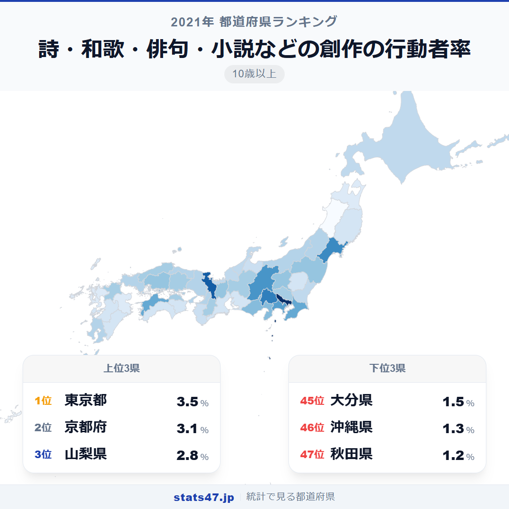
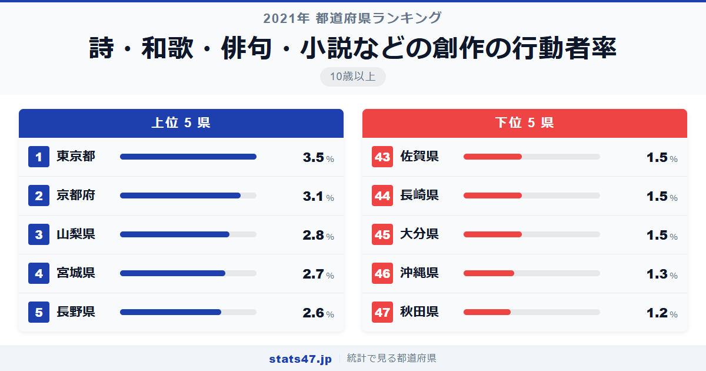
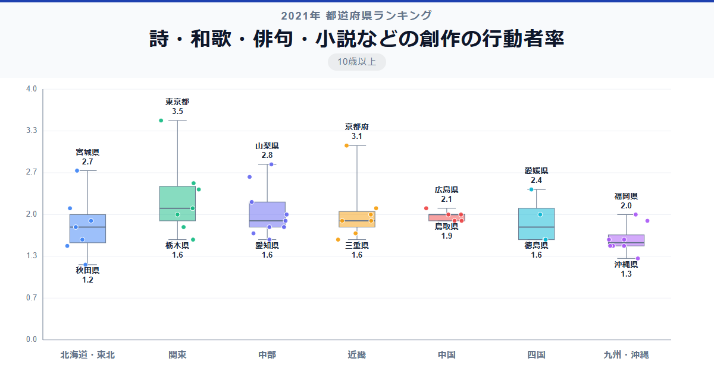

100人に3〜4人しかいない、文芸の世界。詩・和歌・俳句・小説などの創作を趣味とする人の割合は全国平均でわずか1.95％にすぎません。その中で全国1位の東京都は3.5％、偏差値84.7と突出しています。最下位の秋田県はわずか1.2％で偏差値33.1。同じ日本でも創作活動に親しむ人の割合は約3倍の開きがあります。

興味深いのは、2位に京都府、3位に山梨県が入っていること。人口規模だけでは説明できないパターンが見えてきます。

「詩・和歌・俳句・小説などの創作の行動者率」は、過去1年間にこれらの文芸創作を行った10歳以上の人の割合です。総務省「社会生活基本調査」（2021年）に基づくデータです。

## データハイライト

全国平均: 1.95％

1位: 東京都（3.5％ / 偏差値 84.7）

47位: 秋田県（1.2％ / 偏差値 33.1）

上位には大都市だけでなく、文芸の伝統が根づく地域が名を連ねています。下位は東北・九州の一部に集中しており、地方での文芸活動の担い手不足がうかがえます。

## 【コロプレス地図】日本全国の分布

<!-- note投稿時: この画像行を削除し、images/choropleth-map-1080x1080.png をアップロード -->

地図で見ると、東京を頂点に関東から中部にかけて比較的濃い色が広がっています。京都・愛媛なども目立ち、単純な都市部優位とは言い切れない分布です。

東北地方は青森・秋田をはじめ全体的に薄い色で、創作活動人口の少なさが目立ちます。九州も佐賀・長崎・大分が1.5％にとどまり、低い水準です。

注目すべきは山梨県の3位。人口規模では小さい県ながら2.8％と高い数値を記録しました。

## 上位5：分析

<!-- note投稿時: この画像行を削除し、images/chart-x-1200x630.png をアップロード -->

出版社・文芸サークル・カルチャースクールが集中する東京都は偏差値84.7の3.5％で断然のトップ。文学フリマをはじめとする発表の場が豊富で、創作への参入障壁が低い環境です。

京都府が偏差値75.8で3.1％の2位。歌枕の文化や俳句・短歌の伝統が今も息づく土地柄で、大学も多く若い世代の文芸活動も活発です。

意外にも3位は山梨県で、偏差値69.0の2.8％を記録しています。太宰治ゆかりの地としても知られ、自然に恵まれた環境が創作意欲を刺激しているのかもしれません。

4位の宮城県は偏差値66.8の2.7％。仙台は「杜の都」として文学的な土壌があり、東北の中で唯一上位に食い込んでいます。

長野県は偏差値64.5で2.6％の5位。文学館が多く、自然と向き合う暮らしが俳句や詩の創作と結びついている地域です。

## 下位5：分析

秋田県は全国最下位の1.2％で偏差値33.1。高齢化が最も進んだ県の一つであり、創作活動の担い手となる若い世代が少ないことが影響しています。

46位の沖縄県は1.3％で偏差値35.3。独自の文化を持つ沖縄ですが、本土型の文芸創作という枠組みでは低い結果となりました。

佐賀県、長崎県、大分県はいずれも1.5％で偏差値39.8の43位タイ。九州北部から中部にかけてのこの3県は、文芸サークルやカルチャー教室の少なさが共通しています。

## 地域別の傾向

<!-- note投稿時: この画像行を削除し、images/boxplot-1200x630.png をアップロード -->

関東と中部が高く、東北と九州が低い傾向です。近畿は京都が突出して高い一方で、他の府県は平均前後にとどまっています。

## まとめ

文芸創作の行動者率は、文化的インフラと地域の伝統が色濃く反映される指標です。このデータから以下の洞察が得られます。

**東京一極集中が最も顕著な趣味の一つ**

偏差値84.7は他の趣味系ランキングと比べても突出しています。
出版・発表の場が集中する首都圏の優位性が明確です。

**人口規模だけでは語れない文芸の土壌**

京都2位、山梨3位、宮城4位と、文学的な伝統や自然環境が創作率を押し上げる県があります。

**東北・九州の南部で創作離れが進行**

秋田1.2％は東京の3分の1の水準です。
高齢化や文化施設の少なさが、文芸活動の機会を狭めている可能性があります。

## もっと詳しく知りたい方へ

全47都道府県の順位や、グラフ・地図での可視化は stats47 で見ることができます。

### 詩・和歌・俳句・小説などの創作の行動者率ランキング 全都道府県版

https://stats47.jp/ranking/hobby-participation-rate-writing

### 趣味としての読書の行動者率ランキング

https://stats47.jp/ranking/hobby-participation-rate-reading

### 書道の行動者率ランキング

https://stats47.jp/ranking/hobby-participation-rate-calligraphy

### 絵画・彫刻の制作の行動者率ランキング

https://stats47.jp/ranking/hobby-participation-rate-painting

### 楽器の演奏の行動者率ランキング

https://stats47.jp/ranking/hobby-participation-rate-instrument

### 写真の撮影・プリントの行動者率ランキング

https://stats47.jp/ranking/hobby-participation-rate-photography

---

**stats47** は、e-Stat の公的統計データを47都道府県別に可視化するサービスです。
ランキング・散布図・時系列チャートで、地域の違いがひと目でわかります。

https://stats47.jp
