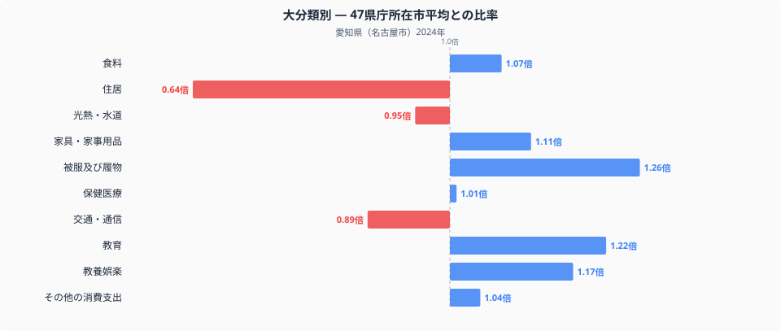
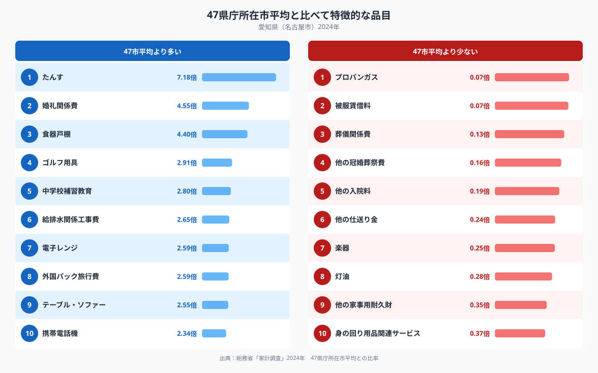

総務省統計局の家計調査(二人以上の世帯)で、愛知県の家計を十大費目の全国比較でみると、もっとも際立つのは住居費です。ここでの比率は、47都道府県庁所在市の単純平均を1.00としたときの水準で、名古屋市の住居費は0.64倍にとどまり、10費目のなかでもっとも平均から離れています。一方で、家具や婚礼にまつわる支出は全国平均を大きく上回ります。この記事では、その内訳を図で確認しながら、名古屋市の家計の特徴を読み解きます。

## 住居費は全国平均の0.64倍にとどまる

十大費目の比率を並べたグラフを見ると、住居費の低さが際立っています。0.64倍という水準は、47都道府県庁所在市のなかでもかなり低いグループに入る値です。反対に、被服及び履物は1.26倍、教育は1.22倍、教養娯楽は1.17倍、家具・家事用品は1.11倍と、住居以外の多くの費目で全国平均を上回っています。食料は1.07倍とほぼ平均並みで、大きな偏りはみられません。食料品目の内訳、つまり何をどれだけ、いくらで買っているかについては、[名古屋市の食卓を数量と価格で読み解いた記事](https://stats47.jp/blog/aichi-food-culture)で詳しく扱っていますので、あわせてご覧ください。住居費だけが突出して低く、それ以外の費目は総じて平均以上という構成が、愛知県の家計の骨格といえそうです。

## たんすや婚礼関係費に厚い支出

品目別にみると、家具にまつわる支出の多さが目立ちます。たんすは全国平均の7.18倍、食器戸棚は4.40倍、テーブル・ソファーは2.55倍と、いずれも大型家具の比率が高くなっています。婚礼関係費も4.55倍に達しており、結婚に伴う支出が家計に占める重みが大きいことがうかがえます。ほかにも、電子レンジ2.59倍、外国パック旅行費2.59倍、携帯電話機2.34倍、ゴルフ用具2.91倍、中学校補習教育2.80倍、給排水関係工事費2.65倍と、耐久財や余暇、教育関連の品目で全国平均を上回るものが並びます。反対に支出が少ない品目には、プロパンガス0.07倍、灯油0.28倍という燃料関連が並びます。葬儀関係費0.13倍や他の冠婚葬祭費0.16倍、他の仕送り金0.24倍、楽器0.25倍も低い水準にとどまっています。

## なぜこのような偏りが生まれるのか

住居費の低さと家具支出の高さは、住宅の持ち方と関係している可能性があります。持ち家で比較的広い住宅を確保しやすい地域では、家賃や住宅ローンに相当する支出(住居費)が抑えられる一方、部屋数に応じて家具をそろえる必要が生じ、たんすや食器戸棚のような大型家具への支出が増えやすいと考えられます。婚礼関係費の高さも、こうした住まいの広さや世帯構成と結びついているのかもしれません。プロパンガスと灯油がともに低いのは、名古屋市が都市部で都市ガスの供給網が整っていることに加え、太平洋側の比較的温暖な気候で暖房用の灯油需要が小さいことを反映していると考えられます。これらはあくまで一つの見方であり、断定できるものではありませんが、住居・家具・燃料という3つの費目が連動して動いている点は、データから読み取れる特徴です。愛知県の他の指標もあわせて見たい方は、[愛知県のデータブック](https://stats47.jp/areas/23000)もご覧ください。

## データについて

本記事の数値は、総務省統計局「家計調査」(2024年、二人以上の世帯)にもとづいています。都道府県別の家計調査は都道府県全体ではなく、県庁所在市(この場合は名古屋市)の世帯を対象に集計されている点にご注意ください。また、本記事の比率は47都道府県庁所在市の単純平均を1.00とした独自の指標であり、総務省が公表する全国平均の値とは一致しません。数値の読み方には、この2点を踏まえてご覧いただければと思います。
