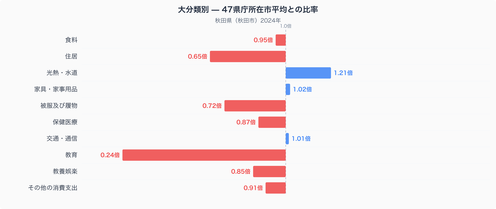
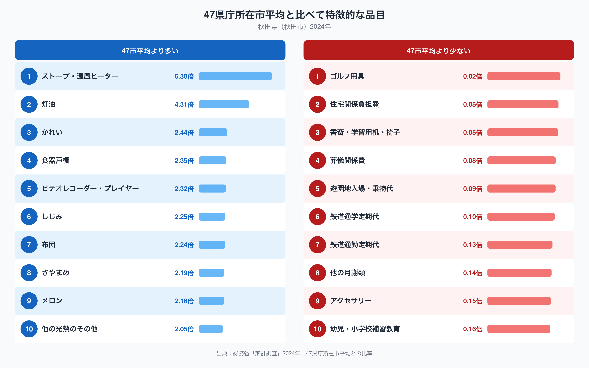

秋田県秋田市の家計簿を全国の県庁所在市と比べると、いちばん際立って違うのは教育費です。秋田市の教育費は47都道府県庁所在市の単純平均を1.00とした場合0.24倍にとどまり、十大費目のなかで最も平均から離れています。一方で光熱・水道は1.21倍と平均を上回っています。同じ家計のなかで、なぜこれほどの偏りが生まれるのでしょうか。十大費目の内訳と、平均から特に離れた品目のデータから見ていきます。

## 十大費目で見る、秋田市の支出の偏り

図のとおり、教育（0.24倍）と住居（0.65倍）は平均を大きく下回り、被服及び履物（0.72倍）、保健医療（0.87倍）、教養娯楽（0.85倍）もやや低めです。反対に光熱・水道（1.21倍）は平均を上回り、家具・家事用品（1.02倍）や交通・通信（1.01倍）はほぼ平均並みです。食料（0.95倍）とその他の消費支出（0.91倍）もわずかに低い水準にとどまっています。住居費の低さは持ち家率の高さや地価の水準と関係している可能性があり、光熱・水道費の高さは冬の暖房需要を映しているのかもしれません。

## 品目に見る、灯油・ストーブと低い教育関連支出

品目単位で見ると、支出が特に多いのはストーブ・温風ヒーター（6.30倍）と灯油（4.31倍）で、これが光熱・水道費全体の高さを引き上げている主な要因と考えられます。次いで食器戸棚（2.35倍）や布団（2.24倍）など、寒さ対策や冬支度に関わる家具・寝具類の比率も高くなっています。食材ではかれい（2.44倍）やしじみ（2.25倍）、さやまめ（2.19倍）、メロン（2.18倍）が47市平均を上回っており、地元で親しまれている食材への支出が反映されているのかもしれません（秋田市の食卓を数量と価格で詳しく見た記事は[こちら](https://stats47.jp/blog/akita-food-culture)にまとめています）。

一方、支出が少ないのはゴルフ用具（0.02倍）や住宅関係負担費（0.05倍）で、教育に関わる品目も軒並み低い水準です。書斎・学習用机・椅子（0.05倍）、他の月謝類（0.14倍）、幼児・小学校補習教育（0.16倍）が平均を大きく下回っており、これが十大費目の教育（0.24倍）の低さと重なっています。また鉄道通学定期代（0.10倍）と鉄道通勤定期代（0.13倍）も低く、通勤・通学の手段として鉄道への依存度が低いことがうかがえます。

## なぜこうした偏りが生まれるのか

秋田県は日本有数の豪雪地帯として知られ、冬の暖房需要の高さがストーブ・温風ヒーターや灯油への支出に表れていると考えられます。持ち家率の高さや地価の水準が住居費の低さに関係している可能性もあります。教育関連支出の低さについては、学習塾や補習教育の選択肢が都市部に比べて限られていることや、公共交通よりも自家用車での移動が中心であることが、鉄道定期代の低さとあわせて背景にあるのかもしれません。かれいやしじみ、さやまめといった食材の比率の高さは、地元で流通しやすい食材を日常的に取り入れる食文化を反映している可能性がありますが、これらはいずれも推測であり、断定できるものではありません。

## データの出典

この記事の数値は、総務省統計局「家計調査」（2024年）をもとにした、二人以上の世帯の品目別支出額を使っています。ここでの比率は47都道府県庁所在市の単純平均を1.00とした値で、家計調査が公表する全国平均そのものとは異なります。また都道府県のデータとして扱っていますが、実際の集計対象は県庁所在市である秋田市の世帯であり、県全体の平均ではない点にご注意ください。秋田県のランキングデータをまとめた[県データブック](https://stats47.jp/areas/05000)では、家計以外の指標も含めて秋田県の特徴を確認できます。
