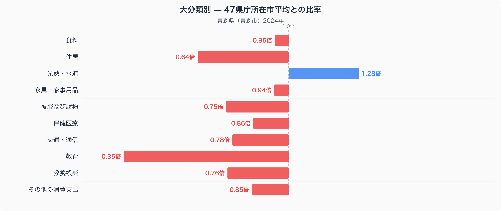
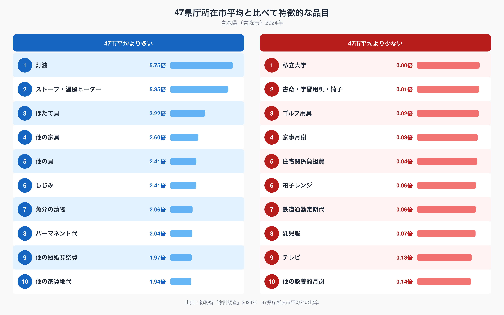

青森県庁所在地・青森市の家計を、全国の県庁所在市と比べてみると、突出して低い費目が一つあります。教育費です。十大費目のうち、47都道府県庁所在市の単純平均を1.00としたときに最も離れているのが教育で、青森市はわずか0.35倍にとどまります。逆に光熱・水道費は1.28倍と、平均を大きく上回っています。なぜ青森市の家計はこれほど教育費が少なく、光熱費に偏っているのでしょうか。十大費目の内訳と、際立って多い・少ない品目から、その理由を読み解いていきます。

## 十大費目でみる青森市の家計

十大費目の比率を見ると、教育が0.35倍で最も47市平均から離れており、次いで住居が0.64倍、光熱・水道が1.28倍と続きます。住居費が低いのは、地方都市で持ち家率が高く、賃貸家賃の相場自体も大都市圏より低いことが背景にあると考えられます。一方で光熱・水道費が47市平均を大きく上回るのは、冬の寒さが厳しい青森ならではの特徴で、暖房関連の支出が家計を押し上げていると見られます。残る被服及び履物(0.75倍)、交通・通信(0.78倍)、教養娯楽(0.76倍)、保健医療(0.86倍)、その他の消費支出(0.85倍)はいずれも平均をやや下回り、食料(0.95倍)と家具・家事用品(0.94倍)はほぼ平均並みです。全体として、住居費と教育費が家計の負担を軽くする一方、光熱費がそれを押し上げる構図になっています。

## 47市平均から突出する品目、少ない品目

品目単位で見ると、この偏りの正体がさらにはっきりします。最も比率が高いのは灯油で、47市平均の5.75倍。次いでストーブ・温風ヒーターが5.35倍と、暖房関連の2品目が突出しています。食の分野では、ほたて貝が3.22倍、他の貝が2.41倍、しじみも2.41倍、魚介の漬物が2.06倍と、青森市の食卓には貝類や海産物の加工品が多く並んでいることがうかがえます。[青森県の食卓を数量と価格から読み解いた記事](https://stats47.jp/blog/aomori-food-culture)では、こうした食材ごとの消費量と価格の関係を詳しく取り上げています。逆に少ない品目の筆頭は私立大学で、比率は0.00倍(47市平均の0.3%程度)とほぼ支出が確認できない水準です。書斎・学習用机・椅子(0.01倍)や鉄道通勤定期代(0.06倍)も極端に低く、教育や通勤にかかる費目が軒並み小さいことがわかります。

## なぜこの偏りが生まれるのか

灯油やストーブ・温風ヒーターへの支出が突出しているのは、青森が全国でも有数の豪雪・寒冷地であることと関係していると考えられます。冬季の暖房需要が高く、灯油ストーブが主要な暖房手段として使われている地域では、こうした支出が膨らみやすくなります。ほたて貝やしじみ、他の貝といった海産物の比率が高いのは、陸奥湾や津軽海峡に面した漁業が盛んな土地柄を反映しているのかもしれません。一方、私立大学や書斎・学習用机・椅子への支出が極端に少ないのは、都市部に比べて私立の高等教育機関への進学や、子どもの学習環境にかける支出が家計の中で相対的に小さいことを反映している可能性があります。鉄道通勤定期代が低いのも、公共交通より自家用車での移動が中心の地方都市らしい傾向と言えそうです。ただし、これらはあくまで数値から読み取れる傾向であり、個々の家庭の事情や価値観まで説明するものではありません。

## データの出典

本記事の数値は、総務省統計局「家計調査」(2024年、二人以上の世帯)を基に、47都道府県庁所在市の値を単純平均した数値を1.00として、青森市の値を比較したものです。総務省が公表する47市平均の値とは基準が異なりますので、その点にご注意ください。また、ここでの「青森県」の値は県全体の平均ではなく、県庁所在市である青森市の二人以上世帯の家計を対象にしています。青森県のより広い統計データは、[青森県のデータブック](https://stats47.jp/areas/02000)でもご覧いただけます。
