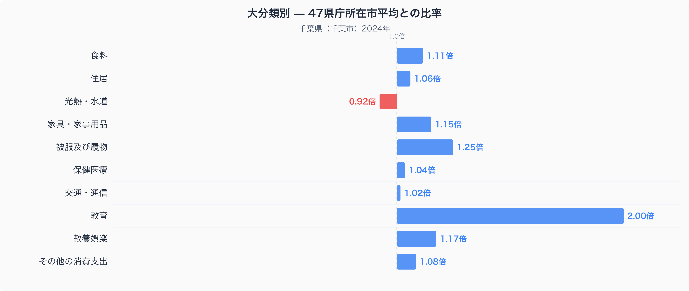
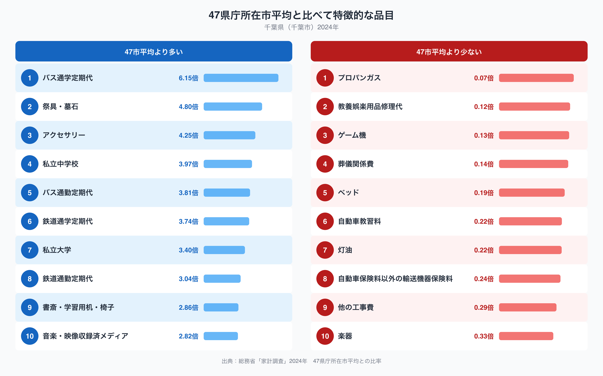

## 教育費が47市平均の2.00倍――千葉市の家計を読み解く

千葉県千葉市の家計調査データ（2024年、二人以上の世帯）を47都道府県庁所在市の平均と比べると、突出しているのは教育費です。47市平均を1.00とした比率で見ると、教育費は2.00倍に達しており、十大費目の中で最も大きな乖離になっています。次に大きいのは被服及び履物の1.25倍で、教養娯楽の1.17倍、家具・家事用品の1.15倍も平均を上回っています。反対に光熱・水道は0.92倍と、唯一平均を下回る費目です。

グラフを見ると、教育だけが飛び抜けて高く、他の費目はおおむね1.0倍前後から1.2倍台に収まっていることが分かります。教育費が2.00倍というのは「教育熱心な地域」という一言では説明しきれない規模の差です。被服及び履物や教養娯楽も平均より高めで、生活全体にゆとりのある支出構造がうかがえます。一方で光熱・水道が0.92倍にとどまっているのは、この後見る暖房関連の支出の少なさが影響していると考えられます。

## 通学定期代と私立校費用が支出を押し上げる

47市平均より特に多い品目の上位10件を見ると、バス通学定期代（6.15倍）、私立中学校（3.97倍）、バス通勤定期代（3.81倍）、鉄道通学定期代（3.74倍）、私立大学（3.40倍）、鉄道通勤定期代（3.04倍）と、通学・通勤の定期代と私立学校の学費に関わる品目が半分を占めています。祭具・墓石（4.80倍）やアクセサリー（4.25倍）、書斎・学習用机・椅子（2.86倍）といった品目も上位に入りますが、通学定期代と私立校費用が並んでいる点は、教育費が突出していた理由と重なります。反対に平均より少ない品目は、プロパンガス（0.07倍）、灯油（0.22倍）といった暖房・燃料関連と、自動車教習料（0.22倍）、ベッド（0.19倍）です。

## なぜ通学と教育にお金が偏るのか

千葉市は東京都心へ鉄道やバスで通勤・通学する人が多い地域です。バス通学定期代や鉄道通勤定期代が47市平均を大きく上回っているのは、都心まで通う距離が長く、定期券の運賃自体が高くなりやすいことと関係している可能性があります。私立中学校・私立大学の支出が多いことも、都市部で私立の教育機関を選ぶ世帯が一定数存在することを反映しているのかもしれません。一方で、プロパンガスや灯油の支出が少ないのは、都市ガスの供給網が整った住宅地では、これらの燃料に頼る世帯自体が少ないことが背景にあると考えられます。太平洋に面し冬の寒さが比較的穏やかな気候も、暖房関連の支出を抑える一因になっているのかもしれません。ここで示した関係はあくまで統計上の対応であり、個々の世帯の事情まで説明するものではない点に注意してください。

食料費の中身を数量と価格から見た記事は[千葉市の食卓を数量と価格で読み解く記事](https://stats47.jp/blog/chiba-food-culture)でまとめています。

## データの出典と読み方の注意

このグラフの元になっているのは、総務省統計局「家計調査」（2024年、二人以上の世帯）です。ここで示した千葉県の数値は、県全体ではなく千葉県庁所在市である千葉市の世帯を対象にした調査であることにご注意ください。また、比較の基準は家計調査が公表する全国平均ではなく、47都道府県庁所在市の単純平均を1.00とした独自の指標です。そのため、総務省が公表する全国値とは一致しません。千葉県の他の統計指標も含めた全体像は、[千葉県データブック](https://stats47.jp/areas/12000)でご覧いただけます。
