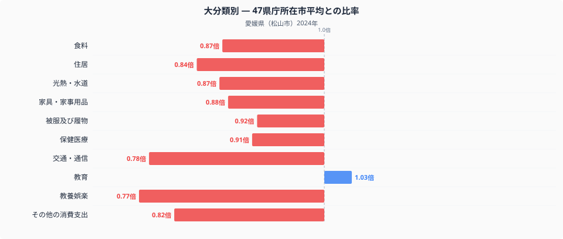

愛媛県松山市の家計を十大費目で見ると、全国平均（47都道府県庁所在市の単純平均）から最もかけ離れているのは「教養娯楽」です。比率は0.77倍で、全国平均より2割以上少ない水準にとどまっています。趣味やレジャーへの支出を抑えている松山市の家計は、いったい何にお金を使っているのでしょうか。十大費目の内訳と、際立って多い・少ない品目から読み解いていきます。

## 十大費目に見る支出の偏り

十大費目のうち、全国平均の1.00を上回っているのは教育（1.03倍）だけです。それ以外の九費目はすべて1.00を下回っており、松山市の家計は全体的に支出を抑える傾向にあります。中でも落ち込みが大きいのは教養娯楽（0.77倍）と交通・通信（0.78倍）で、この二費目だけで平均を大きく引き下げています。食料は0.87倍とやや低めですが、品目別に見ると平均を上回るものも含まれています。食料品の内訳は[愛媛県の食卓を読み解く記事](https://stats47.jp/blog/ehime-food-culture)で詳しく取り上げているので、ここでは十大費目全体の傾向に絞って見ていきます。住居は0.84倍、光熱・水道は0.87倍、家具・家事用品は0.88倍と、暮らしの土台に関わる費目も軒並み1.00を下回っており、突出して支出が多い費目が見当たらないのが松山市の家計の特徴です。教育だけがわずかに平均を上回っている点は、次にみる特徴品目とも関係している可能性があります。

## 突出する特徴品目

品目単位で見ると、全国平均の3倍を超える支出があるのは被服賃借料（3.83倍）と出産入院料（3.51倍）です。次いで清掃代（3.00倍）、高校補習教育・予備校（2.91倍）、ゲーム機（2.65倍）と続きます。愛媛県の特産品であるかんきつ類に関わる「他の柑きつ類」も2.00倍と高く、産地ならではの支出傾向が表れています。反対に、教養娯楽用品修理代（0.01倍未満）、他の家賃地代（0.02倍）、鉄道通学定期代（0.03倍）、バス通学定期代（0.05倍）は全国平均を大きく下回っており、通学に鉄道やバスの定期券を使う世帯が少ないことがうかがえます。交通・通信費が全体として低い水準にとどまっている背景には、こうした通学定期代の少なさが影響している可能性があります。

## なぜこうした偏りが生まれるのか

松山市を含む愛媛県は瀬戸内海式気候で温暖・少雨な地域として知られ、みかんをはじめとするかんきつ類の一大産地です。「他の柑きつ類」への支出が全国平均の2倍に達しているのは、産地に近く入手しやすい環境を反映しているのかもしれません。また、教養娯楽費や交通・通信費の低さについては、郊外に住宅地が広がる地方都市に多い、自家用車を中心とした生活スタイルと関係している可能性があります。鉄道通学定期代・バス通学定期代がいずれも全国最低水準にとどまっているのも、公共交通機関を使わない通学スタイルを反映しているのかもしれません。一方、被服賃借料や出産入院料の高さについては、本データだけでは要因を特定できません。冠婚葬祭の慣習や医療機関の料金体系など、複数の要因が絡んでいる可能性があります。

## データの出典

本記事の数値は、総務省統計局「家計調査」（2024年、二人以上の世帯）の松山市データをもとに、47都道府県庁所在市の単純平均を1.00として算出した比率です。都道府県の家計調査データは県全体ではなく、県庁所在市（この場合は松山市）の二人以上の世帯の値である点にご注意ください。また、ここでの比率は47都道府県庁所在市の単純平均を基準としたもので、総務省が公表する全国平均の値とは一致しません。愛媛県のその他の統計データは、[stats47の県データブック](https://stats47.jp/areas/38000)でご覧いただけます。
