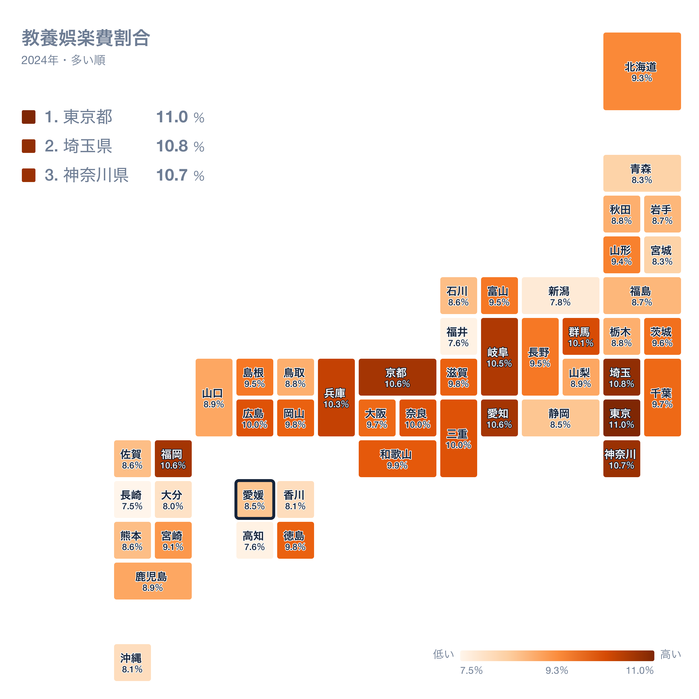
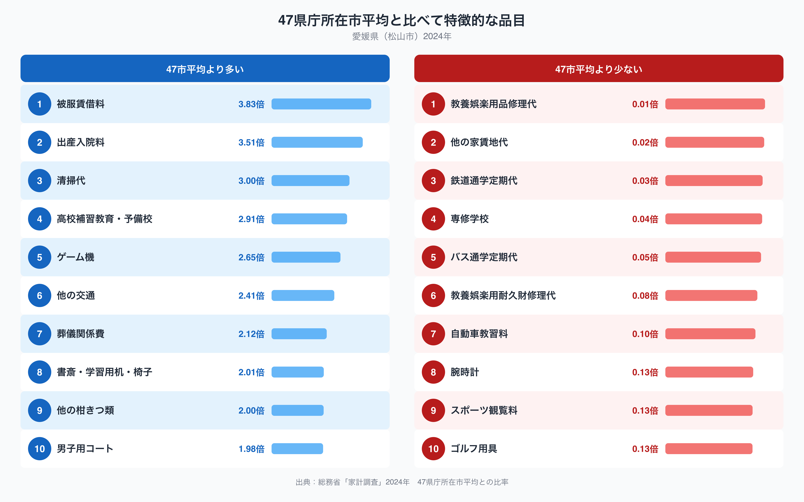
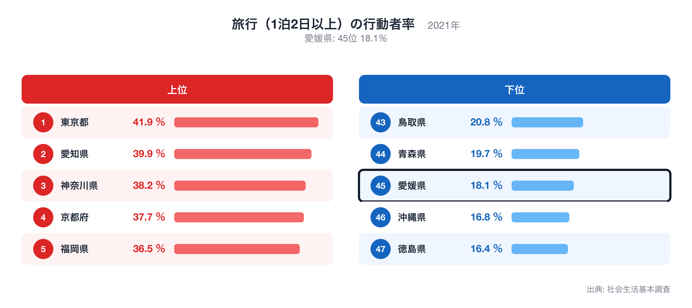
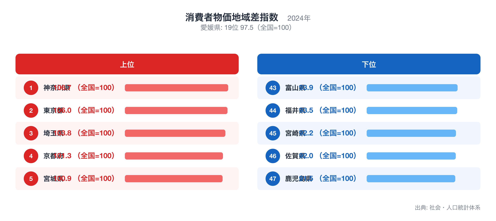

愛媛県の県庁所在地・松山市の家計を、総務省「家計調査」(2024年・二人以上の世帯)で十大費目に分けて見ると、47都道府県庁所在市の単純平均を1.00としたとき、最も乖離が大きいのは教養娯楽の0.77倍です。

この記事では、十大費目の偏り、47県の中での松山市の位置、突出した個別品目、そして教養娯楽が低くなる背景を他の都道府県統計で確かめる、という順で松山市の家計を読み解きます。比率はすべて47市平均に対する倍率で、家計調査が公表する全国平均とは基準が異なります。

十大費目とは食料、住居、光熱・水道、家具・家事用品、被服及び履物、保健医療、交通・通信、教育、教養娯楽、その他の消費支出の10区分で、家計調査が消費支出を分類する最上位の区分です。

## 十大費目にみる松山市の家計の偏り

47市平均を上回るのは1費目で、教育(1.03倍)です。下回るのは9費目で、教養娯楽(0.77倍)、交通・通信(0.78倍)、その他の消費支出(0.82倍)、住居(0.84倍)、光熱・水道(0.87倍)、食料(0.87倍)、家具・家事用品(0.88倍)、保健医療(0.91倍)、被服及び履物(0.92倍)です。最も大きく離れているのは教養娯楽の0.77倍、最も平均に近いのは教育の1.03倍で、松山市の家計は教養娯楽が低いほうに偏った構造だとわかります。

上の地図は、消費支出に占める教養娯楽の割合(教養娯楽費割合)を47都道府県で比べたもので、愛媛県は37位(8.5%)です。割合が最も高いのは東京都(11.0%)、次いで埼玉県(10.8%)、神奈川県(10.7%)で、最も低いのは長崎県(7.5%)です。倍率は「47市平均に対して何倍か」、地図の順位は「支出全体に占める割合が大きい順」なので、同じ費目でも見方が違います。倍率が高くても割合の順位が中位にとどまる場合は、他の費目も同じように多いことを意味します。全国ランキングの詳細は[教養娯楽費割合](https://stats47.jp/ranking/culture-recreation-expenditure-ratio-multi-person-households)で確認できます。

## 突出した品目にみる暮らしの実像

品目別に見ると、47市平均より多い側の上位10品目は被服賃借料(3.83倍)、出産入院料(3.51倍)、清掃代(3.00倍)、高校補習教育・予備校(2.91倍)、ゲーム機(2.65倍)、他の交通(2.41倍)、葬儀関係費(2.12倍)、書斎・学習用机・椅子(2.01倍)、他の柑きつ類(2.00倍)、男子用コート(1.98倍)です。少ない側の10品目は教養娯楽用品修理代(0.01倍)、他の家賃地代(0.02倍)、鉄道通学定期代(0.03倍)、専修学校(0.04倍)、バス通学定期代(0.05倍)、教養娯楽用耐久財修理代(0.08倍)、自動車教習料(0.10倍)、腕時計(0.13倍)、スポーツ観覧料(0.13倍)、ゴルフ用具(0.13倍)で、平均の1%程度にとどまる品目もあります。多い側の1位である被服賃借料と、少ない側の1位である教養娯楽用品修理代が、松山市の暮らしを最も端的に表す品目です。品目の倍率は世帯あたりの年間支出額を47市平均で割ったもので、購入頻度の低い品目ほど年ごとの振れが大きい点には注意が必要です。

## 教養娯楽の低さを他の統計で確かめる

旅行（1泊2日以上）の行動者率は愛媛県が全国45位(18.1%、2021年)で、教養娯楽が低くなることと整合します。全国1位は東京都(41.9%)、最下位は徳島県(16.4%)です。順位は値が大きい順で、全国ランキングは[旅行（1泊2日以上）の行動者率](https://stats47.jp/ranking/travel-participation-rate-overnight)で確認できます。

消費者物価地域差指数は愛媛県が全国19位(97.5（全国=100）、2024年)で中位にあり、教養娯楽が低くなる理由としては説明力が弱い指標です。全国1位は神奈川県(106.7（全国=100）)、最下位は鹿児島県(91.5（全国=100）)です。順位は値が大きい順で、全国ランキングは[消費者物価地域差指数](https://stats47.jp/ranking/consumer-price-difference-index-culture-recreation)で確認できます。

ここで示した対応関係は同じ年次の都道府県統計を並べた相関であり、因果の証明ではありません。家計調査の県庁所在市データは標本が小さく、年ごとの変動も大きいため、複数年・複数指標で確かめることを前提に読んでください。倍率の分母は47都道府県庁所在市の単純平均で、東京都区部や政令市の重みづけはしていません。順位は同じ値の県を小さい方の順位にそろえています。

## データの出典

本記事の数値は総務省統計局「家計調査」(2024年、二人以上の世帯)にもとづきます。都道府県の値は県全体ではなく県庁所在市である松山市の世帯を対象にした数値で、比率の基準は47都道府県庁所在市の単純平均を1.00としたものです。裏付けに使った旅行（1泊2日以上）の行動者率と消費者物価地域差指数は stats47 のランキングページ(出典は各ページに記載)から取得しました。
