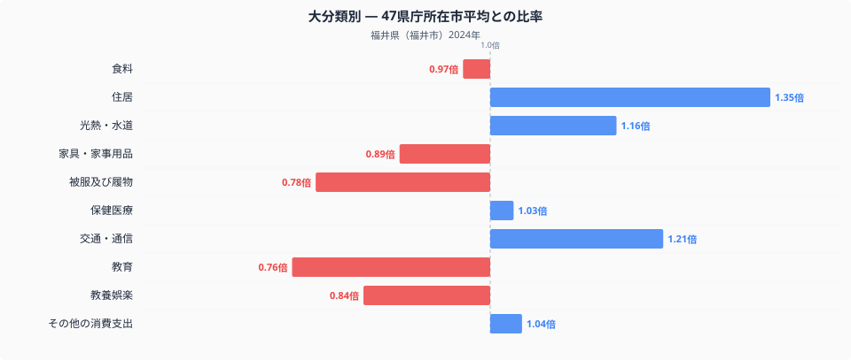
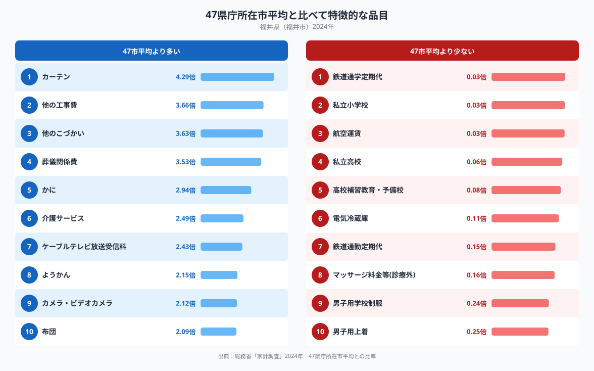

福井県福井市の家計を十大費目で見ると、全国平均（47都道府県庁所在市の単純平均）から最もかけ離れているのは「住居」です。比率は1.35倍で、十大費目の中でひときわ高い水準にあります。マイホーム志向が強いと言われる福井市の家計は、住まいにどれだけお金をかけ、逆に何を切り詰めているのでしょうか。十大費目の内訳と、際立って多い・少ない品目から読み解いていきます。

## 十大費目に見る支出の偏り

十大費目のうち、全国平均の1.00を上回っているのは住居（1.35倍）、交通・通信（1.21倍）、光熱・水道（1.16倍）、その他の消費支出（1.04倍）、保健医療（1.03倍）の五費目です。中でも住居は突出して高く、この一費目だけで福井市の家計を全国平均から大きく引き離しています。反対に、教育（0.76倍）と被服及び履物（0.78倍）は全国平均の8割に届かず、教養娯楽（0.84倍）や家具・家事用品（0.89倍）もやや低めです。食料は0.97倍とほぼ全国平均並みですが、品目別の内訳は[福井県の食卓を読み解く記事](https://stats47.jp/blog/fukui-food-culture)で詳しく取り上げているので、ここでは十大費目全体の傾向に絞って見ていきます。

## 突出する特徴品目

品目単位で見ると、全国平均の4倍を超える支出があるのはカーテン（4.29倍）だけです。次いで他の工事費（3.66倍）、他のこづかい（3.63倍）、葬儀関係費（3.53倍）、かに（2.94倍）と続き、上位10品目のうち5品目が2.9倍を超えています。カーテンや他の工事費、布団（2.09倍）は住まいに関わる品目で、住居費の高さと同じ方向を向いています。かにへの支出が全国平均の3倍近くに達している点は、福井県ならではの特徴と言えるでしょう。反対に、鉄道通学定期代・私立小学校・航空運賃はいずれも全国平均の0.03倍程度にとどまり、私立高校も0.06倍と低水準です。教育費全体の低さは、こうした私立校関連支出の少なさが影響している可能性があります。

## なぜこうした偏りが生まれるのか

福井県は共働き世帯や三世代同居の割合が高い地域として知られ、持ち家を早い段階で取得する家庭が多いと言われます。住居費やカーテン・他の工事費・布団といった住まいに関わる支出の高さは、こうしたマイホーム志向を反映しているのかもしれません。日本海に面し、越前がにの水揚げで知られる福井県では、かにへの支出が全国平均の3倍近くに達しており、産地に近く入手しやすい環境を反映していると考えられます。一方、私立小学校・私立高校や鉄道通学定期代の少なさは、公共交通よりも自家用車での通学・通勤が中心となりやすい地方都市の生活スタイルや、私立校の選択肢が都市部ほど多くない地域事情を反映している可能性があります。他の工事費や他のこづかい、ようかんの高さについては、本データだけでは要因を特定できません。

## データの出典

本記事の数値は、総務省統計局「家計調査」（2024年、二人以上の世帯）の福井市データをもとに、47都道府県庁所在市の単純平均を1.00として算出した比率です。都道府県の家計調査データは県全体ではなく、県庁所在市（この場合は福井市）の二人以上の世帯の値である点にご注意ください。また、ここでの比率は47都道府県庁所在市の単純平均を基準としたもので、総務省が公表する全国平均の値とは一致しません。福井県のその他の統計データは、[stats47の県データブック](https://stats47.jp/areas/18000)でご覧いただけます。
