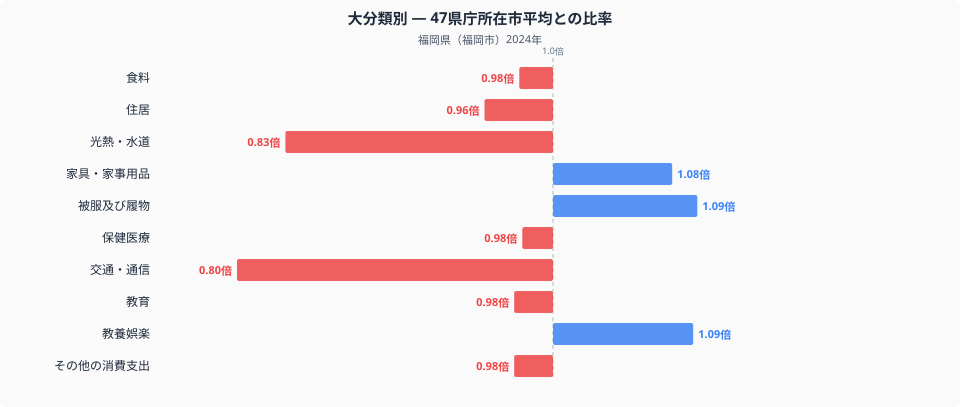
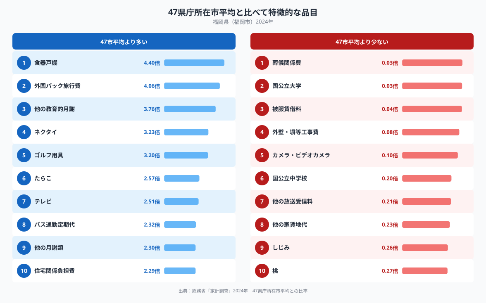

総務省統計局の家計調査(二人以上の世帯)で、福岡県の家計を十大費目の全国比較でみると、もっとも際立つのは交通・通信費です。ここでの比率は、47都道府県庁所在市の単純平均を1.00としたときの水準で、福岡市の交通・通信費は0.80倍にとどまり、10費目のなかでもっとも平均から離れています。ところが品目別にみると、バス通勤定期代だけは2.32倍と全国平均を大きく上回っており、費目全体の低さと特定品目の突出が同居しています。この記事では、その内訳を図で確認しながら、福岡市の家計の特徴を読み解きます。

## 交通・通信費は全国平均の0.80倍にとどまる

十大費目の比率を並べたグラフを見ると、交通・通信費の低さが際立っています。0.80倍という水準は、47都道府県庁所在市のなかでもかなり低いグループに入る値です。次いで光熱・水道も0.83倍と低めになっています。反対に、被服及び履物は1.09倍、教養娯楽も1.09倍、家具・家事用品は1.08倍とやや高い費目もありますが、その差は交通・通信ほど大きくありません。食料は0.98倍、住居は0.96倍、保健医療は0.98倍、教育は0.98倍、その他の消費支出は0.98倍と、多くの費目はほぼ平均並みに収まっており、突出しているのは交通・通信の低さだけといえそうです。食料品目の内訳、つまり何をどれだけ、いくらで買っているかについては、[福岡市の食卓を数量と価格で読み解いた記事](https://stats47.jp/blog/fukuoka-food-culture)で詳しく扱っていますので、あわせてご覧ください。

## バス通勤とたらこに厚い支出

品目別にみると、もっとも比率が高いのは食器戸棚で、全国平均の4.40倍に達します。次いで外国パック旅行費4.06倍、他の教育的月謝3.76倍、ネクタイ3.23倍、ゴルフ用具3.20倍と続きます。食品では、たらこが2.57倍と際立っており、辛子めんたいこの産地として知られる福岡らしい支出といえそうです。交通関連では、交通・通信費という費目全体は全国平均より2割低いにもかかわらず、バス通勤定期代だけは2.32倍と突出しています。ほかにも、テレビ2.51倍、他の月謝類2.30倍、住宅関係負担費2.29倍が全国平均を上回る品目として並びます。反対に支出が少ない品目には、葬儀関係費0.03倍、国公立大学0.03倍、被服賃借料0.04倍が挙げられます。外壁・塀等工事費0.08倍、カメラ・ビデオカメラ0.10倍、国公立中学校0.20倍、他の放送受信料0.21倍、他の家賃地代0.23倍も低い水準です。食品では、しじみ0.26倍、桃0.27倍が全国平均を下回っています。

## なぜこのような偏りが生まれるのか

交通・通信費全体の低さは、福岡市がコンパクトな都市構造をもち、地下鉄や西鉄バスなど公共交通が発達していることと関係している可能性があります。自家用車を持たずに生活できる世帯が多ければ、車両の購入費や燃料費といった支出が抑えられ、費目全体の水準が下がりやすくなります。その一方でバス通勤定期代だけが高いのは、通勤や通学に日常的にバスを利用する世帯が多いことの表れと考えられます。光熱・水道費の低さは、福岡が九州のなかでも比較的温暖な気候にあり、冬季の暖房需要が抑えられていることを反映しているのかもしれません。たらこへの支出の高さは、隣接する博多地域が辛子めんたいこの一大産地であることと結びついている可能性があります。これらはあくまで一つの見方であり、断定できるものではありませんが、交通・通信、光熱・水道という2つの費目が低く抑えられている点は、データから読み取れる特徴です。福岡県の他の指標もあわせて見たい方は、[福岡県のデータブック](https://stats47.jp/areas/40000)もご覧ください。

## データについて

本記事の数値は、総務省統計局「家計調査」(2024年、二人以上の世帯)にもとづいています。都道府県別の家計調査は都道府県全体ではなく、県庁所在市(この場合は福岡市)の世帯を対象に集計されている点にご注意ください。また、本記事の比率は47都道府県庁所在市の単純平均を1.00とした独自の指標であり、総務省が公表する全国平均の値とは一致しません。数値の読み方には、この2点を踏まえてご覧いただければと思います。
