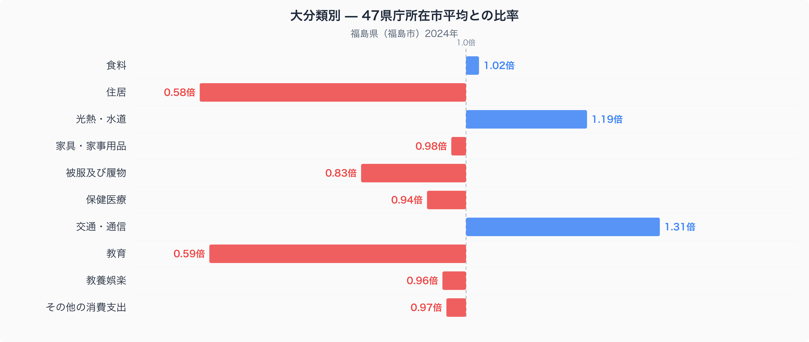
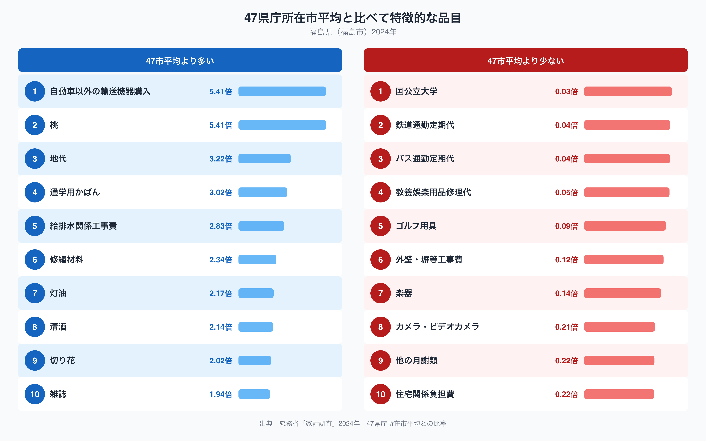

福島県福島市の家計を十大費目で47市平均と比べると、もっとも際立っているのは住居費です。比率は0.58倍で、47都道府県庁所在市の平均を4割以上下回っています。食料や光熱・水道など他の費目と比べても、住居費の落差はひときわ大きくなっています。なぜ福島市の家計では住居にかけるお金がこれほど少ないのでしょうか。十大費目の内訳と、47市平均から特に離れた品目の両方から見ていきます。

## 十大費目でみると住居と教育が低く、交通・通信が高い

図からわかるとおり、福島市で47市平均を大きく下回っているのは住居（0.58倍）と教育（0.59倍）です。逆に高いのは交通・通信（1.31倍）と光熱・水道（1.19倍）で、被服及び履物もやや低め（0.83倍）になっています。食料や家具・家事用品、教養娯楽、その他の消費支出はいずれも1.00に近く、大きな偏りはみられません。住居費が低いことは、持ち家率が高く家賃を払う世帯が少ない地域でよくみられる傾向です。一方で交通・通信費が高いのは、鉄道や路線バスの利用が少なく、自家用車を中心にした生活を送る世帯が多いことと関係している可能性があります。

## 品目でみると桃と地代、灯油が突出している

品目別にみると、47市平均に対する比率がもっとも高いのは自動車以外の輸送機器購入（5.41倍）と桃（5.41倍）で、次いで地代（3.22倍）、通学用かばん（3.02倍）、給排水関係工事費（2.83倍）と続きます。桃は福島県を代表する果物であり、産地であることが支出額の突出に表れた典型的な例といえます。灯油も2.17倍と高く、冷え込みが厳しい盆地の気候を反映していると考えられます。地代が3.22倍と高い一方で住居費全体は0.58倍と全国で最も低い水準にあるのは一見矛盾するようにみえますが、家賃を払う世帯が少なく持ち家が中心の地域で、借地に家を建てている一部の世帯だけが地代を負担しているという構図を反映しているのかもしれません。反対に比率が低いのは国公立大学（0.03倍）、鉄道通勤定期代（0.04倍）、バス通勤定期代（0.04倍）で、公共交通機関を使って通勤する世帯がきわめて少ないことがうかがえます。福島の桃がどのように食卓に登場するかは、[福島市の食卓を数量と価格から読み解いた記事](https://stats47.jp/blog/fukushima-food-culture)で詳しく取り上げていますので、あわせてご覧ください。

## なぜこうした偏りが生まれるのか

福島市の家計に表れる偏りは、地理と気候、産業に結びついているとみられます。盆地特有の寒暖差が大きい気候は果樹栽培に適しており、桃をはじめとする果物の生産が盛んな土地柄が、地元での購入額を押し上げていると考えられます。冬場の冷え込みが厳しいことは灯油の支出の多さにも表れています。また、鉄道や路線バスの利用が少なく自動車に依存した生活が一般的な地域では、公共交通機関の定期代がほとんど発生せず、その分だけ交通・通信費全体は自動車関連の支出に押し上げられているのかもしれません。持ち家率の高さは住居費の低さと結びついている可能性がありますが、これはあくまで一つの見方であり、断定はできません。

## データの出典

本記事の数値は総務省統計局の家計調査（2024年、二人以上の世帯）にもとづいています。都道府県の家計調査値は県全体ではなく、県庁所在市（ここでは福島市）の世帯を対象にした調査であることにご注意ください。また、ここでの比率は47都道府県庁所在市の単純平均を1.00とした場合の値であり、家計調査が公表する全国平均の値とは一致しません。福島市の家計全体をより詳しく知りたい方は、[福島県のデータブック](https://stats47.jp/areas/07000)もあわせてご覧ください。
