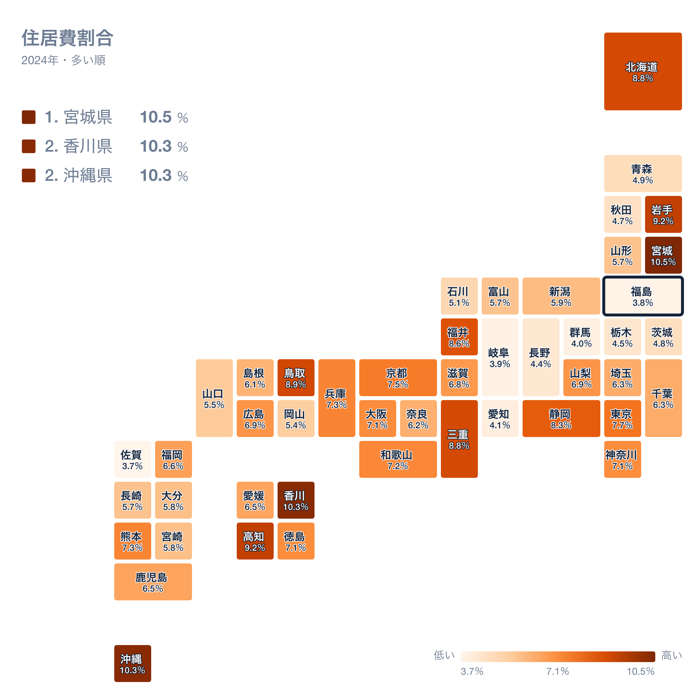
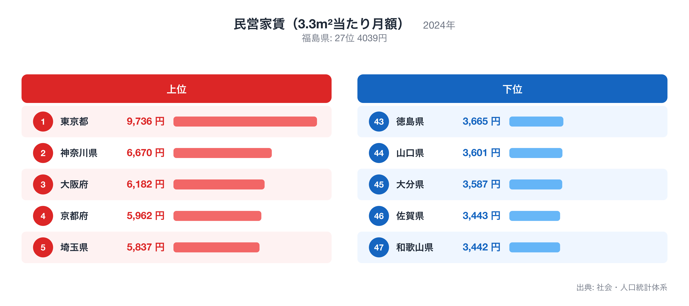
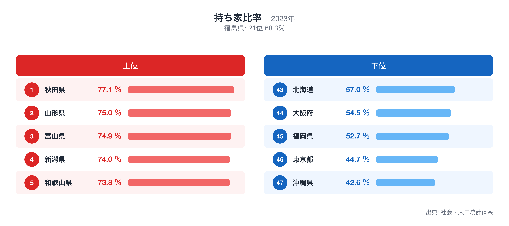

福島県の県庁所在地・福島市の家計を、総務省「家計調査」(2024年・二人以上の世帯)で十大費目に分けて見ると、47都道府県庁所在市の単純平均を1.00としたとき、最も乖離が大きいのは住居の0.58倍です。

この記事では、十大費目の偏り、47県の中での福島市の位置、突出した個別品目、そして住居が低くなる背景を他の都道府県統計で確かめる、という順で福島市の家計を読み解きます。比率はすべて47市平均に対する倍率で、家計調査が公表する全国平均とは基準が異なります。

十大費目とは食料、住居、光熱・水道、家具・家事用品、被服及び履物、保健医療、交通・通信、教育、教養娯楽、その他の消費支出の10区分で、家計調査が消費支出を分類する最上位の区分です。

## 十大費目にみる福島市の家計の偏り

47市平均を上回るのは3費目で、交通・通信(1.31倍)、光熱・水道(1.19倍)、食料(1.02倍)です。下回るのは7費目で、住居(0.58倍)、教育(0.59倍)、被服及び履物(0.83倍)、保健医療(0.94倍)、教養娯楽(0.96倍)、その他の消費支出(0.97倍)、家具・家事用品(0.98倍)です。最も大きく離れているのは住居の0.58倍、最も平均に近いのは食料の1.02倍で、福島市の家計は住居が低いほうに偏った構造だとわかります。

上の地図は、消費支出に占める住居の割合(住居費割合)を47都道府県で比べたもので、福島県は46位(3.8%)です。割合が最も高いのは宮城県(10.5%)、次いで香川県(10.3%)、沖縄県(10.3%)で、最も低いのは佐賀県(3.7%)です。倍率は「47市平均に対して何倍か」、地図の順位は「支出全体に占める割合が大きい順」なので、同じ費目でも見方が違います。倍率が高くても割合の順位が中位にとどまる場合は、他の費目も同じように多いことを意味します。全国ランキングの詳細は[住居費割合](https://stats47.jp/ranking/housing-expenditure-ratio-multi-person-households)で確認できます。

## 突出した品目にみる暮らしの実像

品目別に見ると、47市平均より多い側の上位10品目は自動車以外の輸送機器購入(5.41倍)、桃(5.41倍)、地代(3.22倍)、通学用かばん(3.02倍)、給排水関係工事費(2.83倍)、修繕材料(2.34倍)、灯油(2.17倍)、清酒(2.14倍)、切り花(2.02倍)、雑誌(1.94倍)です。少ない側の10品目は国公立大学(0.03倍)、鉄道通勤定期代(0.04倍)、バス通勤定期代(0.04倍)、教養娯楽用品修理代(0.05倍)、ゴルフ用具(0.09倍)、外壁・塀等工事費(0.12倍)、楽器(0.14倍)、カメラ・ビデオカメラ(0.21倍)、他の月謝類(0.22倍)、住宅関係負担費(0.22倍)で、平均の3%程度にとどまる品目もあります。多い側の1位である自動車以外の輸送機器購入と、少ない側の1位である国公立大学が、福島市の暮らしを最も端的に表す品目です。品目の倍率は世帯あたりの年間支出額を47市平均で割ったもので、購入頻度の低い品目ほど年ごとの振れが大きい点には注意が必要です。

## 住居の低さを他の統計で確かめる

民営家賃（3.3m²当たり月額）は福島県が全国27位(4,039円、2024年)で中位にあり、住居が低くなる理由としては説明力が弱い指標です。全国1位は東京都(9,736円)、最下位は和歌山県(3,442円)です。順位は値が大きい順で、全国ランキングは[民営家賃（3.3m²当たり月額）](https://stats47.jp/ranking/private-rental-housing-rent-per-3-3m2)で確認できます。

持ち家比率は福島県が全国21位(68.3%、2023年)で中位にあり、住居が低くなる理由としては説明力が弱い指標です。全国1位は秋田県(77.1%)、最下位は沖縄県(42.6%)です。順位は値が大きい順で、全国ランキングは[持ち家比率](https://stats47.jp/ranking/owner-occupied-housing-ratio)で確認できます。

ここで示した対応関係は同じ年次の都道府県統計を並べた相関であり、因果の証明ではありません。家計調査の県庁所在市データは標本が小さく、年ごとの変動も大きいため、複数年・複数指標で確かめることを前提に読んでください。倍率の分母は47都道府県庁所在市の単純平均で、東京都区部や政令市の重みづけはしていません。順位は同じ値の県を小さい方の順位にそろえています。

## データの出典

本記事の数値は総務省統計局「家計調査」(2024年、二人以上の世帯)にもとづきます。都道府県の値は県全体ではなく県庁所在市である福島市の世帯を対象にした数値で、比率の基準は47都道府県庁所在市の単純平均を1.00としたものです。裏付けに使った民営家賃（3.3m²当たり月額）と持ち家比率は stats47 のランキングページ(出典は各ページに記載)から取得しました。
