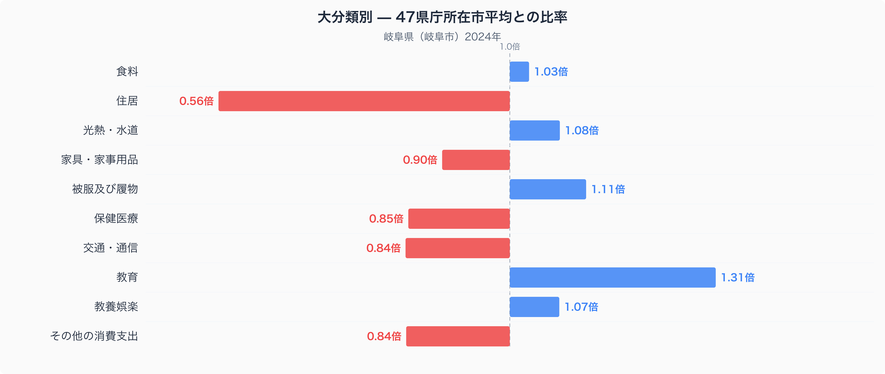
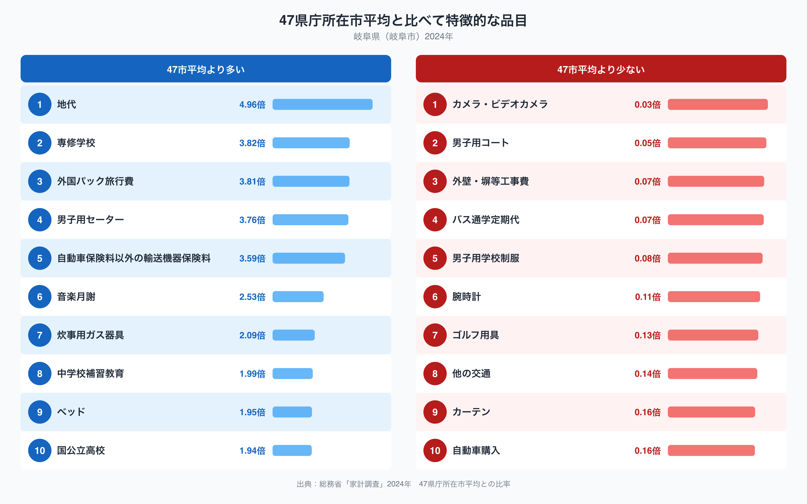

多くの都道府県で「住居」は家計に重くのしかかる費目ですが、岐阜県はその逆を行きます。岐阜市の二人以上世帯を家計調査で見ると、住居費は47都道府県庁所在市の単純平均を1.00としたとき0.56倍しかありません。十大費目の中で47市平均から最も離れているのがこの住居費です。ところが同じ住居費の内訳に含まれる「地代」だけを取り出すと、逆に47市平均の4.96倍という突出した数字が現れます。全体としては軽い住居費の中に、なぜこれほど重い項目が隠れているのでしょうか。

## 十大費目で見る岐阜市の家計

図を見ると、住居費0.56倍の低さが際立つ一方で、教育費は1.31倍と47市平均を大きく上回っています。十大費目のうち47市平均から最も離れているのが住居費、次に離れているのが教育費です。光熱・水道は1.08倍、被服及び履物は1.11倍、教養娯楽は1.07倍とやや高めで、保健医療は0.85倍、交通・通信は0.84倍、その他の消費支出は0.84倍、家具・家事用品は0.90倍とやや低めに収まっています。食料は1.03倍でほぼ平均並みです。住居費が47市平均を4割以上下回っていることは、岐阜市の家計を語るうえでまず押さえておきたい特徴です。[食卓の中身については別記事](https://stats47.jp/blog/gifu-food-culture)で数量と価格に分けて見ていますが、この記事では家計全体の偏りに焦点を当てます。

## 47市平均から離れた品目

47市平均より多い品目の上位を見ると、先ほど触れた地代の4.96倍を筆頭に、専修学校が3.82倍、外国パック旅行費が3.81倍、男子用セーターが3.76倍、自動車保険料以外の輸送機器保険料が3.59倍と続きます。学校教育の枠に収まらない専修学校や補習教育、輸送機器保険料といった項目が並ぶ点は、教育費全体の1.31倍という数字とも整合的です。反対に47市平均より少ない品目では、カメラ・ビデオカメラが0.03倍、男子用コートが0.05倍、外壁・塀等工事費が0.07倍、バス通学定期代が0.07倍、自動車購入が0.16倍と、いずれも47市平均の1割前後かそれ以下にとどまります。住居費の低さと呼応するように、外壁・塀等工事費のような住宅関連の支出も47市平均を大きく下回っています。

## なぜこの偏りが生まれるのか

住居費が低く地代だけが高いという組み合わせは、家賃を払って部屋を借りる暮らしより、土地を借りて自分の家を構える暮らしが相対的に多いことを反映しているのかもしれません。地代は家計調査の十大費目「住居」に含まれる細目で、持ち家であっても敷地を借りている場合に発生します。岐阜市を含む濃尾平野は古くからの城下町や農村集落が広がる地域で、土地の貸借慣行が根付いてきた土地柄と関係している可能性があります。専修学校や中学校補習教育、音楽月謝といった教育関連品目が上位に並ぶ点も、教育費全体の高さと合わせて読むと、進学や習い事にかける支出の厚みを示していると考えられます。一方でバス通学定期代や自動車購入が低いのは、自家用車や自転車での通学・通勤が中心で、公共交通や新車購入への支出が相対的に少ないためかもしれません。こうした関係はあくまで数字から読み取れる傾向であり、断定はできません。[岐阜県のデータブック](https://stats47.jp/areas/21000)では他の指標もあわせて確認できます。

## データの出典

本記事の数値は総務省統計局「家計調査」(2024年、二人以上の世帯、490品目)にもとづきます。都道府県のデータとして扱っていますが、実際に集計されているのは岐阜市など都道府県庁所在市の世帯であり、県全体の平均ではありません。また比率の基準は家計調査が公表する全国平均ではなく、47都道府県庁所在市を単純平均した値を1.00としたものです。この点を踏まえたうえで、他の都道府県と比べる際の目安としてご覧ください。
