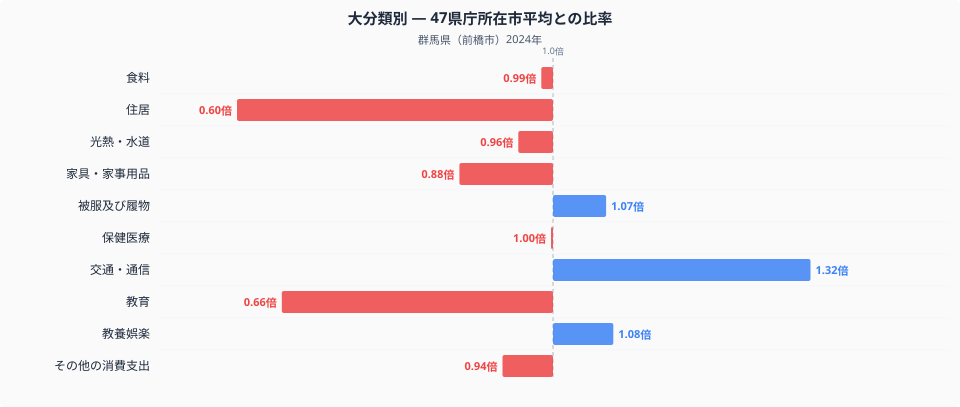
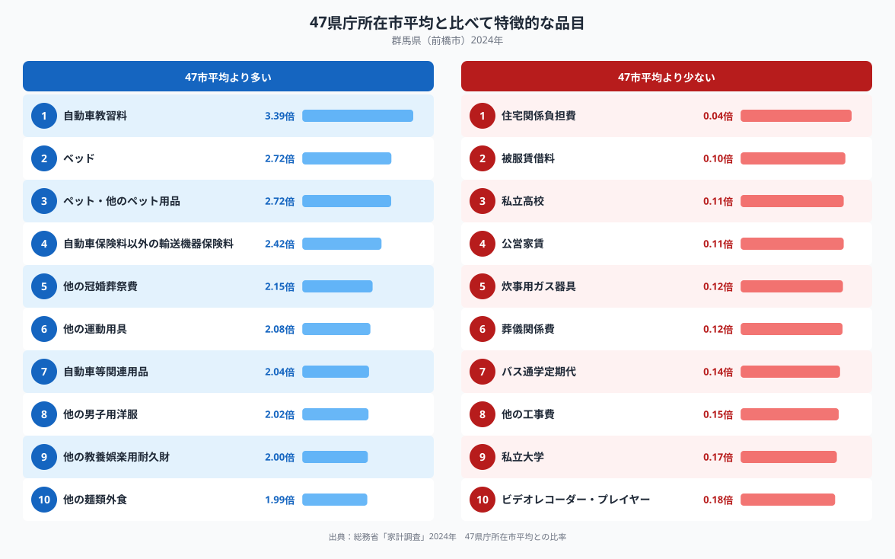

群馬県前橋市の家計を全国の県庁所在市と比べると、もっとも際立つのは住居費の少なさです。十大費目のうち住居は全国平均の0.60倍にとどまり、他のどの費目よりも平均から離れています。一方で交通・通信は1.32倍と、全国平均を大きく上回っています。同じ家計の中で、なぜこれほど対照的な結果になるのでしょうか。

## 十大費目で見る前橋市の家計

上のグラフは、十大費目それぞれについて前橋市の家計支出が47都道府県庁所在市の単純平均と比べてどの水準にあるかを示したものです。もっとも低いのは住居で0.60倍、次いで教育が0.66倍と、いずれも全国平均より3割以上少なくなっています。反対に交通・通信は1.32倍で唯一大きく平均を上回り、被服及び履物が1.07倍、教養娯楽が1.08倍とわずかに平均を上回る水準です。食料は0.99倍、保健医療は1.00倍で、これらの費目には目立った偏りが見られません。食料費の全体像はほぼ全国並みですが、品目単位で見ると地域色が強く出ており、その詳細は[前橋市の食卓を数量と価格で読み解く記事](https://stats47.jp/blog/gunma-food-culture)でまとめています。

## 全国平均から飛び抜ける品目たち

品目単位で見ると、前橋市の家計の特徴はさらにはっきりします。全国平均より多い品目の上位には自動車教習料が3.39倍で入り、自動車保険料以外の輸送機器保険料が2.42倍、自動車等関連用品が2.04倍と、車に関わる支出が複数並びます。あわせてベッドが2.72倍、ペット・他のペット用品が2.72倍、他の冠婚葬祭費が2.15倍、他の運動用具が2.08倍と、住空間や趣味に関わる耐久的な支出も目立ちます。反対に少ない側では、住宅関係負担費が0.04倍、公営家賃が0.11倍、私立高校が0.11倍、私立大学が0.17倍と、住居や教育に関わる負担が軒並み低い水準にとどまっています。バス通学定期代も0.14倍と少なく、通学の足が公共交通に依存していない様子がうかがえます。

## なぜ住居費は少なく、車には手厚いのか

住居費が低い背景には、持ち家世帯の割合が高い地域ほど家計調査の「住居」に計上される金額が小さくなりやすいという、この統計特有の性質が関係している可能性があります。家計調査の住居費は主に家賃や住宅の修繕費を捉えるもので、住宅ローンの元金返済は含まれません。そのため賃貸より持ち家が多い地域では、数字の上で住居費が少なく見えやすくなります。一方の交通・通信の高さは、自動車教習料や車両保険、関連用品への支出が重なっていることから、公共交通よりも自家用車を前提とした生活が根付いている地域性を反映しているのかもしれません。群馬県のように県内の移動が広域にわたり、鉄道網が主要都市間に限られる地方では、通勤や買い物に車を使う場面が多くなりやすく、それが車関連費目の高さに表れていると考えられます。県全体の統計は[群馬県のデータブック](https://stats47.jp/areas/10000)でも確認できます。

## データの出典

本記事の数値は総務省統計局「家計調査」(2024年、二人以上の世帯)による前橋市のデータをもとにしています。都道府県の家計調査値は県全体ではなく県庁所在市の二人以上世帯の値であり、ここで示した比率は47都道府県庁所在市の単純平均を1.00とした場合の相対値です。家計調査が公表する全国平均とは基準が異なる点にご注意ください。
