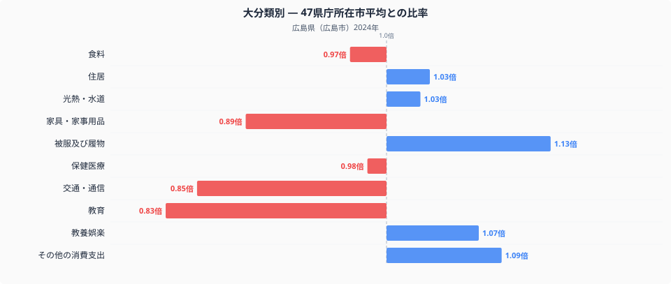
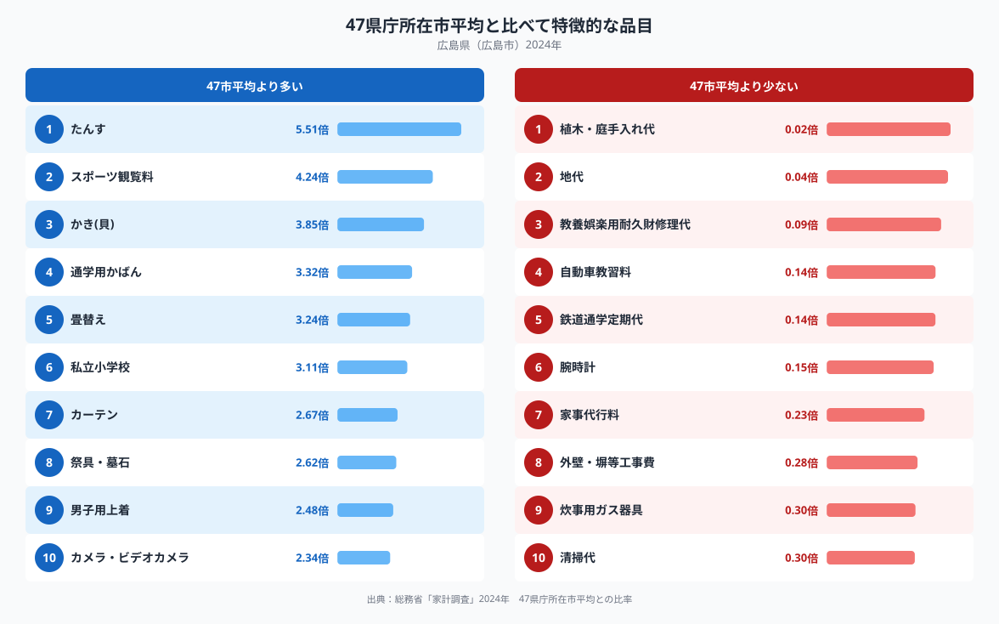

## 教育費が際立って少ない広島市の家計

総務省の家計調査から、47都道府県庁所在市の消費支出を十大費目ごとに比べてみると、広島市でもっとも全国平均から離れているのは「教育」でした。47都道府県庁所在市の単純平均を1.00とすると、広島市の教育費は0.83倍で、十大費目の中でもっとも平均との差が大きい項目です。裏を返せば、他の都市に比べて教育に振り向けられるお金の割合が小さいということになります。では、その分だけ広島市の家計はどこにお金を使っているのでしょうか。十大費目の比率と、突出して多い・少ない個別の品目から見ていきます。

## 十大費目で見る広島市の支出バランス

図を見ると、もっとも低いのは教育の0.83倍で、これに次ぐのが交通・通信の0.85倍、家具・家事用品の0.89倍です。反対にもっとも高いのは被服及び履物の1.13倍で、その他の消費支出も1.09倍、教養娯楽も1.07倍と平均を上回っています。住居と光熱・水道はどちらも1.03倍とわずかに高く、食料は0.97倍、保健医療は0.98倍とほぼ平均並みです。全体として、広島市の家計は移動や通信、教育といった費目を控えめにする一方、衣類や娯楽、その他の消費支出といった費目にお金を振り向けている構図が見えます。

## 品目に見る広島市らしさ

品目単位で見ると、もっとも比率が高いのは家具の「たんす」で5.51倍、次いでスポーツ観覧料が4.24倍、瀬戸内の名産である「かき(貝)」が3.85倍と続きます。[食卓に見る広島の食文化](https://stats47.jp/blog/hiroshima-food-culture)でも取り上げているとおり、かきは広島を代表する特産品で、家計調査の数字にもその存在感がはっきり表れています。通学用かばんが3.32倍、私立小学校が3.11倍と、個別の品目では教育関連の支出が目立つ一方、教育の費目全体としては全国平均より低いというねじれも見られます。教育費の総額は抑えられていても、私立小学校を選ぶ一部の世帯や通学用品への支出が突出して高いことが、この差を生んでいるのかもしれません。反対に比率が低いのは、植木・庭手入れ代が0.02倍、地代が0.04倍、自動車教習料と鉄道通学定期代がそれぞれ0.14倍などで、いずれも持ち家の庭の手入れや土地の賃借に関わる支出が控えめであることを示しています。

広島市は瀬戸内海に面し、かき養殖をはじめとする水産業が盛んな地域です。かきの比率が突出して高いのは、こうした地元産の食材が日常の食卓にのぼりやすいことと関係している可能性があります。また祭具・墓石が2.62倍と高いことについては、広島県を含む中国地方が浄土真宗の信仰が篤い土地柄として知られ、法事などの仏事を大切にする文化が根付いていることと関係しているのかもしれません。植木・庭手入れ代や地代の低さは、広島市が集合住宅の多い都市部を中心とした居住形態であることを反映していると見ることもできそうです。県全体の指標は[広島県のデータブック](https://stats47.jp/areas/34000)でも確認できます。

## データの出典

本記事の数値は総務省統計局「家計調査」(2024年、二人以上の世帯)にもとづいています。都道府県の家計調査値は県全体ではなく、広島県の場合は県庁所在市である広島市の二人以上世帯の数値である点にご注意ください。また、ここでの比率はいずれも47都道府県庁所在市の単純平均を1.00とした相対値であり、家計調査が公表する全国値そのものとは一致しません。
