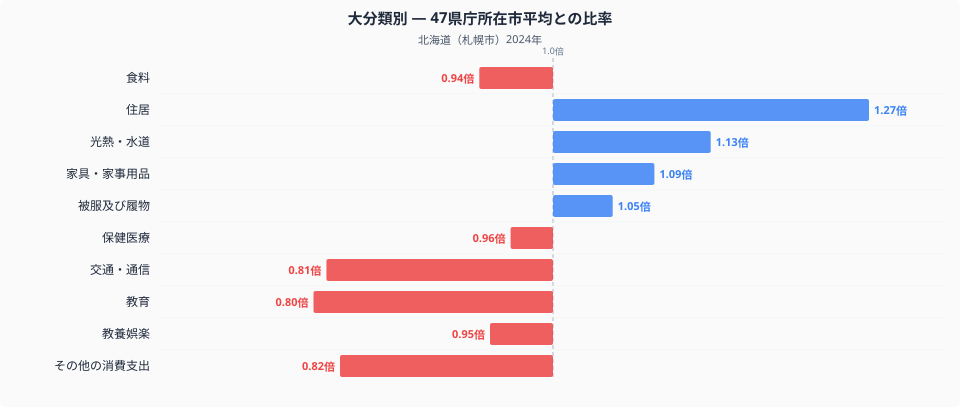
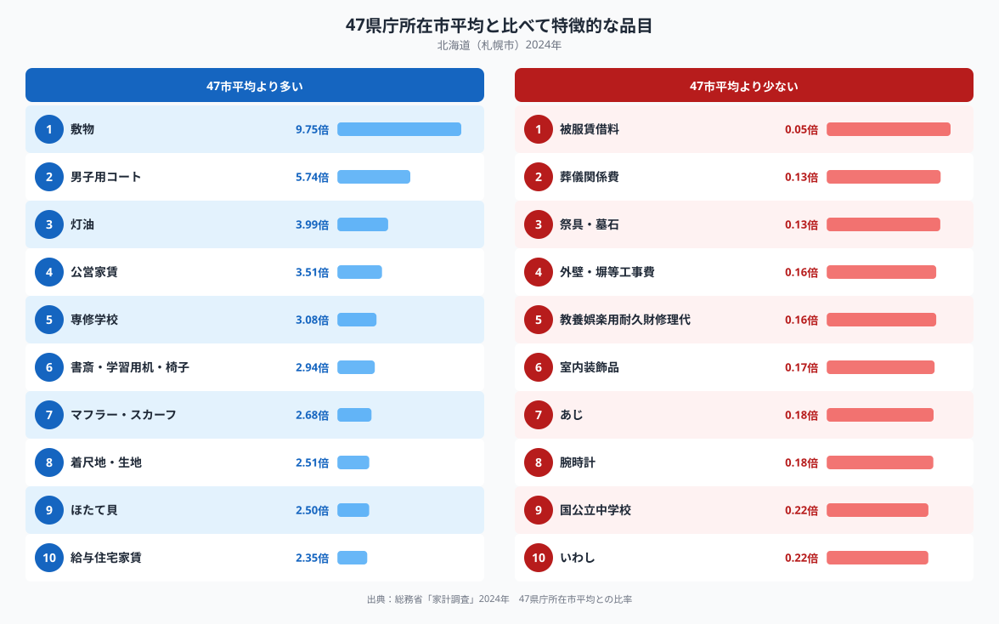

北海道の家計を47都道府県庁所在市と比べると、いちばん違って見えるのは食べ物でも通信費でもなく、住居費です。北海道(札幌市)の住居費は47県庁所在市平均を1.27倍上回っており、十大費目のなかで基準の1.00から最も離れています。食卓の話題になりがちな北海道で、なぜ住まいにお金が集まっているのでしょうか。この記事では、家計調査のデータから北海道の家計全体の構造を読み解きます。

## 住居費が北海道の家計を特徴づけている

十大費目を47県庁所在市平均(基準値1.00)と比べると、北海道は住居が1.27倍でもっとも高く、光熱・水道も1.13倍とやや高めです。一方で交通・通信は0.81倍、教育は0.80倍と、いずれも平均を下回っています。食料も0.94倍で平均以下です。つまり北海道の家計は、暮らしの土台となる「住まい」と「暖房・電気・水道」にお金をかける一方で、移動や教育、食費は相対的に抑えられているという構図が見えてきます。全体として、家計の重心が日々の消費よりも「住まいを維持すること」に寄っている家計だといえそうです。

## 敷物・灯油・公営家賃 ── 数字に表れる冬支度

個別の品目を見ると、北海道らしさがより具体的に浮かび上がります。もっとも突出しているのは敷物への支出で、47県庁所在市平均の9.75倍にのぼります。次いで男子用コートが5.74倍、灯油が3.99倍、公営家賃が3.51倍、専修学校が3.08倍と続きます。敷物とコートは寒さをしのぐための備え、灯油は暖房費そのものであり、いずれも住居費や光熱・水道費が高かったこととも符合します。公営家賃の高さは、北海道で公営住宅に暮らす世帯が相対的に多いことを反映している可能性があります。一方で支出が少ない側を見ると、被服賃借料は0.05倍、葬儀関係費は0.13倍と全国平均を大きく下回っており、こうした品目には地域差というより個々の世帯事情が強く出ている可能性があります。

## 寒さと広さがつくる支出の構造

北海道で住居費や暖房費が高くなる背景には、まず気候があります。積雪と低温が長く続く地域では、断熱性の高い住宅や十分な暖房設備が生活の前提になり、灯油代や敷物のような防寒用品への支出がかさみやすくなります。また北海道は都府県に比べて可住地面積あたりの人口密度が低く、住宅の延床面積が広くとられやすいことも、住居費や光熱費を押し上げる方向に働いていると考えられます。専修学校や公営家賃の高さについては、進学先の構成や住宅供給のあり方の地域差を反映しているのかもしれません。ただし、これらはあくまで家計調査の集計値から読み取れる傾向であり、個々の世帯の事情まで説明するものではない点には注意が必要です。

同じ北海道の家計を、食卓という切り口から見た記事も公開しています。[札幌市の食卓を数量と価格で読み解く記事](https://stats47.jp/blog/hokkaido-food-culture)もあわせてご覧ください。また、北海道の他の統計データは[stats47の北海道データブック](https://stats47.jp/areas/01000)でまとめて確認できます。

## データの出典

本記事の数値は総務省統計局「家計調査」(2024年、二人以上の世帯)にもとづいています。ここでいう都道府県の値は道県全体ではなく、札幌市など県庁所在市の家計を指す点にご留意ください。また、比率の基準は家計調査が公表する全国値ではなく、47都道府県庁所在市の単純平均を1.00としたものです。したがって「全国平均に対して何倍か」ではなく、「他の道府県庁所在市と比べて何倍か」を示す数値である点も踏まえてお読みください。
