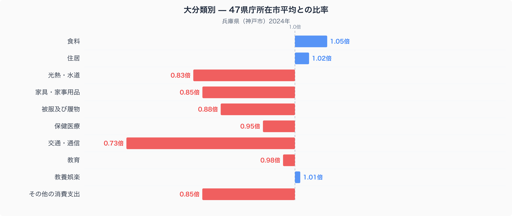
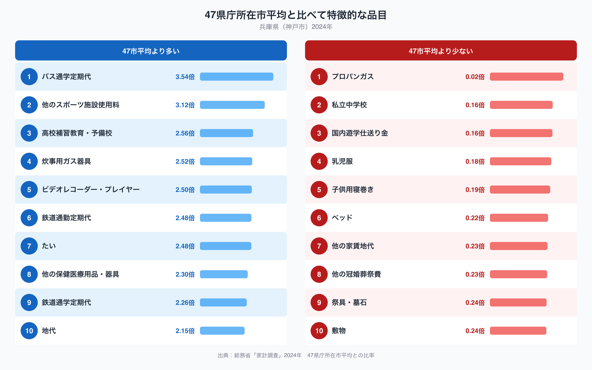

兵庫県庁所在地・神戸市の家計を十大費目でみると、いちばん際立つのは支出が多い費目ではなく、逆に少ない費目です。交通・通信費は、47都道府県庁所在市の平均を1.00としたとき0.73倍と、10費目のなかで最も平均から離れています。ところが同じ交通・通信のなかでも、通勤・通学の定期代だけは全国トップクラスに高いのです。この矛盾した動きから、神戸市の家計の特徴が見えてきます。

## 交通・通信費は全国で最も平均から離れた費目

総務省統計局の家計調査（二人以上の世帯・2024年）をもとに、神戸市の十大費目ごとの支出を47都道府県庁所在市の単純平均と比べると、交通・通信は0.73倍で最も低い水準にあります。次いで光熱・水道が0.83倍、家具・家事用品とその他の消費支出がそれぞれ0.85倍と続き、生活インフラに関わる費目がそろって平均を下回っています。一方で食料は1.05倍、住居は1.02倍とわずかに平均を上回り、教養娯楽も1.01倍とほぼ平均並みです。

グラフを見ると、神戸市の家計は「車社会型の支出」が薄く、「都市生活型の支出」がやや厚いという構図になっていることがわかります。交通・通信費が低いのは、自動車の維持にかかる費用が47市平均より少ないためだと考えられます。神戸市を含む阪神間はJRと私鉄が並走する鉄道網が発達しており、通勤・通学で自家用車に頼らずに移動できる世帯が多いことが、費目全体を押し下げている可能性があります。

## 定期代とスポーツ施設使用料に際立つ支出

品目単位で見ると、47市平均から最も離れている10品目のうち上位はバス通学定期代が3.54倍、他のスポーツ施設使用料が3.12倍、高校補習教育・予備校が2.56倍、鉄道通勤定期代が2.48倍、たいが2.48倍、鉄道通学定期代が2.26倍と続きます。

交通・通信費全体が47市平均より低い一方で、バス通学定期代や鉄道通勤定期代、鉄道通学定期代がそろって全国トップクラスに高いのは、一見すると矛盾しているように見えます。しかしこれは、自家用車を持たない、あるいは使わない世帯の割合が高いぶん、公共交通機関への支出に集中している構造を映していると考えられます。神戸市は明石海峡に面しており、たいの支出が2.48倍と高いのも、瀬戸内海沿岸で鯛の水揚げが知られる地域性を反映しているのかもしれません。詳しい食料品目の内訳は、[神戸市の食卓を数量×価格で読み解いた記事](https://stats47.jp/blog/hyogo-food-culture)で紹介しています。反対に平均から離れて少ない側では、プロパンガスが0.02倍、私立中学校が0.16倍、国内遊学仕送り金が0.16倍と、都市部特有の生活基盤が見えてきます。プロパンガスの支出がほぼゼロに近いのは、神戸市中心部では都市ガスの供給網が広く行き渡っているためだと考えられます。

## なぜこの偏りが生まれるのか

神戸市を含む兵庫県南部は、明治期以来の港湾都市として鉄道網の整備が早くから進み、通勤・通学の足として電車やバスが定着してきた地域です。都市ガスのインフラも比較的早くから整備されており、プロパンガスに頼る世帯が少ないこともうなずけます。一方で自家用車の保有・維持にかかる費用は、公共交通機関が発達しているぶん相対的に抑えられていると考えられます。こうした都市インフラの整備状況が、交通・通信費全体を押し下げながら定期代だけを押し上げるという、一見すると矛盾した支出構造を生み出していると言えそうです。兵庫県のそのほかの統計データは、[兵庫県のデータブック](https://stats47.jp/areas/28000)でまとめて確認できます。

## データの出典と読み方

本記事の数値は、総務省統計局「家計調査」（二人以上の世帯・2024年）にもとづいています。ここでいう兵庫県の家計とは、県内全域ではなく神戸市（県庁所在市）の世帯を指す点にご注意ください。また比率の基準は、家計調査が公表する全国平均ではなく、47都道府県庁所在市の支出を単純平均した値を1.00としたものです。全国値そのものとは一致しませんが、都道府県間の相対的な偏りを見るための指標として使っています。
