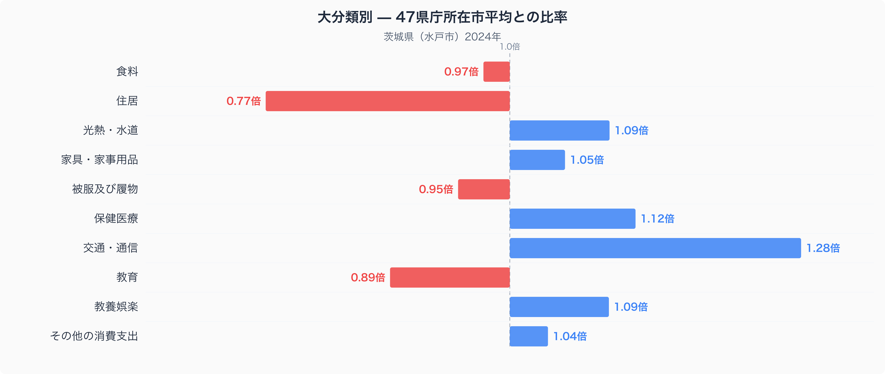
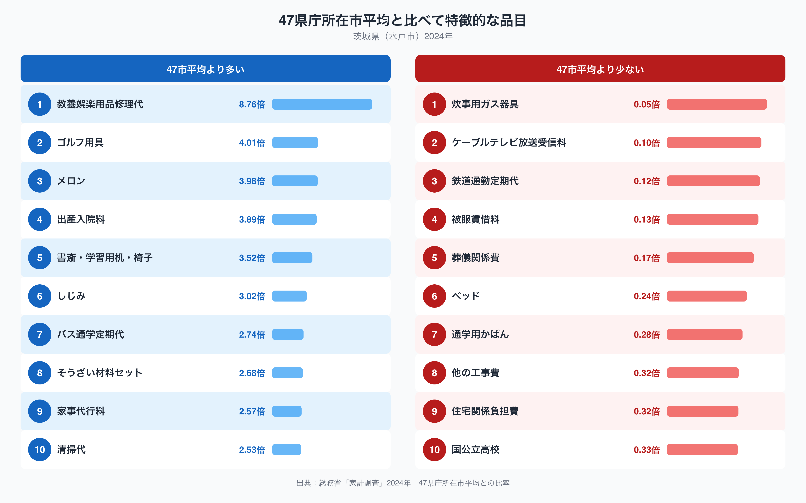

水戸市の家計を十大費目の47市平均（47都道府県庁所在市の単純平均を1.00とした比率）と比べると、もっとも差が大きいのは交通・通信費で1.28倍です。逆にもっとも低いのは住居費で0.77倍にとどまります。同じ関東地方に位置しながら、なぜこの2つの費目でこれほど大きな差が生まれるのでしょうか。

## 十大費目でみる茨城県の家計

図を見ると、交通・通信費（1.28倍）を筆頭に、保健医療（1.12倍）、光熱・水道（1.09倍）、教養娯楽（1.09倍）が47市平均を上回っています。反対に住居費（0.77倍）と教育費（0.89倍）は47市平均を下回り、食料（0.97倍）と被服及び履物（0.95倍）もわずかに低い水準です。十大費目のうち差がもっとも大きいのは交通・通信費と住居費で、この2つが水戸市の家計の輪郭を形づくっています。

## 47市平均から突出した品目

品目別にみると、教養娯楽用品修理代が8.76倍ともっとも高く、ゴルフ用具（4.01倍）、メロン（3.98倍）、出産入院料（3.89倍）、書斎・学習用机・椅子（3.52倍）と続きます。霞ヶ浦・北浦の漁でとれるしじみ（3.02倍）や、バス通学定期代（2.74倍）も上位に入りました。一方で47市平均を大きく下回るのは炊事用ガス器具（0.05倍）、ケーブルテレビ放送受信料（0.10倍）、そして鉄道通勤定期代（0.12倍）です。バス通学定期代が高く鉄道通勤定期代が低いという組み合わせは、通勤・通学の足として鉄道よりも自動車やバスに頼る度合いが高い地域性を映しているのかもしれません。茨城県のメロンをはじめとした食料品目の消費量と価格の詳しい内訳は、姉妹記事「[茨城県の食卓](https://stats47.jp/blog/ibaraki-food-culture)」でも扱っていますので、あわせてご覧ください。

## 車社会と農業県が生む支出のかたち

茨城県は関東平野の広がる農業県であり、メロンやしじみのように地元の産物が家計にも表れています。同時に、都心と直結する常磐線沿線を除くと鉄道網が薄く、日常の移動を自動車に頼る地域が多いといわれています。交通・通信費の高さや鉄道通勤定期代の低さは、こうした自動車中心の暮らし方と関係している可能性があります。住居費が47市平均より低いのは、首都圏に位置しながらも東京都心部ほど地価水準が高くないことを反映しているのかもしれません。教育費が47市平均を下回り、国公立高校（0.33倍）の支出も低めなのは、公立志向や学校数の分布など複数の要因が絡んでいると考えられ、単純な理由には還元できません。

## データの出典

本記事の数値は総務省統計局「家計調査」（2024年、二人以上の世帯）にもとづいています。都道府県の家計調査値は県全体ではなく、水戸市という県庁所在市の値である点にご注意ください。また、ここでの比率は47都道府県庁所在市の単純平均を1.00とした相対値であり、家計調査が公表する全国平均とは基準が異なります。十大費目以外の指標も含めた茨城県のデータは「[stats47 茨城県データブック](https://stats47.jp/areas/08000)」でご覧いただけます。
