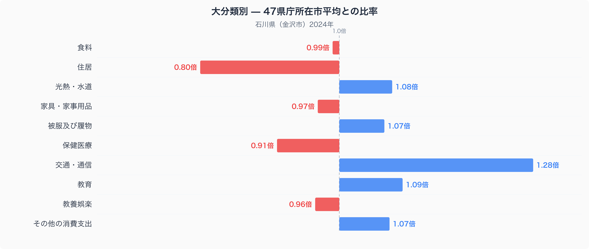
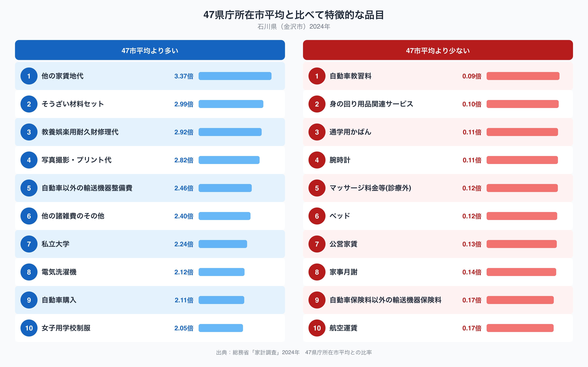

石川県金沢市の家計を家計調査（二人以上世帯、2024年）でみると、十大費目のうち47市平均から最も離れているのは「交通・通信」で、47都道府県庁所在市の単純平均に対して1.28倍という高さです。逆にもっとも少ないのは「住居」で0.80倍にとどまります。このねじれは何を映しているのでしょうか。品目別の比率まで見ていくと、金沢市の暮らしの輪郭が見えてきます。

## 十大費目に見る金沢市の家計の形

十大費目のうち石川県が47市平均を上回るのは「交通・通信」1.28倍、「教育」1.09倍、「光熱・水道」1.08倍、「被服及び履物」1.07倍、「その他の消費支出」1.07倍です。下回るのは「住居」0.80倍、「保健医療」0.91倍、「家具・家事用品」0.97倍、「教養娯楽」0.96倍、「食料」0.99倍で、食料はほぼ47市平均並みにおさまっています。もっとも突出しているのが交通・通信で、次に低いのが住居という組み合わせは、地方都市に共通しやすい構図でもあります。自家用車を維持する費用が家計の大きな割合を占める一方で、地価や家賃の水準が抑えられているぶん、住居費の比重が軽くなっている、という読み方ができます。

## 特徴的な品目からわかること

品目単位で見ると、「他の家賃地代」が3.37倍ともっとも高い比率です。住居費全体は47市平均より低いにもかかわらず、この項目だけが突出しているのは興味深い点で、駐車場や物置など家賃以外の賃借料が一定の支出として計上されている可能性があります。ほかにも「自動車以外の輸送機器整備費」2.46倍、「自動車購入」2.11倍と、車まわりの支出が上位に複数入っており、「交通・通信」費の高さを個別品目からも裏づけています。「私立大学」2.24倍や「女子用学校制服」2.05倍も高く、教育費の高さと重なる部分です。一方で少ない側を見ると、「自動車教習料」0.09倍がもっとも低く、「腕時計」0.11倍、「通学用かばん」0.11倍と続きます。自動車の保有・維持にお金をかける一方で、免許取得そのものへの支出が少ないのは一見矛盾するようですが、対象月の偏りや、標本の少なさによるばらつきが影響している可能性も考えられます。

## なぜこの偏りが生まれるのか

石川県は積雪期のある地域で、公共交通機関の路線密度が大都市圏ほど高くない地方都市でもあります。こうした条件のもとでは、通勤や通学、買い物に自家用車を使う世帯が多くなりやすく、車両の購入や整備、燃料費がかさむことは自然な帰結として理解できます。「交通・通信」費の高さは、こうした地理的・気候的な条件を反映しているのかもしれません。一方で「住居」費の低さは、大都市圏に比べて地価や家賃の水準が抑えられていることと関係している可能性があります。ただし、これらはあくまで比率から読み取れる傾向であり、個々の世帯の事情や消費性向まで説明するものではない点には注意が必要です。

同じ石川県のデータでも、食卓に上る食品の量と価格に注目した記事は別にまとめています。[金沢市の食卓を数量と価格で読み解く記事](https://stats47.jp/blog/ishikawa-food-culture)もあわせてご覧ください。また、石川県の人口や産業構造など県全体の統計は[石川県のデータブック](https://stats47.jp/areas/17000)で確認できます。

## データの出典と注意点

本稿の数値は総務省統計局「家計調査」（2024年、二人以上の世帯）にもとづき、石川県のデータは金沢市（県庁所在市）の値です。石川県全体の平均ではない点にご留意ください。また、比率の基準は家計調査が公表する全国平均ではなく、47都道府県庁所在市の単純平均を1.00とした独自の集計です。総務省が公表する全国平均値とは一致しませんので、他の資料と比較する際はご注意ください。
