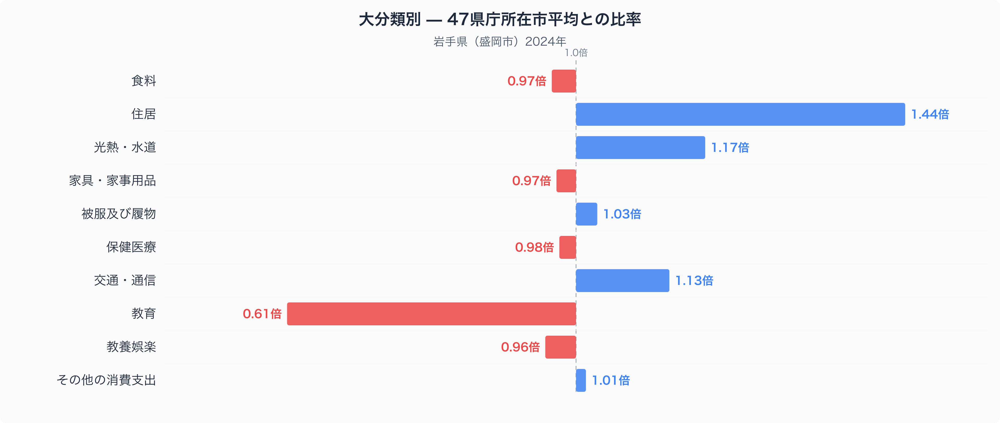
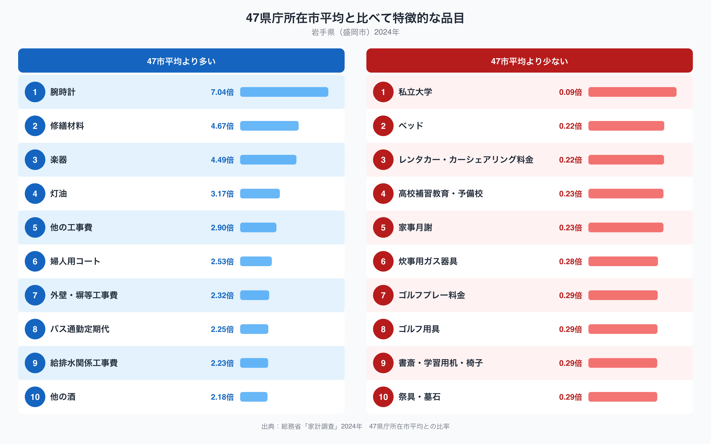

岩手県盛岡市の家計を十大費目でみると、ひとつの費目だけが際立って47市平均から離れています。住居です。47都道府県庁所在市の単純平均を1.00としたとき、盛岡市の住居費は1.44倍に達し、10費目のなかで最も1.00から離れた値になっています。逆方向で最も離れているのは教育費で、0.61倍にとどまります。家賃や住宅ローンだけでは説明のつかないこの数字の背景には、何があるのでしょうか。

## 十大費目でみる岩手県の支出バランス

図を見ると、住居(1.44倍)を筆頭に、光熱・水道(1.17倍)、交通・通信(1.13倍)が47市平均を上回っています。冬の暖房や、車での移動が前提になる暮らしが数字に表れているとみられます。一方で教育(0.61倍)は突出して低く、食料(0.97倍)、家具・家事用品(0.97倍)、保健医療(0.98倍)、教養娯楽(0.96倍)はいずれも1.00にわずかに届かない水準です。食料そのものの品目別の違いは、[盛岡市の食卓を数量と価格から読み解いた記事](https://stats47.jp/blog/iwate-food-culture)で扱っているので、ここでは住居に絞って見ていきます。

## 何にお金が使われているのか

47市平均を大きく上回る品目を見ると、修繕材料が4.67倍、他の工事費が2.90倍、外壁・塀等工事費が2.32倍、給排水関係工事費が2.23倍と、住まいの補修・工事に関わる項目が並びます。灯油も3.17倍あり、住居費の高さとあわせて読むと、家そのものを維持する費用が家計の大きな部分を占めていることがうかがえます。腕時計(7.04倍)や楽器(4.49倍)、他の酒(2.18倍)のように住居とは直接結びつかない品目も上位に入っており、こうした品目はサンプル数の少なさや世帯構成の偏りが影響している可能性もあります。反対に低い品目では、私立大学が0.09倍、高校補習教育・予備校が0.23倍、家事月謝が0.23倍と、教育関連の支出が軒並み47市平均を下回っています。

## なぜ住居費が高く、教育費が低いのか

住居費の高さは、冬の積雪や寒冷な気候と関係している可能性があります。屋根にかかる雪の重みや、凍結と融解を繰り返す気候は外壁や配管への負担が大きく、修繕や工事の頻度・費用を押し上げる要因になっているのかもしれません。灯油の支出が47市平均の3倍を超えているのも、暖房期間の長さを反映していると考えられます。教育費の低さについては、私立大学への支出が特に少ないことから、進学先として県内の国公立大学や近隣県の学校を選ぶ世帯が多いことを反映している可能性がありますが、家計調査のデータだけからこの理由を断定することはできません。岩手県の人口や産業構造など他の指標もあわせて見るなら、[岩手県のデータブック](https://stats47.jp/areas/03000)で確認できます。

## データの出典

本記事の数値は、総務省統計局「家計調査」(2024年、岩手県盛岡市、二人以上の世帯)にもとづいています。ここでの比率は家計調査が公表する全国平均ではなく、47都道府県庁所在市の単純平均を1.00とした場合の値です。また、対象はあくまで盛岡市の世帯であり、岩手県全体の家計を表すものではない点にご注意ください。より詳しい地域データは[岩手県のデータブック](https://stats47.jp/areas/03000)でも確認できます。
