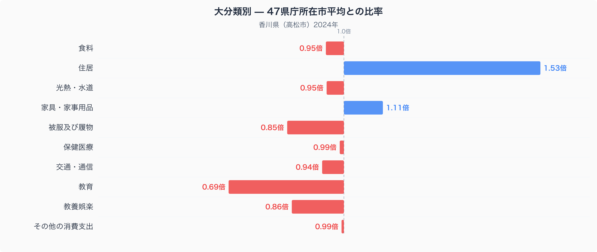
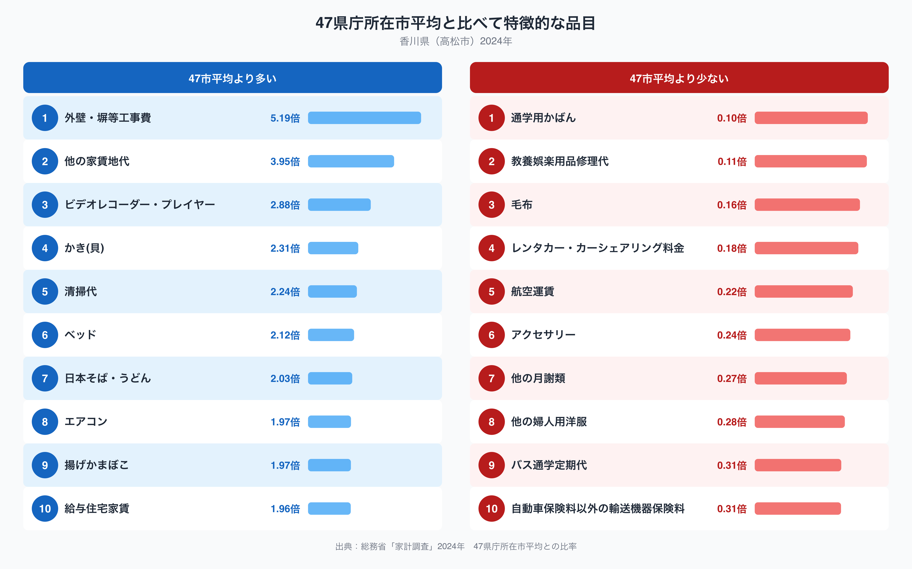

香川県高松市の家計簿を47都道府県庁所在市の平均と比べると、いちばん際立って違うのは住居費です。高松市の住居費は単純平均を1.00とした場合1.53倍に達しており、十大費目のなかで最も平均から離れています。反対に教育は0.69倍にとどまり、平均を下回っています。うどん県として知られる香川県の家計は、いったい何にお金が偏っているのでしょうか。十大費目の内訳と、平均から特に離れた品目のデータから見ていきます。

## 十大費目で見る、高松市の支出の偏り

図のとおり、住居（1.53倍）が平均を大きく上回っている一方、教育（0.69倍）と被服及び履物（0.85倍）、教養娯楽（0.86倍）はやや低めの水準です。家具・家事用品（1.11倍）も平均をわずかに上回っていますが、食料（0.95倍）、光熱・水道（0.95倍）、交通・通信（0.94倍）、保健医療（0.99倍）、その他の消費支出（0.99倍）はいずれもほぼ平均並みにとどまっています。住居費の高さは、家賃や住宅の維持管理にかかる費用の比率が高いことを示しており、その内訳は次の品目データから読み取れます。

## 品目に見る、住居関連費とうどんへの支出

品目単位で見ると、支出が特に多いのは外壁・塀等工事費（5.19倍）と他の家賃地代（3.95倍）で、これが住居費全体の高さを引き上げている主な要因と考えられます。給与住宅家賃（1.96倍）も平均を上回っており、住まいにかかる費用のいくつもの項目が47市平均を超えています。清掃代（2.24倍）やベッド（2.12倍）、エアコン（1.97倍）も高めで、住まいまわりの支出全体が目立つ結果になっています。食では日本そば・うどん（2.03倍）が高く、うどん県ならではの家計の特徴が数字にも表れているといえそうです。揚げかまぼこ（1.97倍）も瀬戸内海の水産加工品として親しまれている品目のひとつです（高松市の食卓を数量と価格で詳しく見た記事は[こちら](https://stats47.jp/blog/kagawa-food-culture)にまとめています）。

一方、支出が少ないのは通学用かばん（0.10倍）や教養娯楽用品修理代（0.11倍）、毛布（0.16倍）で、いずれも平均の2割にも届きません。レンタカー・カーシェアリング料金（0.18倍）や航空運賃（0.22倍）も低く、他の月謝類（0.27倍）やバス通学定期代（0.31倍）といった教育関連の品目の低さも、十大費目の教育（0.69倍）の低さと重なっています。

## なぜこうした偏りが生まれるのか

香川県は日本で最も面積が小さい県で、瀬戸大橋によって岡山県と鉄道・高速道路で直結しています。本州への移動が陸路で完結しやすいことが、航空運賃やレンタカー・カーシェアリング料金の低さに関係している可能性があります。住居費の高さについては、外壁・塀等工事費や他の家賃地代といった品目の比率が高いことから、住宅の維持管理や賃貸にかかる費用がかさんでいることがうかがえますが、具体的な要因は世帯構成や住宅の築年数など複数の事情が重なっている可能性があり、断定はできません。教育関連の支出が低い背景も、世帯あたりの子どもの数や通学手段の違いなど、複数の事情が影響しているのかもしれません。うどんへの支出の高さは、讃岐うどんの本場として知られる香川県の食文化を色濃く反映した結果といえそうです。

## データの出典

この記事の数値は、総務省統計局「家計調査」（2024年）をもとにした、二人以上の世帯の品目別支出額を使っています。ここでの比率は47都道府県庁所在市の単純平均を1.00とした値で、家計調査が公表する全国平均そのものとは異なります。また都道府県のデータとして扱っていますが、実際の集計対象は県庁所在市である高松市の世帯であり、県全体の平均ではない点にご注意ください。香川県のランキングデータをまとめた[県データブック](https://stats47.jp/areas/37000)では、家計以外の指標も含めて香川県の特徴を確認できます。
