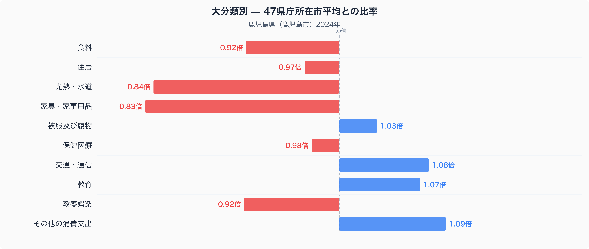
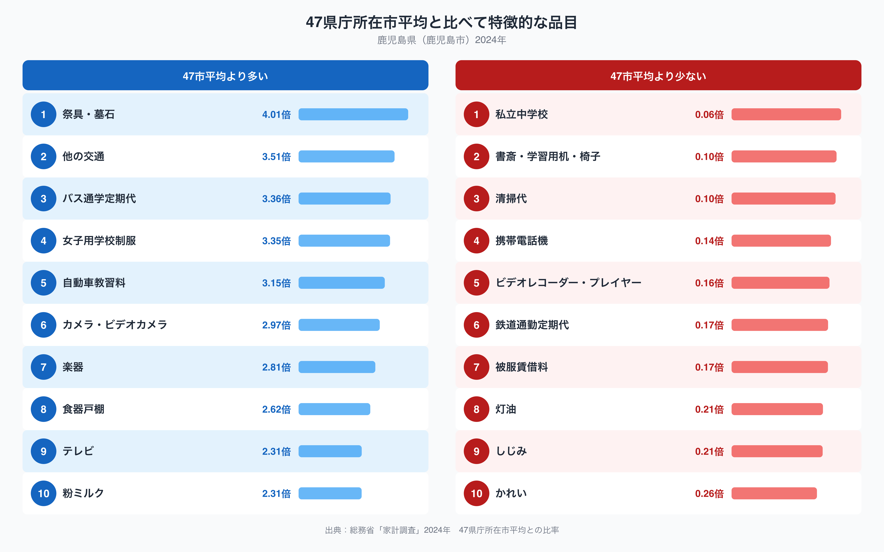

鹿児島市の家計調査(二人以上の世帯、2024年)を十大費目別に見ると、47都道府県庁所在市の単純平均を1.00としたとき、家具・家事用品への支出は0.83倍にとどまり、十大費目の中で最も平均から離れた費目になっています。一方で、個別の品目まで見ていくと、祭具・墓石への支出は47市平均の4.01倍に達し、突出して高い水準です。同じ鹿児島市の家計の中に、「大きく削られている費目」と「際立って多い品目」が同居しているのです。この記事では、この二つの視点から鹿児島市の家計の輪郭をたどります。

## 十大費目で見る鹿児島市の家計

十大費目の比率を並べると、鹿児島市は「その他の消費支出」が1.09倍、「交通・通信」が1.08倍、「教育」が1.07倍とやや高めに出ている一方、「家具・家事用品」が0.83倍、「光熱・水道」が0.84倍と低く出ています。「食料」も0.92倍、「教養娯楽」も0.92倍とやや控えめです。「住居」(0.97倍)や「保健医療」(0.98倍)、「被服及び履物」(1.03倍)は47市平均に近く、大きな偏りは主に光熱・水道と家具・家事用品の低さ、そして交通・通信や教育のやや高めの水準に集約されます。家具・家事用品と光熱・水道がともに低いのは、住宅設備の更新や暖房にかける支出が控えめであることの表れかもしれません。

## 際立って多い品目・少ない品目

品目単位まで見ると、鹿児島市で47市平均より突出して多いのは、祭具・墓石(4.01倍)、他の交通(3.51倍)、バス通学定期代(3.36倍)、女子用学校制服(3.35倍)、自動車教習料(3.15倍)です。祭具・墓石が最上位に来ているのは十大費目の合計だけでは見えてこない特徴で、冠婚葬祭や仏事に関わる支出の水準が高いことを示しています。バス通学定期代や女子用学校制服、自動車教習料が並ぶのは、公共交通機関が鉄道より路線バス中心であることや、自動車免許の取得を通学・通勤の前提として重視する土地柄を反映していると考えられます。反対に少ないのは、私立中学校(0.06倍)、書斎・学習用机・椅子(0.10倍)、清掃代(0.10倍)、携帯電話機(0.14倍)、鉄道通勤定期代(0.17倍)で、とりわけ私立中学校と鉄道通勤定期代の低さが目立ちます。

## なぜこの偏りが生まれるのか

鉄道通勤定期代が47市平均の0.17倍と低いのは、鹿児島市の通勤・通学が鉄道よりも路線バスや自家用車に依存している地域構造を反映しているのかもしれません。バス通学定期代や自動車教習料が高いのも、同じ交通事情と関係している可能性があります。灯油(0.21倍)が47市平均よりかなり低いのは、九州南部の温暖な気候によって冬季の暖房需要そのものが小さいことと関係しているのかもしれません。一方、祭具・墓石への支出が突出して高い背景は、この家計調査のデータだけからは特定できません。仏事や先祖供養に関わる慣習が地域に根付いていることをうかがわせるデータではありますが、断定的な理由づけは避け、今後の検証課題として留めておきたいと思います。

家計の中身をもう一段掘り下げたい方は、[鹿児島市の食卓の傾向をまとめた記事](https://stats47.jp/blog/kagoshima-food-culture)もあわせてご覧ください。米や魚介類など、食料品の数量と価格を分解しています。また、鹿児島県の他の統計指標は[鹿児島県のデータブック](https://stats47.jp/areas/46000)で確認できます。

## データの出典

このデータは総務省統計局「家計調査」(2024年、二人以上の世帯)を基にしています。都道府県別の値として扱っていますが、実際には各都道府県庁所在市(鹿児島県の場合は鹿児島市)の世帯を対象にした調査であり、県全体の平均ではありません。また、本文中の比率は47都道府県庁所在市の単純平均を1.00とした値であり、家計調査が公表している47市平均の値とは一致しない点にご注意ください。
