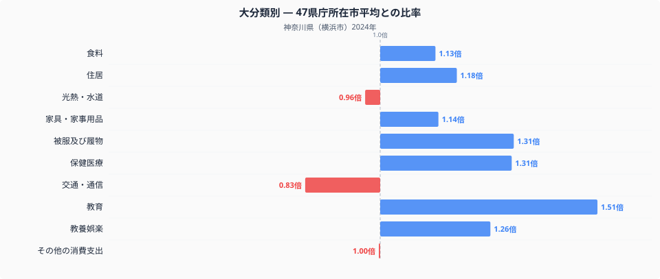
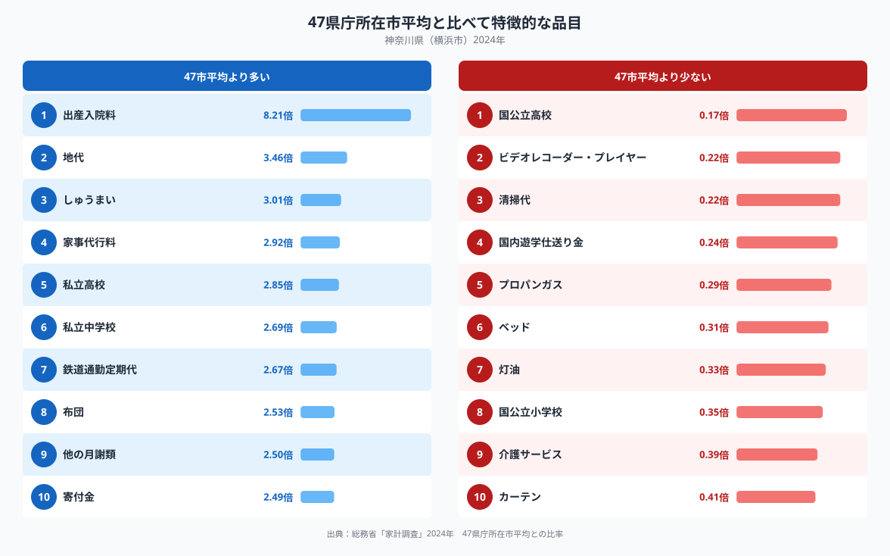

神奈川県横浜市の家計を全国平均（47都道府県庁所在市の単純平均）と比べると、もっとも大きく離れているのは教育費です。十大費目のうち教育は1.51倍で、被服及び履物や保健医療、教養娯楽といった項目もそろって高めに出ています。逆に交通・通信は0.83倍、光熱・水道は0.96倍と、全国平均より低く抑えられています。全国トップクラスの人口を抱え、東京と隣接する神奈川県の家計は、いったいどこに偏っているのでしょうか。

## 大分類でみる神奈川県の家計

図を見ると、教育（1.51倍）を筆頭に、被服及び履物（1.31倍）、保健医療（1.31倍）、教養娯楽（1.26倍）、住居（1.18倍）が全国平均を上回っています。家具・家事用品（1.14倍）や食料（1.13倍）もやや高めです。食料の内訳、つまり何を多く食べ何を控えているかについては別記事「[横浜市の食卓](https://stats47.jp/blog/kanagawa-food-culture)」で扱っているので、ここでは家計全体の構造に絞ります。一方で、交通・通信（0.83倍）と光熱・水道（0.96倍）は全国平均より低く、その他の消費支出（1.00倍）はほぼ横並びです。教育・被服・保健医療という、いわば「子育てと自分への投資」にあたる費目が高く出ているのが、神奈川県の家計の特徴といえます。

## とりわけ目立つ品目

品目単位で見ると、差はさらに際立ちます。全国平均より多いのは出産入院料（8.21倍）、地代（3.46倍）、しゅうまい（3.01倍）、家事代行料（2.92倍）、私立高校（2.85倍）、私立中学校（2.69倍）、鉄道通勤定期代（2.67倍）などです。一方で少ないのは国公立高校（0.17倍）、プロパンガス（0.29倍）、灯油（0.33倍）、国公立小学校（0.35倍）といった項目です。私立高校・私立中学校が上位に、国公立高校・国公立小学校が下位に並ぶ構図は、公立ではなく私立を選ぶ世帯が相対的に多いことを反映しているのかもしれません。

## なぜこの形になるのか

教育費の高さは、私立中学・高校への進学と、「他の月謝類」（2.50倍）に表れる塾や習い事の支出が重なって見えている結果だと考えられます。都市部で教育の選択肢が多い地域ほど、こうした支出が積み上がりやすいのかもしれません。地代（3.46倍）の高さは、東京に隣接し地価水準が高い神奈川県らしい数字です。鉄道通勤定期代（2.67倍）が高いのも、東京方面への通勤者が多い地域という位置づけと関係している可能性があります。反対に灯油（0.33倍）やプロパンガス（0.29倍）が少ないのは、冬の寒さが比較的穏やかで、都市ガスの供給網が広い地域では灯油やガスボンベに頼る世帯が少ないことを反映しているのかもしれません。しゅうまい（3.01倍）は、横浜の名物として広く親しまれていることの表れといえそうです。神奈川県のほかの指標もあわせて見たい方は、[神奈川県のデータブック](https://stats47.jp/areas/14000)にまとめてあります。

## データについて

この記事の数値は、総務省統計局「家計調査」（2024年、二人以上の世帯）をもとにしています。都道府県の家計調査値は県全体ではなく、横浜市など県庁所在市の値である点にご注意ください。また、ここでの比率は家計調査が公表する全国平均ではなく、47都道府県庁所在市を単純平均した値を1.00とした場合の比率です。因果関係を断定するものではなく、あくまで支出構造の傾向として読んでいただければと思います。
