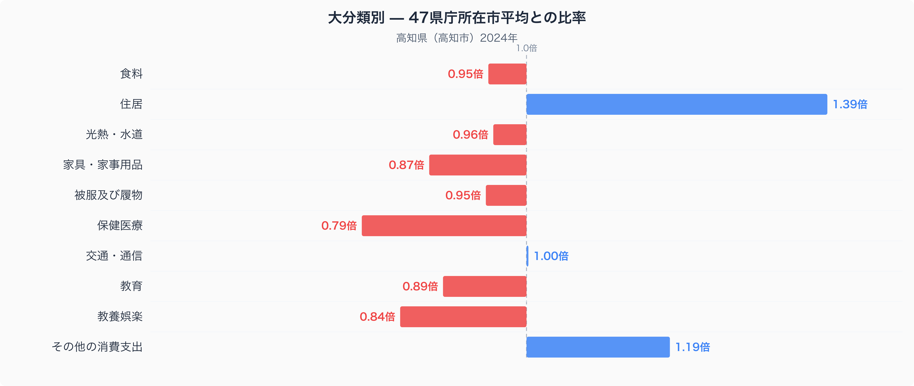
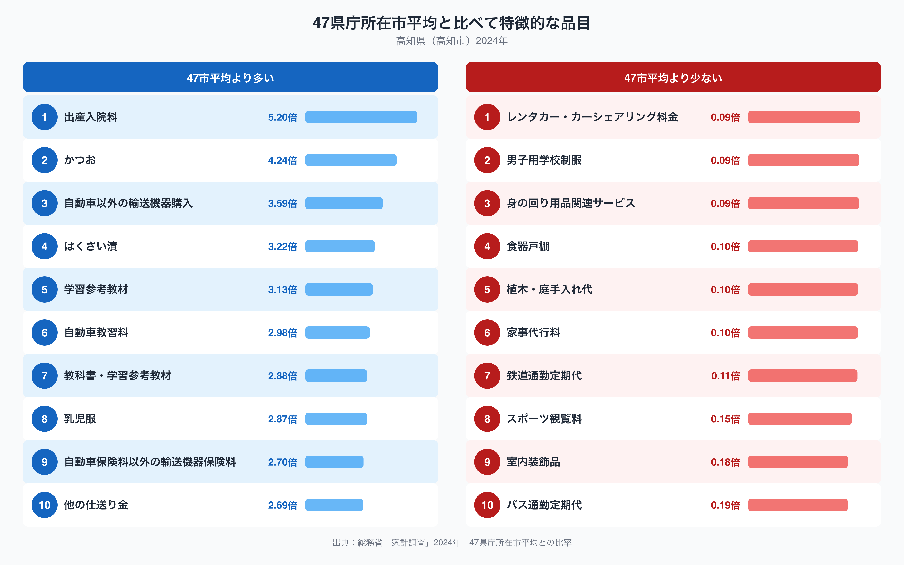

高知県高知市の家計を、47都道府県庁所在市の平均と比べてみると、もっとも際立つのは食費でも交通費でもなく「住居」への支出です。十大費目のなかで住居費だけが47市平均の1.39倍に達しており、ほかのどの費目よりも平均からの乖離が大きくなっています。なぜ高知市の家計は住居にこれほど偏って支出しているのでしょうか。この記事では、家計調査の十大費目と特徴的な品目のデータから、高知県の暮らしの姿を読み解いていきます。

## 十大費目で見る高知市の偏り

上のグラフは、47都道府県庁所在市の単純平均を1.00としたときの、高知市の十大費目それぞれの比率です。住居が1.39倍でもっとも高く、次いで「その他の消費支出」が1.19倍となっています。反対にもっとも低いのは保健医療で、47市平均の0.79倍にとどまっています。交通・通信はほぼ47市平均並みの1.00倍で、食料や光熱・水道、被服及び履物も0.95〜0.96倍と平均に近い水準です。教育や教養娯楽、家具・家事用品はいずれも0.84〜0.89倍で、住居に振り向けられている分だけ、これらの費目への支出がやや控えめになっているようにも見えます。

## かつおと出産入院料に見る高知市の特徴

品目単位で見ると、高知市らしさがさらにはっきりします。もっとも比率が高いのは出産入院料で、47市平均の5.20倍です。保健医療という大分類全体では支出が47市平均より少ないにもかかわらず、この品目だけが突出しているのは興味深い点です。次に高いのがかつおで、47市平均の4.24倍にのぼります。高知県は一本釣りなどでかつおの水揚げが盛んな地域として知られており、かつおのたたきに代表される食文化が家計にも表れていると考えられます。[高知市の食卓を数字で読む](https://stats47.jp/blog/kochi-food-culture)では、このかつおを含む食卓の「量×価格」をさらに詳しく分解しています。同様にはくさい漬も3.22倍と高く、漬物を含む家庭の保存食文化がうかがえます。また自動車以外の輸送機器の購入が3.59倍、自動車教習料が2.98倍、自動車保険料以外の輸送機器保険料が2.70倍と、車や船を中心とした暮らしを示す品目が複数上位に並んでいます。一方で、鉄道通勤定期代は47市平均の0.11倍、バス通勤定期代は0.19倍、レンタカー・カーシェアリング料金は0.09倍と、いずれも47市平均を大きく下回っています。

## なぜ住居費と車社会型消費が際立つのか

高知県は県土の大部分を山地が占め、平地が少ないことで知られています。鉄道網もJR土讃線などに限られ、日常の移動の多くを自家用車に頼らざるを得ない地域だといえます。公共交通の定期代が全国的に見て少ない一方、自動車教習料や自動車保険料以外の輸送機器保険料が高いのは、こうした車社会型の暮らしを反映しているのかもしれません。レンタカーやカーシェアリングの利用が少ないのも、多くの世帯がすでに自家用車を保有しているためと考えられます。住居費の高さについては、高知県が台風の通り道にあたる地域で、暴風や大雨による住宅の補修・維持にかかる費用が47市平均より発生しやすいことと関係している可能性があります。住居費を含む高知県のさまざまな指標は、[高知県データブック](https://stats47.jp/areas/39000)でまとめて確認することができます。

## データの出典

このデータは総務省統計局「家計調査」(2024年、二人以上の世帯)にもとづいています。都道府県の家計調査値は都道府県全体ではなく、県庁所在市である高知市の世帯の値である点にご注意ください。また、ここでの比率はいずれも47都道府県庁所在市の単純平均を1.00とした値であり、家計調査が公表している47市平均の値とは一致しません。
