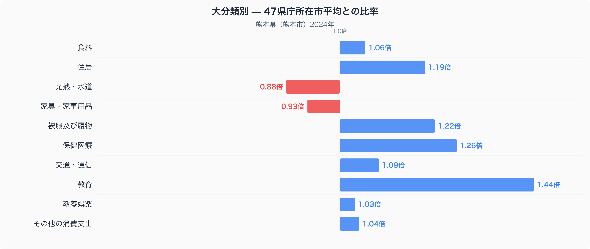
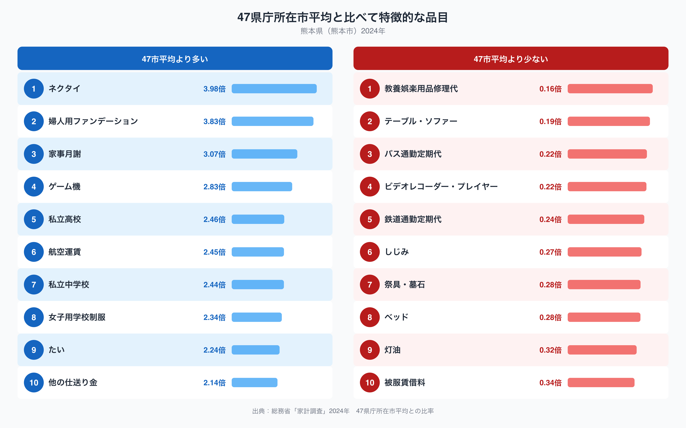

熊本県庁所在地・熊本市の家計を家計調査データで十大費目に分けてみると、突出して高いのは教育費です。47都道府県庁所在市の単純平均を1.00とすると、熊本市の教育費は1.44倍に達し、他のどの費目よりも47市平均からの乖離が大きくなっています。なぜ熊本市の家計は教育にこれほどお金をかけているのでしょうか。十大費目の偏りと、突出した個別品目の両面から読み解いていきます。

## 十大費目にみる熊本市の家計の偏り

上のグラフのとおり、教育を筆頭に、保健医療(1.26倍)、被服及び履物(1.22倍)、住居(1.19倍)が47市平均を上回っています。交通・通信(1.09倍)や食料(1.06倍)、その他の消費支出(1.04倍)、教養娯楽(1.03倍)もわずかに47市平均を上回り、光熱・水道(0.88倍)と家具・家事用品(0.93倍)だけが47市平均を下回っています。つまり熊本市の家計は、ほとんどの費目でやや高め、なかでも教育・保健医療・被服・住居にまとまった支出を振り向ける一方、光熱費や家具にはお金をかけない構造だとわかります。熊本県のほかの指標も含めた全体像は[熊本県のデータブック](https://stats47.jp/areas/43000)でも確認できます。

## 突出した品目にみる暮らしの実像

品目別にみると、教育費の突出を裏付けるように私立高校(2.46倍)や私立中学校(2.44倍)、女子用学校制服(2.34倍)、他の仕送り金(2.14倍)が上位に並びます。家事月謝(3.07倍)も高く、子どもの習い事や進学にかける支出が47市平均を大きく上回っていることがうかがえます。あわせてネクタイ(3.98倍)や婦人用ファンデーション(3.83倍)、ゲーム機(2.83倍)、たい(2.24倍)も特徴的な品目です。たいのような魚介類への支出については、[熊本の食卓を読み解く記事](https://stats47.jp/blog/kumamoto-food-culture)でさらに詳しく取り上げています。一方で支出が少ない品目としては、バス通勤定期代(0.22倍)や鉄道通勤定期代(0.24倍)が目立ち、灯油(0.32倍)も47市平均の3割程度にとどまっています。テーブル・ソファー(0.19倍)やベッド(0.28倍)といった大型家具も低めで、光熱・家具の費目全体が低かったこととあわせて読むと一貫した傾向といえます。

## なぜ教育と仕送りにお金が偏るのか

熊本県には済々黌高校をはじめとする進学校の伝統があり、私立中学校や私立高校への進学、それに伴う制服や月謝への支出の多さは、こうした教育熱の高さを反映しているのかもしれません。他の仕送り金の高さも、大学進学などで子どもが県外に出る家庭が多いことと関係している可能性があります。一方、通勤定期代の低さは、熊本市が公共交通網よりも自家用車での移動を中心とした地方都市であることを反映していると考えられます。灯油の支出が少ないのも、九州の比較的温暖な気候により冬季の暖房需要が小さいことと関係しているのかもしれません。こうしてみると、教育に厚く投資しながら生活基盤の維持費は抑える、というのが熊本市の家計の一つの特徴だといえそうです。

## データの出典

本記事の数値は総務省統計局「家計調査」(2024年、二人以上の世帯)にもとづいています。ここでの都道府県の値は県全体ではなく、県庁所在市である熊本市の世帯を対象にした数値です。また、比率の基準は47都道府県庁所在市の単純平均を1.00としたもので、家計調査が公表する全国平均の値とは異なる点にご注意ください。
