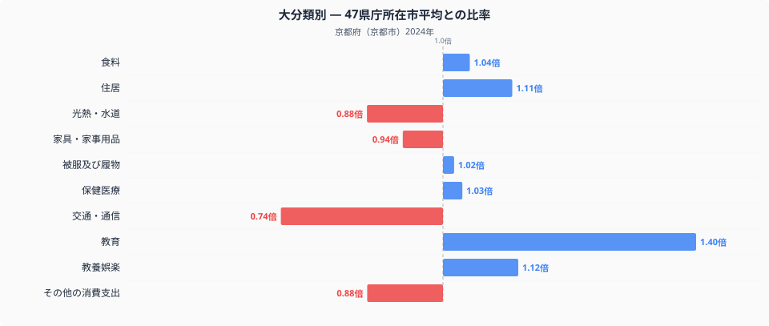
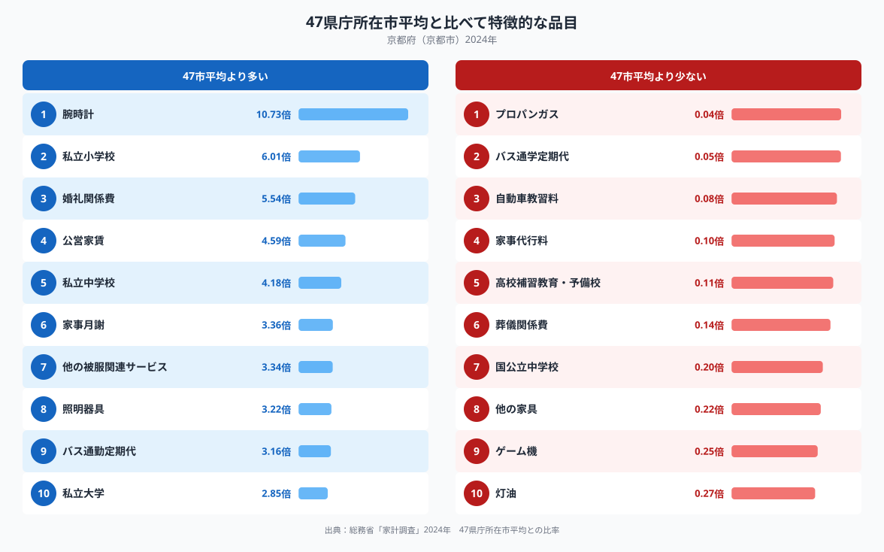

京都市の家計を全国の家計調査データと比べると、十大費目のなかで最も際立つのは教育費です。京都市の教育費は47都道府県庁所在市の平均を1.00とした場合に1.40倍に達しており、他のどの費目よりも平均から離れています。なぜ京都市の家計はここまで教育にお金をかけているのでしょうか。特徴的な品目を見ていくと、その理由の一端が浮かび上がってきます。

## 十大費目に見る京都市家計の偏り

十大費目のグラフを見ると、教育が1.40倍で唯一大きく全国平均を上回っており、次に高いのは教養娯楽の1.12倍、住居の1.11倍と続きます。食料はほぼ平均並みの1.04倍で、品目ごとの数量や価格の違いは[京都市の食卓を数量と価格で読み解いた記事](https://stats47.jp/blog/kyoto-food-culture)で扱っています。逆に最も低いのは交通・通信で0.74倍、続いてその他の消費支出と光熱・水道がともに0.88倍前後です。教育とほかの費目の差は際立っており、京都市の家計は生活費全般を切り詰めながら教育に資金を振り向けている構図が見えてきます。

## 全国平均から突出・低下する品目

特徴品目を見ると、教育関連の突出がさらにはっきりします。私立小学校は全国平均の6.01倍、私立中学校は4.18倍、私立大学も2.85倍と、私立校への支出が軒並み上位に並びます。一方で国公立中学校は0.20倍、高校の補習教育・予備校は0.11倍と大きく下回っており、公立校や塾よりも私立校そのものへ直接お金をかける傾向がうかがえます。最も突出した品目は腕時計の10.73倍で、婚礼関係費5.54倍や照明器具3.22倍も上位に入りますが、これらは教育とは別の消費文化を反映したものと考えられます。反対にプロパンガス0.04倍やバス通学定期代0.05倍、灯油0.27倍が低いのは、都市ガスの普及や自転車・徒歩通学の多さと関係しているのかもしれません。

## なぜ京都市はこうなるのか

京都市に教育費の突出した支出が見られる背景には、平安時代から続く私学の伝統や、同志社・立命館・龍谷などの大学を核とした学校法人が多数集積してきた歴史があると考えられます。地元に選択肢の多い私立小中学校や大学があることが、公立校ではなく私立校へ直接お金をかける家計行動につながっている可能性があります。また、交通・通信費が低いのは、京都市が地下鉄・市バス・JRが網の目のように走る歴史的な都市であり、自家用車を持たなくても生活が成り立ちやすい街であることを反映しているのかもしれません。自動車教習料が0.08倍と低いことも、車を持たない世帯が多い可能性と整合的です。バス通勤定期代が3.16倍と高い一方でバス通学定期代が0.05倍と低いのは、通学は徒歩や自転車が中心である一方、通勤には市バスが広く使われていることの表れと考えられます。詳しい京都府全体の統計は[京都府のデータブック](https://stats47.jp/areas/26000)にまとめています。

## データの出典

本記事の数値は総務省統計局「家計調査」(2024年、二人以上の世帯)を基に、47都道府県庁所在市の単純平均を1.00とした比率で算出しています。ここでの京都府のデータは京都府全体ではなく京都市の値であり、また比率の基準は家計調査が公表する全国平均そのものではなく、47都道府県庁所在市の単純平均である点にご注意ください。
