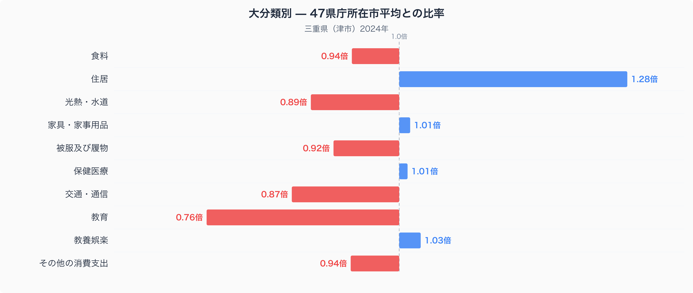
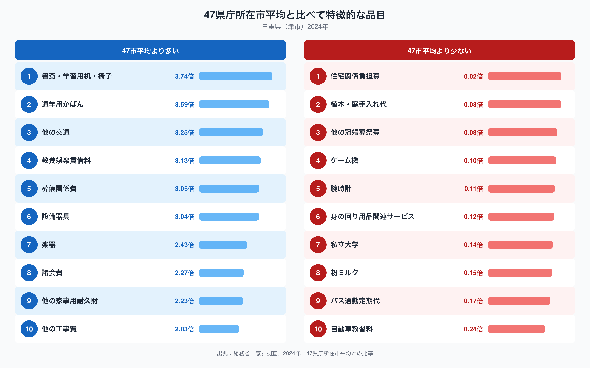

三重県津市の家計を全国の都道府県庁所在市（47市）の単純平均と比べると、最も差が大きいのは「住居」で、平均を1.28倍上回っています。逆に最も低いのは「教育」で、平均の0.76倍にとどまります。同じ「家計」という言葉でくくられていても、どこにお金をかけているかは地域によってかなり違います。津市の家計は、全国と比べてどこにお金が偏っているのでしょうか。

## 十大費目に見る津市の偏り

家計調査では消費支出を「食料」「住居」「光熱・水道」など十大費目に分けて集計します。津市を見ると、住居（1.28倍）が突出して高く、次いで教養娯楽（1.03倍）、家具・家事用品（1.01倍）、保健医療（1.01倍）がわずかに平均を上回ります。一方で教育（0.76倍）が最も低く、交通・通信（0.87倍）、光熱・水道（0.89倍）、被服及び履物（0.92倍）が続き、その他の消費支出（0.94倍）と食料（0.94倍）も平均をやや下回っています。食料の内訳を数量と価格に分けて見た記事は[三重県の食卓を読み解く](https://stats47.jp/blog/mie-food-culture)で紹介していますので、あわせてご覧ください。10費目のうち平均を上回るのは4費目にとどまり、住居以外は1.03倍以内の小さな差にとどまっている点が特徴です。つまり津市の家計の「偏り」は、多くの費目に薄く分散しているのではなく、住居という1つの費目に集中して表れていると言えます。

## 突出して多い品目・少ない品目

費目をさらに細かい品目単位で見ると、津市で47市平均より特に多いのは「書斎・学習用机・椅子」（3.74倍）と「通学用かばん」（3.59倍）です。次いで「他の交通」（3.25倍）、「教養娯楽賃借料」（3.13倍）、「葬儀関係費」（3.05倍）、「設備器具」（3.04倍）と続きます。これらの品目は購入する世帯が少なく、年によって支出額が動きやすいため、比率の大きさをそのまま「津市は特別多く買っている」と断定するのは早計ですが、上位に住居の修繕や設備に関わるとみられる「設備器具」や、後述する「他の工事費」（2.03倍）が並ぶ点は、住居費の高さと重なる動きとして注目できます。逆に少ないのは「住宅関係負担費」（0.02倍）、「植木・庭手入れ代」（0.03倍）、「他の冠婚葬祭費」（0.08倍）、「ゲーム機」（0.10倍）、「腕時計」（0.11倍）などで、いずれも支出のある世帯が限られる品目です。全国最低水準の教育費を支える形で「私立大学」（0.14倍）も低い比率にとどまっています。

## なぜ住居費がここまで高いのか

住居の費目には家賃・地代のほか、修繕や設備の更新にかかる費用が含まれます。津市の特徴品目の上位に「設備器具」（3.04倍）や「他の工事費」（2.03倍）が入っていることから、賃貸の家賃そのものよりも、持ち家の修繕・改修に伴う支出が住居費を押し上げている可能性があります。三重県は北勢地域に石油化学や自動車関連の製造業が集積し、南部には伊勢志摩の観光地を抱えるなど地域差の大きい県で、県庁所在地である津市は行政・教育機関が集まる中規模都市です。持ち家世帯の割合や住宅の築年数の分布が47市平均と異なれば、同じ2人以上世帯でも修繕にかかる支出の出方は変わってきます。ここで示した数字だけでは断定できませんが、住居関連の複数の品目が同時に高く出ている点は、津市の住宅事情を映しているのかもしれません。津市を含む三重県の各種統計データは[stats47.jpの三重県データブック](https://stats47.jp/areas/24000)でも確認できます。

## データの出典

本記事の数値は総務省統計局「家計調査」（2024年、二人以上の世帯）に基づいています。ここで示した比率は、47都道府県庁所在市の単純平均を1.00とした場合の津市の値であり、家計調査が公表する全国平均の値とは一致しません。また、家計調査の都道府県別データは各都道府県全体ではなく、県庁所在市（津市）の二人以上世帯を対象とした調査であるため、県全体の家計を代表するものではない点にご留意ください。
