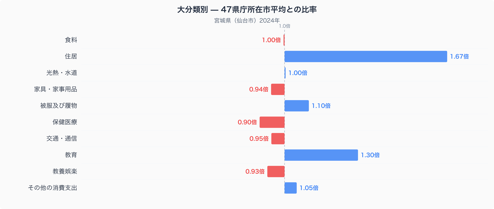
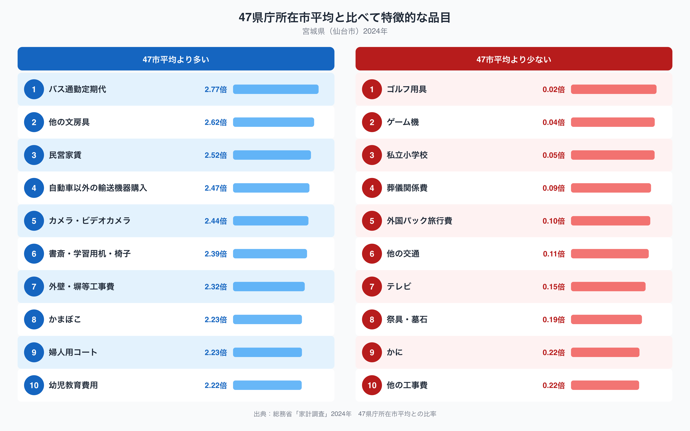

## 仙台市の家計で最も際立つのは「住居費」

宮城県庁所在市・仙台市の家計調査(二人以上の世帯、2024年)を十大費目で見ると、47都道府県庁所在市の単純平均(=1.00)から最も離れているのは住居費で、1.67倍にのぼります。次いで教育費が1.30倍、保健医療費は0.90倍と平均を下回ります。食料や光熱・水道はほぼ平均並みで、住居費だけが突出している構造です。なぜ仙台市はこれほど住居にお金が偏るのでしょうか。

十大費目を並べると、住居費の1.67倍が他の費目を大きく引き離していることが一目でわかります。教育費の1.30倍も高い水準ですが、住居費との差は歴然です。一方で保健医療は0.90倍、家具・家事用品は0.94倍、交通・通信は0.95倍と、複数の費目で平均をやや下回っており、住居に家計が集中している分、他の支出が抑えられている構図が読み取れます。仙台市が東北で唯一の政令指定都市であり、賃貸需要の受け皿になっていることが背景にありそうです。

## 品目で見ると「賃貸」と「通勤」に色が出る

特徴品目の上位を見ると、バス通勤定期代が2.77倍、民営家賃が2.52倍で全国上位に並びます。自動車以外の輸送機器購入(2.47倍)や書斎・学習用机・椅子(2.39倍)、幼児教育費用(2.22倍)も高く、通勤・住まい・子どもの学びに関わる支出が目立ちます。一方で下位を見ると、ゴルフ用具は0.02倍、ゲーム機は0.04倍、私立小学校は0.05倍にとどまり、余暇や私費教育への支出は控えめです。かまぼこは2.23倍と47市平均より大きく多く、宮城県を代表する食文化が家計にもはっきり表れています。仙台の食卓を数量と価格で詳しく見るなら、[仙台市の食卓を数量と価格で読み解く記事](https://stats47.jp/blog/miyagi-food-culture)もあわせてご覧ください。

## 東北の拠点都市という構造が支出配分に反映されている可能性

仙台市は東北6県で唯一の政令指定都市で、進学や転勤で流入する単身・若年世帯が多い都市です。賃貸住宅の需要が集中すれば民営家賃が押し上げられ、住居費全体の比率も高くなると考えられます。バス通勤定期代の高さは、地下鉄と並んで市内交通の中心を担うバス路線網の広さを反映しているのかもしれません。かまぼこの高い比率は、仙台市が笹かまぼこの産地として知られる水産加工業の集積地であることと関係している可能性があります。私立小学校やゲーム機など娯楽・私費教育への支出が低いのは、住居費への支出が相対的に大きい分、他の費目に振り向ける余地が限られていることの裏返しとも読めます。宮城県のほかの統計指標は[stats47の宮城県データブック](https://stats47.jp/areas/04000)でご覧いただけます。

## データの出典

本記事の数値は総務省統計局「家計調査」(2024年、二人以上の世帯)を基にしています。都道府県の家計調査値は県全体ではなく県庁所在市(ここでは仙台市)の値である点にご留意ください。また、本記事で示す比率は47都道府県庁所在市の単純平均を1.00とした場合の相対値であり、家計調査が公表する全国値そのものとは一致しません。
