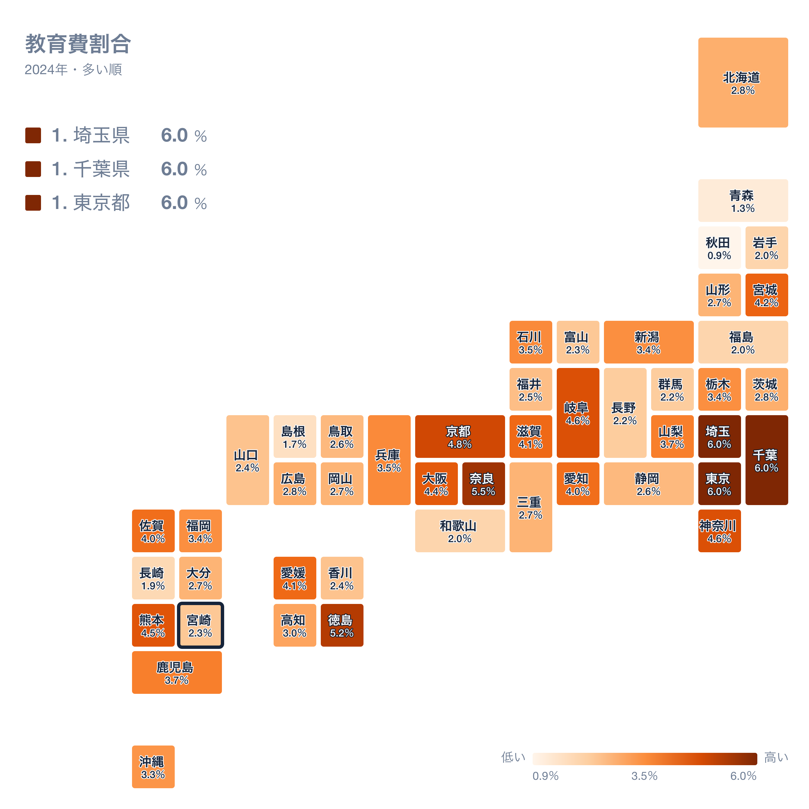
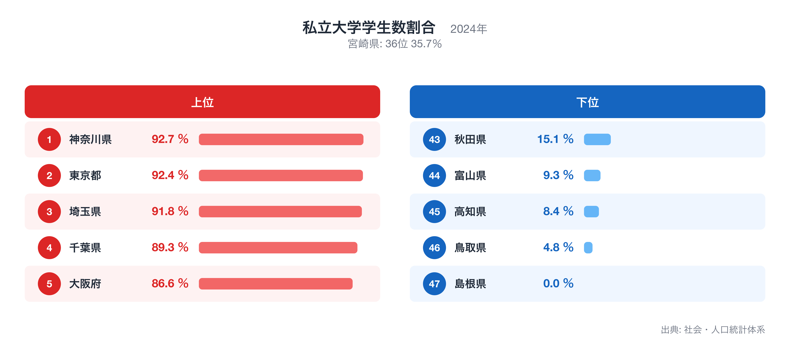
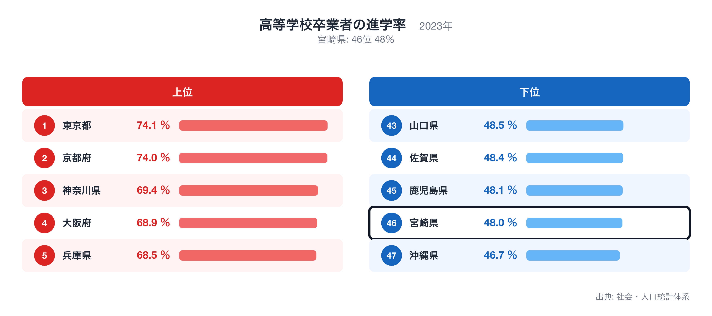

宮崎県の県庁所在地・宮崎市の家計を、総務省「家計調査」(2024年・二人以上の世帯)で十大費目に分けて見ると、47都道府県庁所在市の単純平均を1.00としたとき、最も乖離が大きいのは教育の0.61倍です。

この記事では、十大費目の偏り、47県の中での宮崎市の位置、突出した個別品目、そして教育が低くなる背景を他の都道府県統計で確かめる、という順で宮崎市の家計を読み解きます。比率はすべて47市平均に対する倍率で、家計調査が公表する全国平均とは基準が異なります。

十大費目とは食料、住居、光熱・水道、家具・家事用品、被服及び履物、保健医療、交通・通信、教育、教養娯楽、その他の消費支出の10区分で、家計調査が消費支出を分類する最上位の区分です。

## 十大費目にみる宮崎市の家計の偏り

47市平均を上回るのは1費目で、保健医療(1.01倍)です。下回るのは9費目で、教育(0.61倍)、光熱・水道(0.77倍)、住居(0.78倍)、被服及び履物(0.79倍)、教養娯楽(0.87倍)、交通・通信(0.87倍)、家具・家事用品(0.91倍)、食料(0.95倍)、その他の消費支出(0.96倍)です。最も大きく離れているのは教育の0.61倍、最も平均に近いのは保健医療の1.01倍で、宮崎市の家計は教育が低いほうに偏った構造だとわかります。

上の地図は、消費支出に占める教育の割合(教育費割合)を47都道府県で比べたもので、宮崎県は37位(2.3%)です。割合が最も高いのは埼玉県(6.0%)、次いで千葉県(6.0%)、東京都(6.0%)で、最も低いのは秋田県(0.9%)です。倍率は「47市平均に対して何倍か」、地図の順位は「支出全体に占める割合が大きい順」なので、同じ費目でも見方が違います。倍率が高くても割合の順位が中位にとどまる場合は、他の費目も同じように多いことを意味します。全国ランキングの詳細は[教育費割合](https://stats47.jp/ranking/education-expenditure-ratio-multi-person-households)で確認できます。

## 突出した品目にみる暮らしの実像

品目別に見ると、47市平均より多い側の上位10品目は教養娯楽用耐久財修理代(3.01倍)、公営家賃(2.74倍)、焼酎(2.43倍)、他の保健医療用品・器具(2.39倍)、航空運賃(2.39倍)、他の入場・ゲーム代(2.32倍)、他の家賃地代(2.11倍)、火災・地震保険料(2.09倍)、葬儀関係費(2.05倍)、整骨(接骨)・鍼灸院治療代(2.01倍)です。少ない側の10品目は鉄道通学定期代(0.01倍)、外壁・塀等工事費(0.05倍)、被服賃借料(0.05倍)、ベッド(0.10倍)、鉄道通勤定期代(0.11倍)、自動車教習料(0.13倍)、たんす(0.14倍)、介護サービス(0.14倍)、電気冷蔵庫(0.15倍)、スポーツ観覧料(0.18倍)で、平均の1%程度にとどまる品目もあります。多い側の1位である教養娯楽用耐久財修理代と、少ない側の1位である鉄道通学定期代が、宮崎市の暮らしを最も端的に表す品目です。品目の倍率は世帯あたりの年間支出額を47市平均で割ったもので、購入頻度の低い品目ほど年ごとの振れが大きい点には注意が必要です。

## 教育の低さを他の統計で確かめる

私立大学学生数割合は宮崎県が全国36位(35.7%、2024年)で、教育が低くなることと整合します。全国1位は神奈川県(92.7%)、最下位は島根県(0.0%)です。順位は値が大きい順で、全国ランキングは[私立大学学生数割合](https://stats47.jp/ranking/private-university-student-ratio)で確認できます。

高等学校卒業者の進学率は宮崎県が全国46位(48.0%、2023年)で、教育が低くなることと整合します。全国1位は東京都(74.1%)、最下位は沖縄県(46.7%)です。順位は値が大きい順で、全国ランキングは[高等学校卒業者の進学率](https://stats47.jp/ranking/high-school-advancement-rate)で確認できます。

ここで示した対応関係は同じ年次の都道府県統計を並べた相関であり、因果の証明ではありません。家計調査の県庁所在市データは標本が小さく、年ごとの変動も大きいため、複数年・複数指標で確かめることを前提に読んでください。倍率の分母は47都道府県庁所在市の単純平均で、東京都区部や政令市の重みづけはしていません。順位は同じ値の県を小さい方の順位にそろえています。

## データの出典

本記事の数値は総務省統計局「家計調査」(2024年、二人以上の世帯)にもとづきます。都道府県の値は県全体ではなく県庁所在市である宮崎市の世帯を対象にした数値で、比率の基準は47都道府県庁所在市の単純平均を1.00としたものです。裏付けに使った私立大学学生数割合と高等学校卒業者の進学率は stats47 のランキングページ(出典は各ページに記載)から取得しました。
