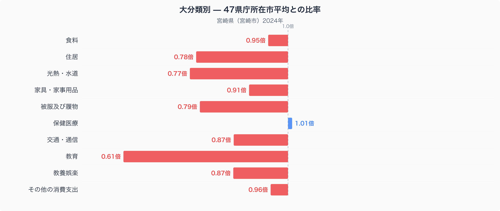
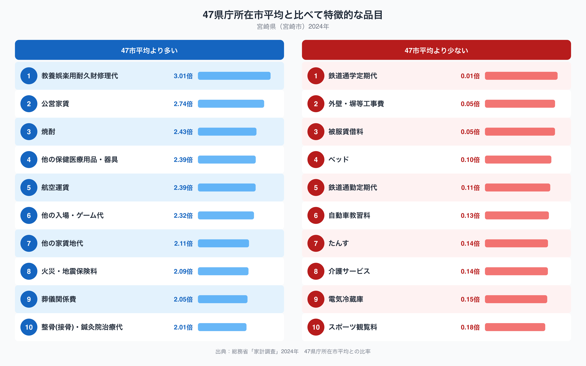

宮崎市の家計を、家計調査(二人以上世帯)にもとづく十大費目でみると、いちばん際立つのは教育費の少なさです。全国47都道府県庁所在市の単純平均を1.00としたとき、宮崎市の教育費は0.61倍にとどまり、10費目のなかで平均からもっとも離れています。一方で、焼酎のように宮崎らしさが色濃く出る品目には、逆に支出が大きく偏っています。宮崎市の家計は、いったいどこにお金をかけ、どこを抑えているのでしょうか。

## 大分類でみる支出の偏り

上の図は、宮崎市の十大費目それぞれが、47都道府県庁所在市の平均と比べてどれだけ多いか少ないかを表したものです。平均を1.00とすると、もっとも低いのは教育で0.61倍、次いで光熱・水道が0.77倍、住居が0.78倍と続きます。逆に平均をわずかに上回るのは保健医療の1.01倍だけで、それ以外の費目はすべて平均を下回っています。

教育費の低さは、十費目のなかでも突出した数字です。学習塾や習い事にかける支出が都市部に比べて少ないことや、進学先の選び方が大都市圏とは異なる傾向を持つことが影響している可能性があります。光熱・水道が低いのは、宮崎県が冬でも比較的温暖な気候のため、暖房にかかる費用を抑えられていることが背景にあるのかもしれません。住居費の低さは、宮崎市の地価や家賃の相場が全国的にみて高くない水準にあることを反映していると考えられます。なお食料は0.95倍とほぼ平均並みですが、品目ごとの数量や価格の違いは[宮崎市の食卓を読み解いた記事](https://stats47.jp/blog/miyazaki-food-culture)で詳しく取り上げています。

## 特徴的な品目に表れる暮らし

品目単位でみると、宮崎市らしさがさらにはっきり表れます。47市平均を大きく上回るのは、教養娯楽用耐久財修理代(3.01倍)、公営家賃(2.74倍)、焼酎(2.43倍)、他の保健医療用品・器具(2.39倍)、航空運賃(2.39倍)などです。なかでも焼酎は、本格焼酎の主要な産地として知られる宮崎県らしい品目で、家庭での消費文化が根付いていることを表しているのかもしれません。航空運賃が高いのは、鉄道網が限られる宮崎から他地域へ移動する際、飛行機を利用する機会が多いことと関係している可能性があります。

反対に、47市平均を大きく下回るのは鉄道通学定期代(0.01倍)や鉄道通勤定期代(0.11倍)です。ほぼゼロに近いこれらの数字は、通学や通勤の主な手段が鉄道ではなく自動車であることを示していると考えられます。自動車教習料(0.13倍)の低さも、公共交通に頼らない生活圏であることと関係しているのかもしれません。介護サービス(0.14倍)やスポーツ観覧料(0.18倍)が低いのは、こうしたサービスを提供する事業者や施設が、都市部に比べて少ないことを反映している可能性があります。

## なぜこうした偏りが生まれるのか

宮崎市の家計に表れるこうした特徴は、いくつかの要因が重なって生まれていると考えられます。ひとつは気候です。年間を通じて温暖な宮崎県では、暖房への支出を抑えられる一方、屋外での活動を楽しむ余暇の過ごし方には、地域ならではの傾向が出やすくなります。

もうひとつは移動手段です。鉄道網が都市部ほど密ではない宮崎県では、日常の移動を自動車に頼る度合いが高く、通学・通勤定期代のような鉄道関連の支出が47市平均を大きく下回る一方、遠方への移動には航空機を使う機会が増えると考えられます。宮崎県の人口や産業構造といった全体像は、[宮崎県のデータブック](https://stats47.jp/areas/45000)でも確認できます。

産業や地域文化との結びつきも見逃せません。焼酎の消費が多いのは、宮崎県が本格焼酎の主要な産地のひとつであり、地元での消費文化が根付いていることと関係しているのかもしれません。教育費の低さについては、都市部に比べて学習塾や習い事の選択肢が限られている可能性のほか、家庭ごとの支出の優先順位が大都市圏とは異なる傾向を持つことも背景にあると考えられます。

## データの出典

本記事の数値は、総務省統計局「家計調査」(2024年)にもとづいています。ここでの都道府県別の値は、県全体ではなく宮崎市など県庁所在市の二人以上世帯を対象としたものである点にご注意ください。また、比率の基準は47都道府県庁所在市の単純平均を1.00としたものであり、家計調査が公表する全国平均の値そのものとは一致しません。
