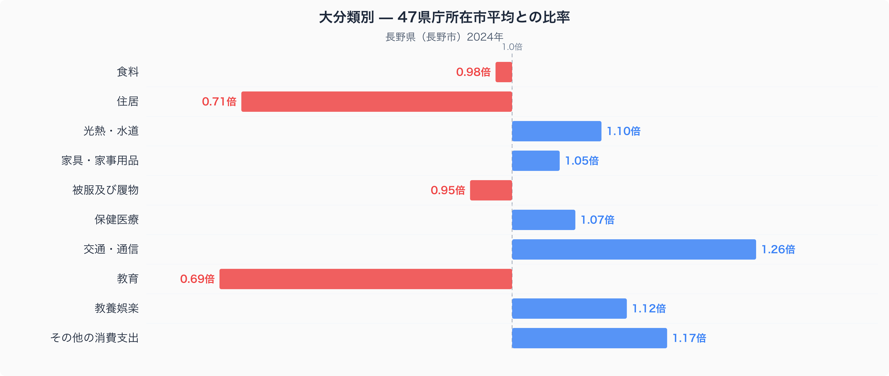
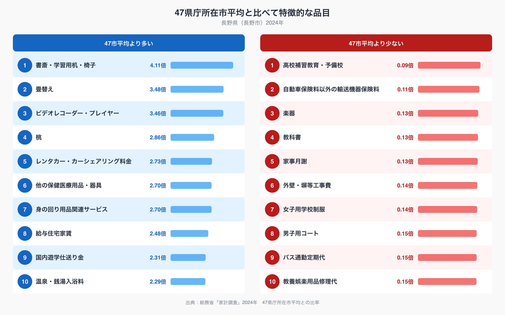

## 教育費が47市平均の0.69倍という長野市の家計

長野市の家計を十大費目でみると、47都道府県庁所在市の平均(=1.00)から最も離れているのは教育費です。長野市の教育費は平均の0.69倍にとどまり、十大費目のなかで唯一「3割以上少ない」水準にあります。ただし品目別に見ていくと、単に教育にお金をかけていないというより、お金の向け先が違うという姿が見えてきます。長野市の家計は、どこに支出を集中させ、どこを絞っているのでしょうか。

## 十大費目の偏り ── 住居と教育は低く、交通・通信は高い

十大費目の比率を見ると、教育(0.69倍)に次いで住居(0.71倍)も47市平均を大きく下回っています。持ち家率が高い地域では住居費の平均が下がりやすい傾向があり、長野市もこの型に近いと考えられます。一方で交通・通信は1.26倍と、十大費目のなかで唯一1.2倍を超えて高く、その他の消費支出も1.17倍、教養娯楽も1.12倍とやや高めです。食料(0.98倍)や被服及び履物(0.95倍)は47市平均に近く、際立っているのは住居・教育の低さと交通・通信の高さという構図です。

## 品目に見る「予備校より学習机」「桃と温泉」の暮らし

品目レベルではさらにはっきりした対比が見えます。教育に関わる品目のうち、高校補習教育・予備校は47市平均の0.09倍、教科書は0.13倍、女子用学校制服は0.14倍と軒並み下位に沈んでいます。ところが同じ教育カテゴリのなかでも、書斎・学習用机・椅子は4.11倍と全品目のなかで最も高く、国内遊学仕送り金も2.31倍にのぼります。塾や予備校といった通学型の支出は少ない一方で、自宅の学習環境を整える支出や、地元を離れて学ぶ子どもへの仕送りは多いという、教育費の「中身の偏り」が読み取れます。産業や気候に関わる品目にも特徴があります。桃は2.86倍、温泉・銭湯入浴料は2.29倍、給与住宅家賃は2.48倍、レンタカー・カーシェアリング料金は2.73倍と、いずれも上位10品目に入ります。長野市の食卓を数量と価格の面から見た記事は[こちら](https://stats47.jp/blog/nagano-food-culture)にまとめています。反対にバス通勤定期代は0.15倍にとどまり、公共交通よりも自家用車に依存した暮らしがうかがえます。

## なぜこの偏りが生まれるのか、そしてデータの出典

長野県は果樹の産地として知られ、桃をはじめとする果物が身近で手に入りやすい環境が消費量の多さに関係している可能性があります。温泉・銭湯入浴料の高さは、渋温泉や野沢温泉など県内に多くの温泉地があることを反映しているのかもしれません。また、諏訪・岡谷地域を中心に精密機械工業が発達してきた歴史があり、給与住宅家賃の高さは、企業が社宅や寮を用意する慣行と関係している可能性があります。山間部が広く公共交通網が限られていることは、バス通勤定期代の低さと交通・通信費全体の高さの両方に関わっているのかもしれません。教育については、進学塾が集中する都市部から離れているぶん、通学型の指導より自宅学習や親元を離れた進学への仕送りにお金が向かっている可能性がありますが、これは家計調査の数字だけからは断定できません。

なお、ここでの都道府県の家計調査値は長野県全体ではなく、長野市(県庁所在市)の二人以上世帯の値です。また、比率の基準は家計調査が公表する全国値ではなく、47都道府県庁所在市の単純平均を1.00としたものである点にご注意ください。データは総務省統計局「家計調査」(2024年)にもとづきます。長野県の統計データをまとめて見るなら、[長野県データブック](https://stats47.jp/areas/20000)もあわせてご覧ください。
