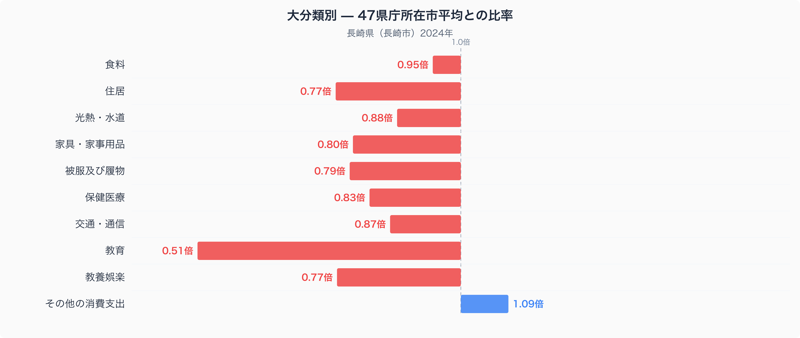
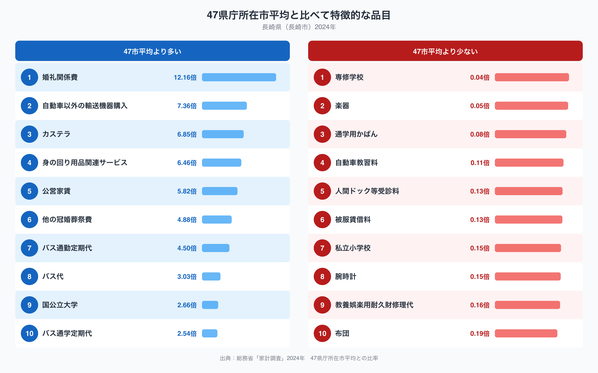

長崎県の家計を、他の46都道府県庁所在市と比べてみると、いちばん際立つのは実は教育費です。長崎市の教育費は47都道府県庁所在市の単純平均を1.00としたとき0.51倍しかなく、十大費目のなかでもっとも平均から離れた項目になっています。逆に、坂の多い港町らしい支出も見えてきます。今回は総務省統計局の家計調査(2024年、二人以上の世帯)から、長崎市の家計がどこにお金を多く使い、どこを削っているのかを見ていきます。

## 十大費目で見る長崎市の特徴

十大費目のうち、長崎市がもっとも平均から離れているのは教育で0.51倍です。半分近くまで落ち込んでいるのは47都市の中でも目立つ水準です。次いで住居が0.77倍、教養娯楽が0.77倍、被服及び履物が0.79倍と続き、暮らしにゆとりを持たせる費目が軒並み平均を下回っています。一方で唯一平均を上回っているのはその他の消費支出で1.09倍です。食料は0.95倍とほぼ平均並みで、光熱・水道も0.88倍と大きくは崩れていません。全体としては、教育と住居まわりの支出を抑えながら暮らしている姿が浮かびます。

## 特徴的な品目にみる長崎市の家計

品目単位で見ると、婚礼関係費が12.16倍ともっとも目立ちます。他の冠婚葬祭費も4.88倍あり、長崎市では慶弔関係にまとまった支出をする世帯が多いようです。交通面ではバス通勤定期代が4.50倍、バス代が3.03倍、バス通学定期代が2.54倍と、バスに関わる支出がそろって高くなっています。自動車以外の輸送機器購入も7.36倍あり、車以外の移動手段への支出が目立ちます。名産品のカステラは6.85倍で、地元の菓子文化がそのまま家計に表れています。公営家賃は5.82倍で、民間の賃貸とは別に公営住宅を利用する世帯が一定数いることがうかがえます。逆に少ない側では、専修学校が0.04倍、楽器が0.05倍、通学用かばんが0.08倍と、教育・習い事関連の支出が軒並み小さくなっています。私立小学校も0.15倍にとどまり、教育費全体の低さと符合する結果です。

## なぜこうした偏りが生まれるのか

長崎市は坂の多い斜面地に市街地が広がる港町で、自動車よりも路面電車やバスが生活の足になっている地域です。バス代・バス通勤定期代・バス通学定期代がそろって高いのは、こうした地形を反映しているのかもしれません。また、五島列島や壱岐・対馬など多くの離島を抱える県であることも、自動車以外の輸送機器購入が高い一因になっている可能性があります。カステラの支出が高いのは、南蛮貿易の窓口として発展してきた長崎の菓子文化が今も日常の消費に根づいていることの表れと考えられます。教育費の低さについては、私立小学校・専修学校・楽器といった項目がそろって小さいことから、私立や習い事にかける支出が47市平均より少ない一方、国公立大学は2.66倍と平均を上回っており、公的な教育機関を選ぶ世帯が相対的に多い可能性があります。ただし、これらはあくまで観測された数字からの推測であり、個々の家庭の事情までは分かりません。

食卓の視点からもっと詳しく知りたい方は、[長崎県の食卓を数量と価格で読み解いた記事](https://stats47.jp/blog/nagasaki-food-culture)もあわせてご覧ください。長崎県のその他の統計データは[長崎県のデータブック](https://stats47.jp/areas/42000)でまとめて確認できます。

## データの出典

本記事の数値は総務省統計局「家計調査」(2024年、二人以上の世帯、494品目)にもとづいています。ここでの都道府県の値は県全体ではなく、県庁所在市である長崎市の家計を代表値として使っています。また、比率の基準は家計調査が公表する全国平均ではなく、47都道府県庁所在市の単純平均を1.00とした独自の計算です。この点にご注意のうえ、参考にしていただければ幸いです。
