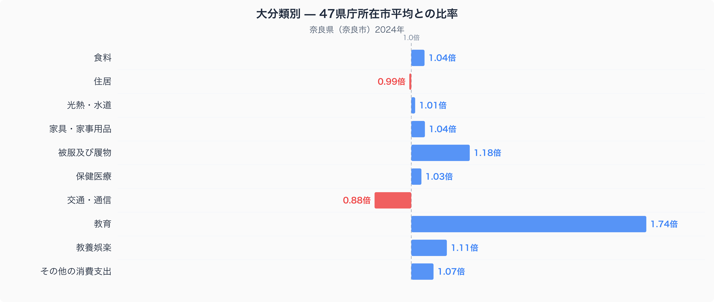
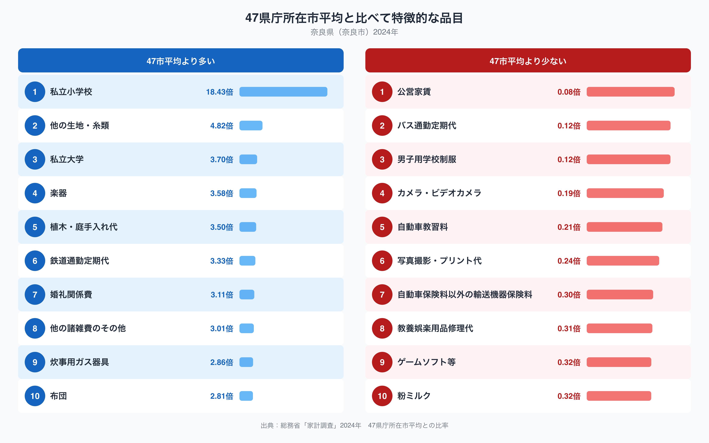

奈良県奈良市の家計調査データを十大費目で見ると、ひとつの費目だけが際立って高くなっています。教育費です。47都道府県庁所在市の単純平均を1.00とした場合、奈良市の教育費は約1.74倍にのぼります。ほかの費目の多くが1.0倍前後に収まる中で、教育費だけが突出して高いのはなぜでしょうか。品目別のデータをたどりながら、奈良市の家計の特徴を見ていきます。

## 十大費目に見る奈良市家計の偏り

十大費目それぞれの比率を並べると、教育費の突出ぶりがよくわかります。教育に次いで比率が高いのは被服及び履物で約1.18倍、教養娯楽が約1.11倍、その他の消費支出が約1.07倍と続きます。逆に交通・通信は約0.88倍と47市平均より1割以上少なく、住居はほぼ47市平均並みの約0.99倍です。

この図からわかるのは、奈良市の家計が「教育に厚く、交通・通信に薄い」構造になっているということです。教育費が1.74倍という水準は、十大費目の中でも突出しており、他都市とは一線を画します。一方で交通・通信費が47市平均を下回っているのは意外に思われるかもしれませんが、この点は後述する通勤・通学の実態と合わせて読むと理解しやすくなります。奈良県全体の指標をまとめて確認したい場合は、[奈良県のデータブック](https://stats47.jp/areas/29000)もあわせてご覧ください。

## 47市平均から突出する品目、下回る品目

教育費の内訳をより細かい品目で見ると、私立小学校の支出が47市平均の18.43倍という突出した数字になっています。私立大学も3.70倍、楽器が3.58倍、鉄道通勤定期代が3.33倍と続きます。一方で、下回る品目には公営家賃(0.08倍)、バス通勤定期代(0.12倍)、男子用学校制服(0.12倍)などが並びます。

上位の品目を見ると、私立小学校・私立大学・楽器・鉄道通勤定期代など、教育とそれに付随する支出が集中していることがわかります。婚礼関係費や炊事用ガス器具、布団といった品目も上位に入っており、教育以外にも生活の節目に関わる支出がやや高めです。下位の品目では、公営家賃やバス通勤定期代の低さが目を引きます。持ち家志向が強く、公共交通も鉄道が中心になっている家計の姿がうかがえます。男子用学校制服が低い水準にとどまっているのは、私立校への進学者が多く、公立校の標準的な制服費が計上されにくいことと関係している可能性があります。

## なぜ奈良市はこの偏りになるのか

奈良市は大阪・京都の両都市圏に近い奈良盆地に位置し、近鉄やJRの鉄道網で両都市への通勤・通学がしやすい立地にあります。鉄道通勤定期代が47市平均の3.33倍という高さは、奈良市から大阪・京都方面へ通勤する世帯が多いことを反映していると考えられます。同時に、私立小学校・私立大学への支出が突出して高いのも、大阪・京都圏の私立校へ通う子どもを持つ世帯が一定数存在することと関係しているのかもしれません。バス通勤定期代の低さは、こうした鉄道中心の通勤圏であることの裏返しと見ることができます。また、公営家賃が47市平均を大きく下回っているのは、奈良市の住宅事情として持ち家世帯の比率が高いことを示唆しているのかもしれません。食料費についても47市平均をやや上回る約1.04倍となっていますが、品目別の数量や価格の違いについては、姉妹記事の[奈良県の食卓を数量×価格で読み解く記事](https://stats47.jp/blog/nara-food-culture)で詳しく取り上げています。

## データの出典

本記事の数値は、総務省統計局の家計調査(2024年、二人以上の世帯)にもとづいています。都道府県の家計調査値は県全体ではなく、県庁所在市(この場合は奈良市)の世帯データである点にご注意ください。また、本記事で示した比率は、家計調査が公表する全国値ではなく、47都道府県庁所在市の単純平均を1.00とした場合の相対値です。品目数は496品目で、教育費や私立小学校などの突出は、あくまで奈良市という一都市のサンプルにもとづく傾向として読んでいただければと思います。
