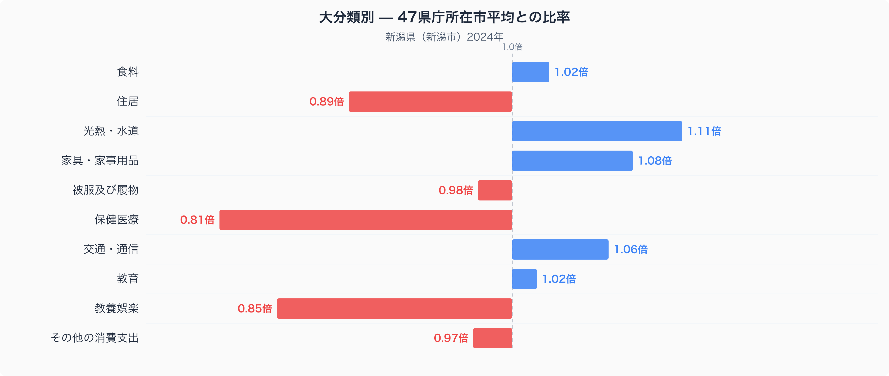
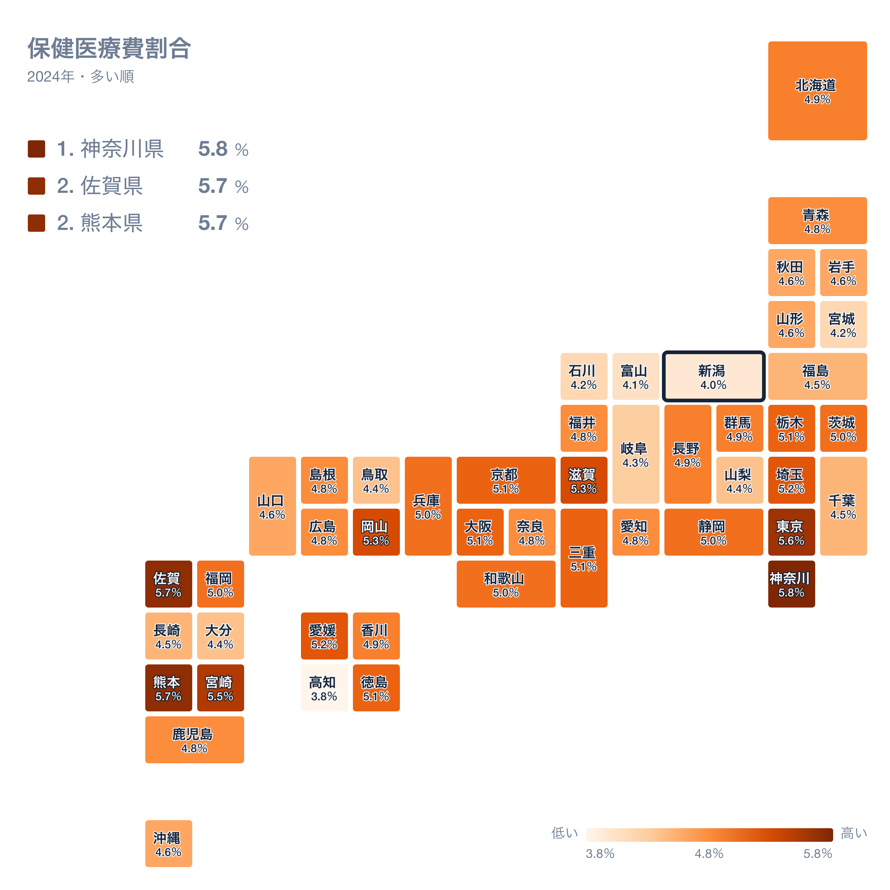
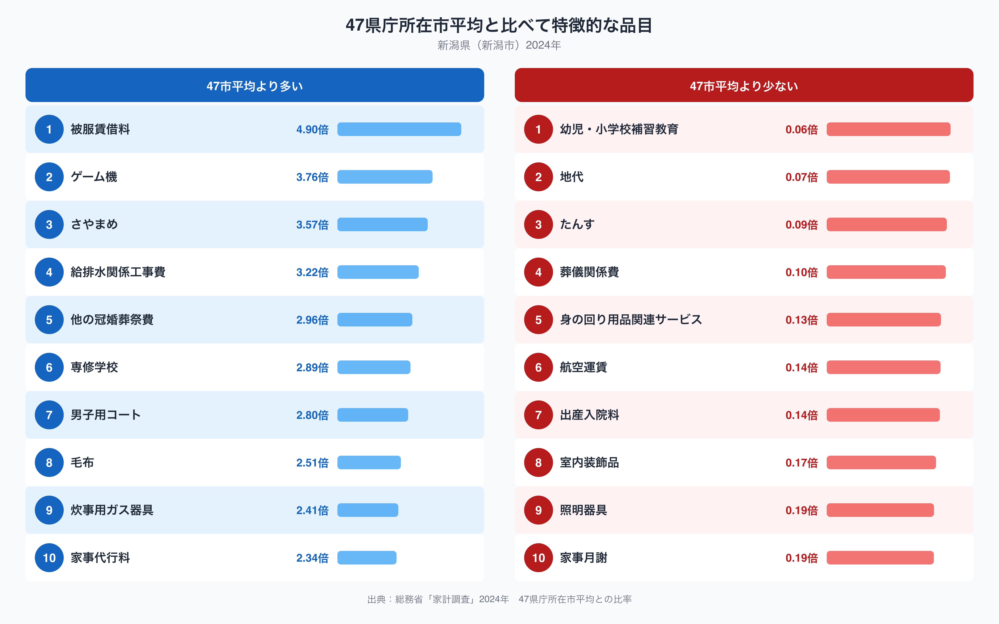
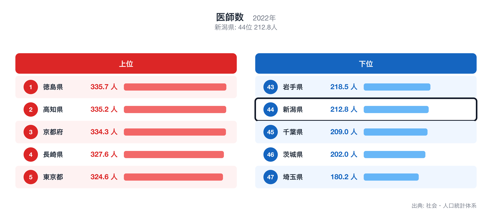
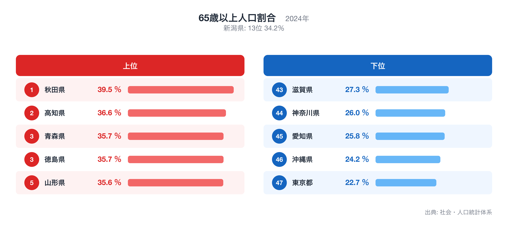

新潟県の県庁所在地・新潟市の家計を、総務省「家計調査」(2024年・二人以上の世帯)で十大費目に分けて見ると、47都道府県庁所在市の単純平均を1.00としたとき、最も乖離が大きいのは保健医療の0.81倍です。

この記事では、十大費目の偏り、47県の中での新潟市の位置、突出した個別品目、そして保健医療が低くなる背景を他の都道府県統計で確かめる、という順で新潟市の家計を読み解きます。比率はすべて47市平均に対する倍率で、家計調査が公表する全国平均とは基準が異なります。

十大費目とは食料、住居、光熱・水道、家具・家事用品、被服及び履物、保健医療、交通・通信、教育、教養娯楽、その他の消費支出の10区分で、家計調査が消費支出を分類する最上位の区分です。

## 十大費目にみる新潟市の家計の偏り

47市平均を上回るのは5費目で、光熱・水道(1.11倍)、家具・家事用品(1.08倍)、交通・通信(1.06倍)、食料(1.02倍)、教育(1.02倍)です。下回るのは5費目で、保健医療(0.81倍)、教養娯楽(0.85倍)、住居(0.89倍)、その他の消費支出(0.97倍)、被服及び履物(0.98倍)です。最も大きく離れているのは保健医療の0.81倍、最も平均に近いのは教育の1.02倍で、新潟市の家計は保健医療が低いほうに偏った構造だとわかります。

上の地図は、消費支出に占める保健医療の割合(保健医療費割合)を47都道府県で比べたもので、新潟県は46位(4.0%)です。割合が最も高いのは神奈川県(5.8%)、次いで佐賀県(5.7%)、熊本県(5.7%)で、最も低いのは高知県(3.8%)です。倍率は「47市平均に対して何倍か」、地図の順位は「支出全体に占める割合が大きい順」なので、同じ費目でも見方が違います。倍率が高くても割合の順位が中位にとどまる場合は、他の費目も同じように多いことを意味します。全国ランキングの詳細は[保健医療費割合](https://stats47.jp/ranking/healthcare-expenditure-ratio-multi-person-households)で確認できます。

## 突出した品目にみる暮らしの実像

品目別に見ると、47市平均より多い側の上位10品目は被服賃借料(4.90倍)、ゲーム機(3.76倍)、さやまめ(3.57倍)、給排水関係工事費(3.22倍)、他の冠婚葬祭費(2.96倍)、専修学校(2.89倍)、男子用コート(2.80倍)、毛布(2.51倍)、炊事用ガス器具(2.41倍)、家事代行料(2.34倍)です。少ない側の10品目は幼児・小学校補習教育(0.06倍)、地代(0.07倍)、たんす(0.09倍)、葬儀関係費(0.10倍)、身の回り用品関連サービス(0.13倍)、航空運賃(0.14倍)、出産入院料(0.14倍)、室内装飾品(0.17倍)、照明器具(0.19倍)、家事月謝(0.19倍)で、平均の6%程度にとどまる品目もあります。多い側の1位である被服賃借料と、少ない側の1位である幼児・小学校補習教育が、新潟市の暮らしを最も端的に表す品目です。品目の倍率は世帯あたりの年間支出額を47市平均で割ったもので、購入頻度の低い品目ほど年ごとの振れが大きい点には注意が必要です。

## 保健医療の低さを他の統計で確かめる

医師数は新潟県が全国44位(212.8人、2022年)で、保健医療が低くなることと整合します。全国1位は徳島県(335.7人)、最下位は埼玉県(180.2人)です。順位は値が大きい順で、全国ランキングは[医師数](https://stats47.jp/ranking/physicians-in-medical-facilities-per-100k)で確認できます。

65歳以上人口割合は新潟県が全国13位(34.2%、2024年)で、保健医療の偏りとは逆方向にあり、この指標では説明できません。全国1位は秋田県(39.5%)、最下位は東京都(22.7%)です。順位は値が大きい順で、全国ランキングは[65歳以上人口割合](https://stats47.jp/ranking/ratio-65-plus)で確認できます。

ここで示した対応関係は同じ年次の都道府県統計を並べた相関であり、因果の証明ではありません。家計調査の県庁所在市データは標本が小さく、年ごとの変動も大きいため、複数年・複数指標で確かめることを前提に読んでください。倍率の分母は47都道府県庁所在市の単純平均で、東京都区部や政令市の重みづけはしていません。順位は同じ値の県を小さい方の順位にそろえています。

## データの出典

本記事の数値は総務省統計局「家計調査」(2024年、二人以上の世帯)にもとづきます。都道府県の値は県全体ではなく県庁所在市である新潟市の世帯を対象にした数値で、比率の基準は47都道府県庁所在市の単純平均を1.00としたものです。裏付けに使った医師数と65歳以上人口割合は stats47 のランキングページ(出典は各ページに記載)から取得しました。
