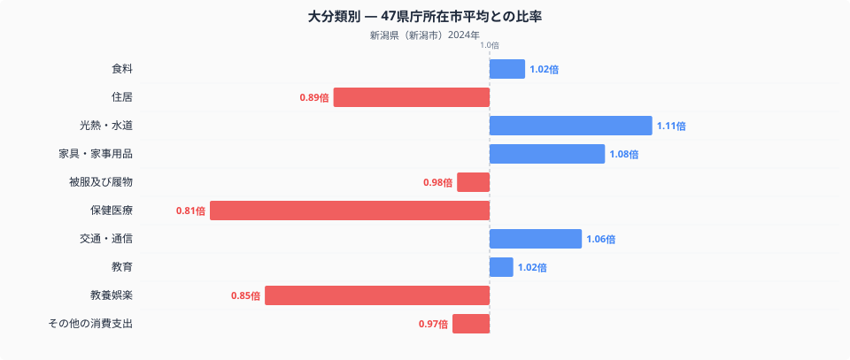
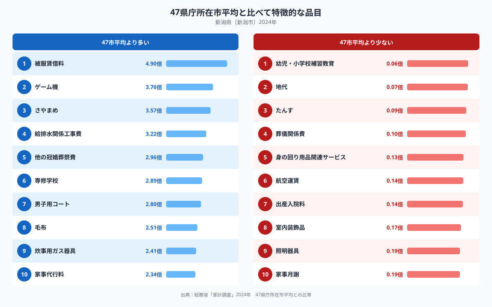

## 保健医療費が全国で最も少ない新潟市

総務省統計局「家計調査」(2024年、二人以上の世帯)をもとに、47都道府県庁所在市の家計を十大費目で比較すると、新潟市が全国平均から最も離れているのは保健医療費です。47市の単純平均を1.00とした場合、新潟市の保健医療費は0.81倍で、平均より約2割少ない水準にとどまっています。逆に平均を上回る費目の中で最も差が大きいのは光熱・水道費の1.11倍で、暖房や給湯にかかる費用がかさんでいることがうかがえます。同じ新潟市の家計の中でも、費目によって全国とのズレの向きも大きさもまちまちで、その凹凸を追っていくと新潟らしい暮らしぶりが見えてきます。

## 十大費目に見る新潟市の家計

上のグラフは、十大費目それぞれの支出額を47市平均と比べたものです。保健医療費(0.81倍)に加えて、教養娯楽費も0.85倍と平均を下回っており、レジャーや趣味への支出はやや控えめな傾向がうかがえます。住居費も0.89倍で平均を下回っており、持ち家比率の高さや地価の水準が影響している可能性があります。一方で光熱・水道費(1.11倍)や家具・家事用品費(1.08倍)、交通・通信費(1.06倍)は平均を上回っており、暖房や住まいまわりの設備、車を使う暮らしが家計を押し上げていると考えられます。教育費(1.02倍)や食料費(1.02倍)、被服及び履物費(0.98倍)はほぼ全国平均並みで、大きな偏りは見られません。

## 突出した支出と控えめな支出

品目単位で見ると、新潟市らしさがさらに際立ちます。支出が特に多いのは「給排水関係工事費」(3.22倍)、「男子用コート」(2.80倍)、「毛布」(2.51倍)、「炊事用ガス器具」(2.41倍)、「他の冠婚葬祭費」(2.96倍)といった項目で、寒さへの備えや冠婚葬祭にまつわる出費が目立ちます。給排水関係工事費の多さは、道路や玄関先の融雪に地下水を利用する消雪パイプ設備が家庭にも普及している地域事情を反映しているのかもしれません。逆に支出が少ないのは「幼児・小学校補習教育」(0.06倍)や「地代」(0.07倍)、「たんす」(0.09倍)、「出産入院料」(0.14倍)、「航空運賃」(0.14倍)などで、学習塾の利用や借地に頼る住まい方、飛行機を使う機会が全国に比べて少ないことがうかがえます。新潟市の食卓そのものについては、品目別の数量や価格を分析した[新潟市の食卓を数字で見る記事](https://stats47.jp/blog/niigata-food-culture)で詳しく取り上げています。

## データの出典

このデータは総務省統計局「家計調査」(2024年、二人以上の世帯)を、都道府県庁所在市単位で集計したもので、対象品目は488にのぼります。都道府県の家計調査値は県全体ではなく県庁所在市の値であり、ここでの比率は47県庁所在市の単純平均を1.00とした独自の基準です。家計調査が公表する全国平均値そのものとは一致しない点にご注意ください。品目ごとの支出額はサンプル数が少なく年による変動が大きいため、断定的な傾向としてではなく、あくまで一つの手がかりとして読むことをおすすめします。新潟県のその他の統計は[新潟県のデータブック](https://stats47.jp/areas/15000)でもまとめて見られます。
