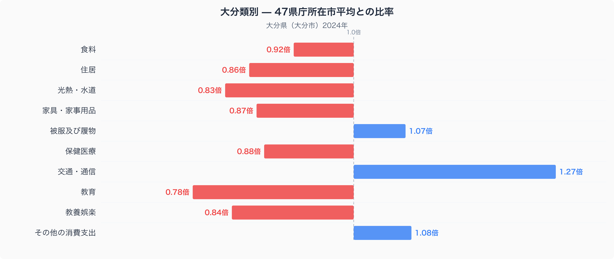
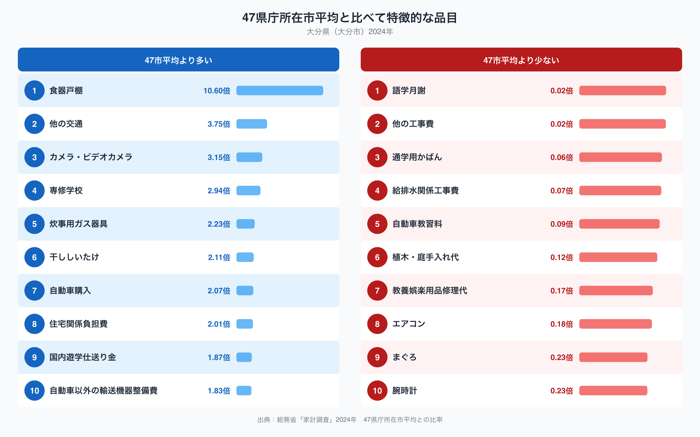

家計調査のデータで大分市の家計を47都道府県庁所在市の平均と比べてみると、いちばん際立って高いのは「交通・通信」で、平均を1.27倍上回っています。反対に最も低いのは「教育」で、平均の0.78倍にとどまります。同じ「暮らしにお金をかける」といっても、大分市の家計は何にどれだけ偏っているのでしょうか。十大費目の比率と、特に差が大きい品目を見ながら確かめていきます。

## 十大費目で見る大分市の家計

十大費目を並べてみると、大分市で目立って高いのは「交通・通信」（1.27倍）、次いで「その他の消費支出」（1.08倍）、「被服及び履物」（1.07倍）です。逆に低いのは「教育」（0.78倍）、「光熱・水道」（0.83倍）、「教養娯楽」（0.84倍）で、いずれも47市平均の8割前後にとどまっています。「食料」「住居」「家具・家事用品」「保健医療」もそろって平均を下回っており、大分市の家計は交通・通信に偏りながら、他の費目は全体的に抑えめという形が見えてきます。1.27倍という水準は十大費目の中でも突出しており、大分市の暮らしを特徴づける費目と言えそうです。

## 品目で見えるクルマ社会の輪郭

品目単位まで見ると、上位には「他の交通」（3.75倍）、「自動車購入」（2.07倍）、「自動車以外の輸送機器整備費」（1.83倍）が並び、交通・通信の高さが自動車まわりの支出によって支えられていることがうかがえます。「専修学校」（2.94倍）や「国内遊学仕送り金」（1.87倍）も高く、進学のために県外へ出る家庭の存在を感じさせます。一方で下位には「自動車教習料」（0.09倍）が入っており、新たに免許を取る支出は少なめです。既に自動車を持つ世帯が多いためかもしれません。ほかにも「語学月謝」（0.02倍）や「エアコン」（0.18倍）が低く、都市部で多い習い事や新規設置需要が控えめな様子が読み取れます。

## なぜこの形になるのか

大分市は路面電車や地下鉄を持たず、鉄道網も市街地を密に覆っているわけではありません。日常の移動を自動車に頼る度合いが高い地域であることは、自動車購入や自動車以外の輸送機器整備費の高さと関係している可能性があります。また、大分県内には専修学校や大学が県外に比べて限られており、進学のために県外へ出る学生への仕送りが「国内遊学仕送り金」の高さを反映しているのかもしれません。一方で教育費全体が低いのは、公立志向が強く私立進学や習い事にかける支出が少ないことを示しているとも考えられます。断定はできませんが、大分市の家計は「移動をクルマに頼り、教育・娯楽は控えめ」という輪郭を持っていると言えそうです。

もっと大分の食卓を知りたい方は、[大分県の食卓 食料品目の記事](https://stats47.jp/blog/oita-food-culture)もあわせてご覧ください。数量と価格の面から、大分市の食生活の特徴を掘り下げています。また、大分県の他の統計指標もまとめて見たい方は[大分県データブック](https://stats47.jp/areas/44000)をどうぞ。

## データの出典

このデータは総務省統計局「家計調査」（2024年、二人以上の世帯）をもとにしています。都道府県別に集計しているように見えますが、実際の調査対象は各都道府県の**県庁所在市**であり、大分県全体ではなく大分市の値である点にご注意ください。また、本文中の比率は家計調査が公表する全国平均ではなく、**47都道府県庁所在市の単純平均を1.00とした場合の相対値**です。全国の公表値とは基準が異なりますので、他の統計と比較する際はご留意ください。
